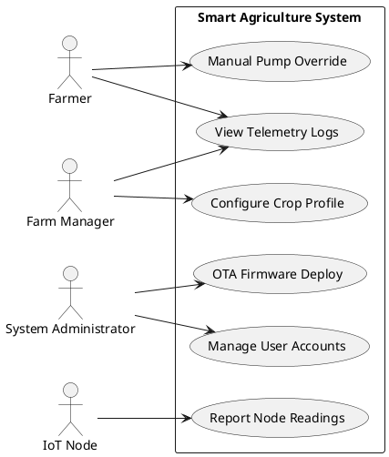
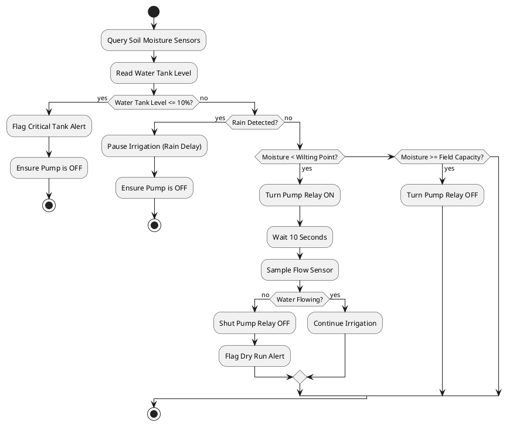
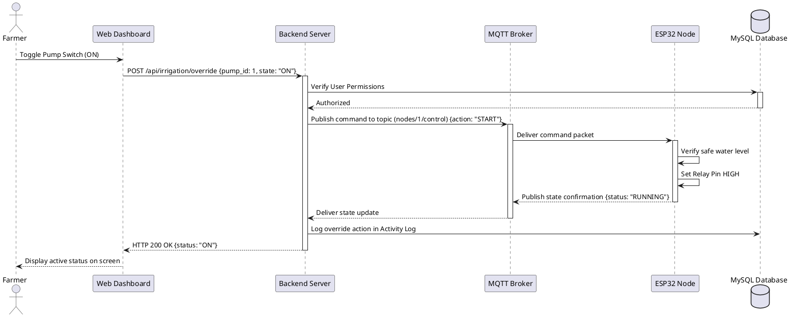
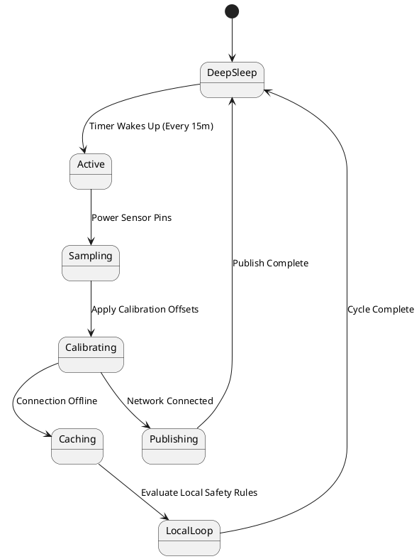
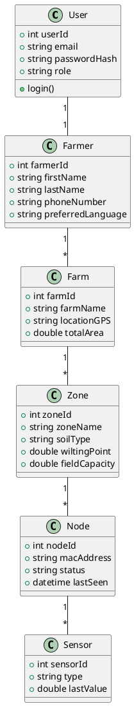
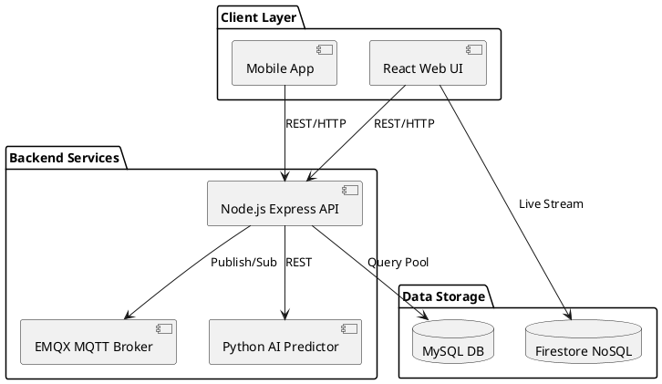
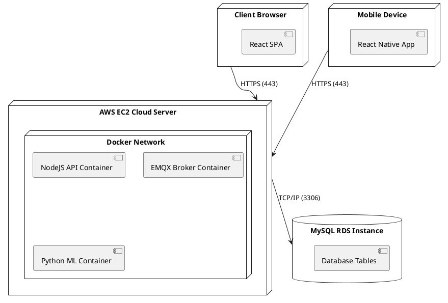
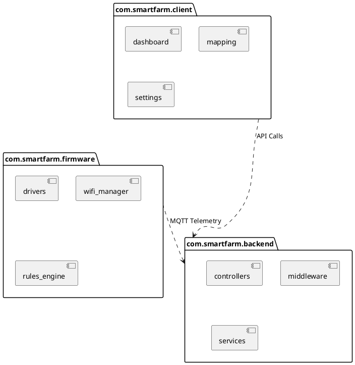
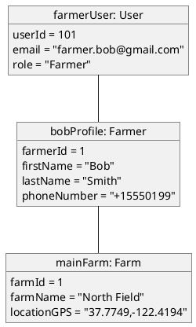
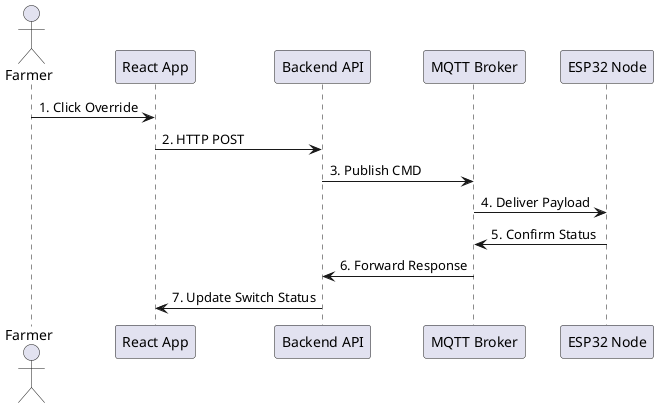

# Software Requirements Specification (SRS)
## Modular IoT Smart Agriculture and Precision Irrigation System
### Document Version: 1.0.0
### Date: August 2026

# Table of Contents

- [1. Introduction](#1-introduction)
  - [1.1 Purpose](#11-purpose)
  - [1.2 Scope](#12-scope)
  - [1.3 Project Overview](#13-project-overview)
  - [1.4 Business Need](#14-business-need)
  - [1.5 Objectives](#15-objectives)
  - [1.6 Existing Problems](#16-existing-problems)
  - [1.7 Proposed Solution](#17-proposed-solution)
  - [1.8 Benefits](#18-benefits)
  - [1.9 Intended Audience](#19-intended-audience)
  - [1.10 Definitions](#110-definitions)
  - [1.11 Acronyms](#111-acronyms)
  - [1.12 Abbreviations](#112-abbreviations)
  - [1.13 References](#113-references)
  - [1.14 Document Organization](#114-document-organization)
- [2. Overall Description](#2-overall-description)
  - [2.1 Product Perspective](#21-product-perspective)
  - [2.2 Product Functions](#22-product-functions)
  - [2.3 User Classes](#23-user-classes)
  - [2.4 Operating Environment](#24-operating-environment)
  - [2.5 System Constraints](#25-system-constraints)
  - [2.6 Assumptions](#26-assumptions)
  - [2.7 Dependencies](#27-dependencies)
  - [2.8 Business Rules](#28-business-rules)
  - [2.9 Design Principles](#29-design-principles)
  - [2.10 Project Vision](#210-project-vision)
  - [2.11 Project Goals](#211-project-goals)
  - [2.12 Stakeholders](#212-stakeholders)
  - [2.13 Detailed Stakeholder Requirements](#213-detailed-stakeholder-requirements)
- [3. Problem Statement](#3-problem-statement)
  - [3.1 Current Agriculture Problems](#31-current-agriculture-problems)
  - [3.2 Water Wastage](#32-water-wastage)
  - [3.3 Manual Irrigation](#33-manual-irrigation)
  - [3.4 Climate Change](#34-climate-change)
  - [3.5 Power Consumption](#35-power-consumption)
  - [3.6 Crop Loss](#36-crop-loss)
  - [3.7 Lack of Automation](#37-lack-of-automation)
  - [3.8 Need of AI](#38-need-of-ai)
  - [3.9 Need of IoT](#39-need-of-iot)
  - [3.10 Need of Precision Agriculture](#310-need-of-precision-agriculture)
  - [3.11 Need of Smart Monitoring](#311-need-of-smart-monitoring)
  - [3.12 Need of Data Analytics](#312-need-of-data-analytics)
- [4. Proposed Solution](#4-proposed-solution)
  - [4.1 Solution Overview](#41-solution-overview)
  - [4.2 Sensor Data Collection](#42-sensor-data-collection)
  - [4.3 ESP32 Edge Processing](#43-esp32-edge-processing)
  - [4.4 Cloud Infrastructure](#44-cloud-infrastructure)
  - [4.5 Hierarchical Database Design](#45-hierarchical-database-design)
  - [4.6 AI Prediction Engine](#46-ai-prediction-engine)
  - [4.7 Pump Automation and Closed-Loop Control](#47-pump-automation-and-closed-loop-control)
  - [4.8 Web & Mobile Dashboards](#48-web-&-mobile-dashboards)
  - [4.9 Notification and Alerting System](#49-notification-and-alerting-system)
  - [4.10 System Extensibility and Future Proofing](#410-system-extensibility-and-future-proofing)
- [5. System Architecture](#5-system-architecture)
  - [5.1 High-Level Architecture](#51-high-level-architecture)
  - [5.2 Low-Level Architecture](#52-low-level-architecture)
  - [5.3 Three-Layer Architecture](#53-three-layer-architecture)
  - [5.4 Four-Layer IoT Architecture](#54-four-layer-iot-architecture)
  - [5.5 Cloud Architecture](#55-cloud-architecture)
  - [5.6 Edge Computing Architecture](#56-edge-computing-architecture)
  - [5.7 Communication Architecture](#57-communication-architecture)
  - [5.8 Network Architecture](#58-network-architecture)
  - [5.9 Deployment Architecture](#59-deployment-architecture)
  - [5.10 Component Architecture](#510-component-architecture)
- [6. System Modules](#6-system-modules)
  - [6.1 Module 1: Authentication](#61-module-1-authentication)
  - [6.2 Module 2: Farmer Management](#62-module-2-farmer-management)
  - [6.3 Module 3: Farm Management](#63-module-3-farm-management)
  - [6.4 Module 4: Sensor Module](#64-module-4-sensor-module)
  - [6.5 Module 5: Communication Module](#65-module-5-communication-module)
  - [6.6 Module 6: Cloud Module](#66-module-6-cloud-module)
  - [6.7 Module 7: Database Module](#67-module-7-database-module)
  - [6.8 Module 8: AI Prediction Module](#68-module-8-ai-prediction-module)
  - [6.9 Module 9: Weather Module](#69-module-9-weather-module)
  - [6.10 Module 10: Automatic Irrigation Module](#610-module-10-automatic-irrigation-module)
  - [6.11 Module 11: Dashboard](#611-module-11-dashboard)
  - [6.12 Module 12: Notification Module](#612-module-12-notification-module)
  - [6.13 Module 13: Report Generation](#613-module-13-report-generation)
  - [6.14 Module 14: Analytics](#614-module-14-analytics)
  - [6.15 Module 15: Admin Module](#615-module-15-admin-module)
- [7. Functional Requirements](#7-functional-requirements)
  - [7.1 Authentication Module (FR-001 to FR-010)](#71-authentication-module-fr-001-to-fr-010)
    - [FR-001: User Login Verification](#fr-001-user-login-verification)
    - [FR-002: Token-Based Authorization](#fr-002-token-based-authorization)
    - [FR-003: Password Hashing and Encryption](#fr-003-password-hashing-and-encryption)
    - [FR-004: Password Reset via Email](#fr-004-password-reset-via-email)
    - [FR-005: Token Refresh Loop](#fr-005-token-refresh-loop)
    - [FR-006: Role-Based Routing](#fr-006-role-based-routing)
    - [FR-007: Log Out Session Invalidation](#fr-007-log-out-session-invalidation)
    - [FR-008: Account Lockout Policy](#fr-008-account-lockout-policy)
    - [FR-009: Session Expiration Enforcement](#fr-009-session-expiration-enforcement)
    - [FR-010: Multi-Factor Authentication (MFA)](#fr-010-multi-factor-authentication-mfa)
  - [7.2 Farmer Management Module (FR-011 to FR-020)](#72-farmer-management-module-fr-011-to-fr-020)
    - [FR-011: Register Farmer Profile](#fr-011-register-farmer-profile)
    - [FR-012: Update Farmer Profiles](#fr-012-update-farmer-profiles)
    - [FR-013: Delete Farmer Accounts](#fr-013-delete-farmer-accounts)
    - [FR-014: View Assigned Farmers](#fr-014-view-assigned-farmers)
    - [FR-015: Assign Farms to Farmers](#fr-015-assign-farms-to-farmers)
    - [FR-016: Language Preference Selection](#fr-016-language-preference-selection)
    - [FR-017: Record Farm Logins](#fr-017-record-farm-logins)
    - [FR-018: Retrieve Alert Configuration](#fr-018-retrieve-alert-configuration)
    - [FR-019: Deactivate Inactive Profiles](#fr-019-deactivate-inactive-profiles)
    - [FR-020: Profile Photo Uploads](#fr-020-profile-photo-uploads)
  - [7.3 Farm Management Module (FR-021 to FR-030)](#73-farm-management-module-fr-021-to-fr-030)
    - [FR-021: Create Farm Zone](#fr-021-create-farm-zone)
    - [FR-022: Configure Crop Type](#fr-022-configure-crop-type)
    - [FR-023: Edit Farm Details](#fr-023-edit-farm-details)
    - [FR-024: Delete Farm Zones](#fr-024-delete-farm-zones)
    - [FR-025: Map Node to Zone](#fr-025-map-node-to-zone)
    - [FR-026: Set Soil Baselines](#fr-026-set-soil-baselines)
    - [FR-027: View Farm Summary Dashboard](#fr-027-view-farm-summary-dashboard)
    - [FR-028: Archive Farm History](#fr-028-archive-farm-history)
    - [FR-029: Zone Irrigation Schedule Definition](#fr-029-zone-irrigation-schedule-definition)
    - [FR-030: Add Sub-Zones](#fr-030-add-sub-zones)
  - [7.4 Sensor Module (FR-031 to FR-040)](#74-sensor-module-fr-031-to-fr-040)
    - [FR-031: Read Moisture Level](#fr-031-read-moisture-level)
    - [FR-032: Read NPK Nutrients](#fr-032-read-npk-nutrients)
    - [FR-033: Read pH Index](#fr-033-read-ph-index)
    - [FR-034: Read Temp and Humidity](#fr-034-read-temp-and-humidity)
    - [FR-035: Detect Rain Presence](#fr-035-detect-rain-presence)
    - [FR-036: Read Water Flow Rate](#fr-036-read-water-flow-rate)
    - [FR-037: Monitor Water Tank Level](#fr-037-monitor-water-tank-level)
    - [FR-038: Calibration Adjustment](#fr-038-calibration-adjustment)
    - [FR-039: Read Node Battery Level](#fr-039-read-node-battery-level)
    - [FR-040: Auto-Detect Connected Sensors](#fr-040-auto-detect-connected-sensors)
  - [7.5 Communication Module (FR-041 to FR-050)](#75-communication-module-fr-041-to-fr-050)
    - [FR-041: Connect to WiFi Network](#fr-041-connect-to-wifi-network)
    - [FR-042: Publish Telemetry Payload](#fr-042-publish-telemetry-payload)
    - [FR-043: Subscribe to Command Topic](#fr-043-subscribe-to-command-topic)
    - [FR-044: Cache Telemetry Offline](#fr-044-cache-telemetry-offline)
    - [FR-045: Upload Cached Telemetry](#fr-045-upload-cached-telemetry)
    - [FR-046: Dynamic MQTT Reconnection](#fr-046-dynamic-mqtt-reconnection)
    - [FR-047: SMS Backup Messaging](#fr-047-sms-backup-messaging)
    - [FR-048: SSL/TLS Encryption](#fr-048-ssltls-encryption)
    - [FR-049: Keep-Alive Pings](#fr-049-keep-alive-pings)
    - [FR-050: Signal Quality Report](#fr-050-signal-quality-report)
  - [7.6 Cloud Module (FR-051 to FR-060)](#76-cloud-module-fr-051-to-fr-060)
    - [FR-051: Process Incoming Telemetry](#fr-051-process-incoming-telemetry)
    - [FR-052: Route Device Commands](#fr-052-route-device-commands)
    - [FR-053: Run Database Cleanup](#fr-053-run-database-cleanup)
    - [FR-054: Sync Real-Time Telemetry](#fr-054-sync-real-time-telemetry)
    - [FR-055: OTA Firmware Update Delivery](#fr-055-ota-firmware-update-delivery)
    - [FR-056: Manage Node Registry](#fr-056-manage-node-registry)
    - [FR-057: Monitor Node Connection Status](#fr-057-monitor-node-connection-status)
    - [FR-058: Generate Data Download Link](#fr-058-generate-data-download-link)
    - [FR-059: API Rate Limiting](#fr-059-api-rate-limiting)
    - [FR-060: Log System Events](#fr-060-log-system-events)
  - [7.7 Database Module (FR-061 to FR-070)](#77-database-module-fr-061-to-fr-070)
    - [FR-061: Save Telemetry Record](#fr-061-save-telemetry-record)
    - [FR-062: Fetch Historical Readings](#fr-062-fetch-historical-readings)
    - [FR-063: Log Alert Event](#fr-063-log-alert-event)
    - [FR-064: Update Actuator State Log](#fr-064-update-actuator-state-log)
    - [FR-065: Read Active User Profiles](#fr-065-read-active-user-profiles)
    - [FR-066: Auto-Index Data Tables](#fr-066-auto-index-data-tables)
    - [FR-067: Backup Database](#fr-067-backup-database)
    - [FR-068: Clear Expired Tokens](#fr-068-clear-expired-tokens)
    - [FR-069: Update Notification Delivery Log](#fr-069-update-notification-delivery-log)
    - [FR-070: Save System Configurations](#fr-070-save-system-configurations)
  - [7.8 AI Prediction Module (FR-071 to FR-080)](#78-ai-prediction-module-fr-071-to-fr-080)
    - [FR-071: Forecast Soil Moisture](#fr-071-forecast-soil-moisture)
    - [FR-072: Calculate Crop Evapotranspiration](#fr-072-calculate-crop-evapotranspiration)
    - [FR-073: Recommend Irrigation Water Volume](#fr-073-recommend-irrigation-water-volume)
    - [FR-074: Model Performance Evaluation](#fr-074-model-performance-evaluation)
    - [FR-075: Dynamically Retrain Models](#fr-075-dynamically-retrain-models)
    - [FR-076: Adjust Crop Coefficients](#fr-076-adjust-crop-coefficients)
    - [FR-077: Run Forecast Simulation](#fr-077-run-forecast-simulation)
    - [FR-078: Trigger Automated Model Revert](#fr-078-trigger-automated-model-revert)
    - [FR-079: Weather Forecast Validation](#fr-079-weather-forecast-validation)
    - [FR-080: Analyze Soil Salinity Trends](#fr-080-analyze-soil-salinity-trends)
  - [7.9 Weather Module (FR-081 to FR-090)](#79-weather-module-fr-081-to-fr-090)
    - [FR-081: Query Weather API](#fr-081-query-weather-api)
    - [FR-082: Parse Forecast JSON](#fr-082-parse-forecast-json)
    - [FR-083: Update Forecast Cache](#fr-083-update-forecast-cache)
    - [FR-084: Track Rain Duration](#fr-084-track-rain-duration)
    - [FR-085: Historical Weather Tracking](#fr-085-historical-weather-tracking)
    - [FR-086: Multi-Location Forecast Queries](#fr-086-multi-location-forecast-queries)
    - [FR-087: Rain Evaporation Calculation](#fr-087-rain-evaporation-calculation)
    - [FR-088: Check API Key Status](#fr-088-check-api-key-status)
    - [FR-089: Fallback to Nearby Stations](#fr-089-fallback-to-nearby-stations)
    - [FR-090: Predict Frost Risks](#fr-090-predict-frost-risks)
  - [7.10 Automatic Irrigation Module (FR-091 to FR-100)](#710-automatic-irrigation-module-fr-091-to-fr-100)
    - [FR-091: Automatic Pump Activation](#fr-091-automatic-pump-activation)
    - [FR-092: Automatic Pump Deactivation](#fr-092-automatic-pump-deactivation)
    - [FR-093: Check Valve Flow](#fr-093-check-valve-flow)
    - [FR-094: Rain Delay Pause](#fr-094-rain-delay-pause)
    - [FR-095: Manual Command Override](#fr-095-manual-command-override)
    - [FR-096: Low Water Safety Shutdown](#fr-096-low-water-safety-shutdown)
    - [FR-097: Run Node Self-Diagnostics](#fr-097-run-node-self-diagnostics)
    - [FR-098: Emergency Status Fallback](#fr-098-emergency-status-fallback)
    - [FR-099: Clear Irrigation Alerts](#fr-099-clear-irrigation-alerts)
    - [FR-100: Track Pump Runtime](#fr-100-track-pump-runtime)
- [8. Non-Functional Requirements](#8-non-functional-requirements)
  - [8.1 Performance & Response Time](#81-performance-&-response-time)
  - [8.2 Availability](#82-availability)
  - [8.3 Reliability & Fault Tolerance](#83-reliability-&-fault-tolerance)
  - [8.4 Scalability](#84-scalability)
  - [8.5 Maintainability & OTA Updates](#85-maintainability-&-ota-updates)
  - [8.6 Security & Data Privacy](#86-security-&-data-privacy)
  - [8.7 Portability & Client Compatibility](#87-portability-&-client-compatibility)
  - [8.8 Accessibility & Usability](#88-accessibility-&-usability)
  - [8.9 Compliance & Standards](#89-compliance-&-standards)
  - [8.10 Backup & Disaster Recovery](#810-backup-&-disaster-recovery)
  - [8.11 Physical & Operational Constraints](#811-physical-&-operational-constraints)
- [9. External Interface Requirements](#9-external-interface-requirements)
  - [9.1 Hardware Interfaces](#91-hardware-interfaces)
  - [9.2 Software Interfaces](#92-software-interfaces)
  - [9.3 Communication Interfaces](#93-communication-interfaces)
  - [9.4 API Interfaces](#94-api-interfaces)
  - [9.5 Cloud Interfaces](#95-cloud-interfaces)
  - [9.6 Mobile Interfaces](#96-mobile-interfaces)
  - [9.7 Database Interfaces](#97-database-interfaces)
  - [9.8 Sensor Interfaces](#98-sensor-interfaces)
  - [9.9 User Interfaces](#99-user-interfaces)
- [10. Database Design](#10-database-design)
  - [10.1 Entity-Relationship Model (ER Diagram)](#101-entity-relationship-model-er-diagram)
  - [10.2 Database Table Specifications](#102-database-table-specifications)
    - [10.2.1 Users Table](#1021-users-table)
    - [10.2.2 Farmer Table](#1022-farmer-table)
    - [10.2.3 Farm Table](#1023-farm-table)
    - [10.2.4 Crop Table](#1024-crop-table)
    - [10.2.5 Sensor Table](#1025-sensor-table)
    - [10.2.6 Sensor Reading Table](#1026-sensor-reading-table)
    - [10.2.7 Water Tank Table](#1027-water-tank-table)
    - [10.2.8 Pump Table](#1028-pump-table)
    - [10.2.9 Weather Table](#1029-weather-table)
    - [10.2.10 AI Prediction Table](#10210-ai-prediction-table)
    - [10.2.11 Notification Table](#10211-notification-table)
    - [10.2.12 Alert Table](#10212-alert-table)
    - [10.2.13 Activity Log Table](#10213-activity-log-table)
    - [10.2.14 Reports Table](#10214-reports-table)
    - [10.2.15 Settings Table](#10215-settings-table)
  - [10.3 Normalization](#103-normalization)
- [11. Use Cases](#11-use-cases)
  - [11.1 Use Case 1: Manual Pump Override](#111-use-case-1-manual-pump-override)
  - [11.2 Use Case 2: Configure Crop Profile](#112-use-case-2-configure-crop-profile)
  - [11.3 Use Case 3: Process Sensor Telemetry](#113-use-case-3-process-sensor-telemetry)
  - [11.4 Use Case 4: AI Irrigation Optimization](#114-use-case-4-ai-irrigation-optimization)
- [12. UML Diagrams](#12-uml-diagrams)
  - [12.1 Use Case Diagram](#121-use-case-diagram)
  - [12.2 Activity Diagram (Irrigation Loop)](#122-activity-diagram-irrigation-loop)
  - [12.3 Sequence Diagram (Manual Override)](#123-sequence-diagram-manual-override)
  - [12.4 State Diagram (Node Operational States)](#124-state-diagram-node-operational-states)
  - [12.5 Class Diagram (Core Domain Model)](#125-class-diagram-core-domain-model)
  - [12.6 Component Diagram](#126-component-diagram)
  - [12.7 Deployment Diagram](#127-deployment-diagram)
  - [12.8 Package Diagram](#128-package-diagram)
  - [12.9 Object Diagram](#129-object-diagram)
  - [12.10 Communication Diagram](#1210-communication-diagram)
- [13. Hardware Design](#13-hardware-design)
  - [13.1 Core Components](#131-core-components)
  - [13.2 Pin Configurations & Connection Mapping](#132-pin-configurations-&-connection-mapping)
  - [13.3 Circuit & Connection Schematic](#133-circuit-&-connection-schematic)
  - [13.4 Power Budget & Calculations](#134-power-budget-&-calculations)
    - [13.4.1 Active Cycle Power (Duration: 30 seconds, runs 4 times per hour)](#1341-active-cycle-power-duration-30-seconds,-runs-4-times-per-hour)
    - [13.4.2 Deep Sleep Cycle Power (Duration: 58 minutes per hour)](#1342-deep-sleep-cycle-power-duration-58-minutes-per-hour)
    - [13.4.3 Battery & Solar Sizing](#1343-battery-&-solar-sizing)
  - [13.5 Bill of Materials (BOM) & Cost Estimates](#135-bill-of-materials-bom-&-cost-estimates)
- [14. Software Design](#14-software-design)
  - [14.1 Technology Stack Selection](#141-technology-stack-selection)
  - [14.2 Folder & Project Directory Structure](#142-folder-&-project-directory-structure)
  - [14.3 Backend Service Architecture](#143-backend-service-architecture)
- [15. AI Module](#15-ai-module)
  - [15.1 Dataset Features & Labels](#151-dataset-features-&-labels)
    - [15.1.1 Feature Set (Input Variables)](#1511-feature-set-input-variables)
    - [15.1.2 Label Set (Target Variables)](#1512-label-set-target-variables)
  - [15.2 Machine Learning Algorithms](#152-machine-learning-algorithms)
    - [15.2.1 Decision Trees](#1521-decision-trees)
    - [15.2.2 Random Forest (Ensemble)](#1522-random-forest-ensemble)
    - [15.2.3 XGBoost (Gradient Boosting)](#1523-xgboost-gradient-boosting)
    - [15.2.4 LightGBM](#1524-lightgbm)
    - [15.2.5 Artificial Neural Networks (ANN)](#1525-artificial-neural-networks-ann)
  - [15.3 Model Training, Testing & Hyperparameter Tuning](#153-model-training,-testing-&-hyperparameter-tuning)
  - [15.4 Performance Evaluation Metrics](#154-performance-evaluation-metrics)
    - [15.4.1 Regression Metrics](#1541-regression-metrics)
    - [15.4.2 Classification Metrics (Irrigation recommendation validation)](#1542-classification-metrics-irrigation-recommendation-validation)
  - [15.5 Feature Importance & Model Interpretation](#155-feature-importance-&-model-interpretation)
  - [15.6 Deployment & Execution Workflow](#156-deployment-&-execution-workflow)
- [16. IoT Module](#16-iot-module)
  - [16.1 Sensor Operations & Interfaces](#161-sensor-operations-&-interfaces)
  - [16.2 Communication Protocols & Network Paths](#162-communication-protocols-&-network-paths)
  - [16.3 MQTT Telemetry Topics](#163-mqtt-telemetry-topics)
  - [16.4 Power Optimization & Sleep Cycles](#164-power-optimization-&-sleep-cycles)
  - [16.5 Offline Edge Autonomy & Cloud Sync](#165-offline-edge-autonomy-&-cloud-sync)
- [17. Web Dashboard](#17-web-dashboard)
  - [17.1 Dashboard Wireframes (ASCII Layouts)](#171-dashboard-wireframes-ascii-layouts)
    - [17.1.1 Main Dashboard View](#1711-main-dashboard-view)
    - [17.1.2 Interactive Map View](#1712-interactive-map-view)
  - [17.2 Core Dashboard Pages & Features](#172-core-dashboard-pages-&-features)
    - [17.2.1 User Login & Registration](#1721-user-login-&-registration)
    - [17.2.2 Live Monitoring Panel](#1722-live-monitoring-panel)
    - [17.2.3 Analytics & Charts](#1723-analytics-&-charts)
    - [17.2.4 Node Management & Map View](#1724-node-management-&-map-view)
    - [17.2.5 AI Recommendation View](#1725-ai-recommendation-view)
    - [17.2.6 Admin Panel & Settings](#1726-admin-panel-&-settings)
- [18. Security Requirements](#18-security-requirements)
  - [18.1 Authentication & Authorization](#181-authentication-&-authorization)
  - [18.2 Data Encryption in Transit & Rest](#182-data-encryption-in-transit-&-rest)
  - [18.3 Role-Based Access Control (RBAC)](#183-role-based-access-control-rbac)
  - [18.4 Security Auditing & Activity Logs](#184-security-auditing-&-activity-logs)
  - [18.5 Threat Analysis & Mitigation Plan](#185-threat-analysis-&-mitigation-plan)
- [19. Testing](#19-testing)
  - [19.1 Testing Levels & Methodology](#191-testing-levels-&-methodology)
  - [19.2 Test Cases Matrix (TC-001 to TC-100)](#192-test-cases-matrix-tc-001-to-tc-100)
- [20. Project Management](#20-project-management)
  - [20.1 Work Breakdown Structure (WBS)](#201-work-breakdown-structure-wbs)
  - [20.2 Project Timeline & Gantt Chart](#202-project-timeline-&-gantt-chart)
  - [20.3 PERT Chart (Critical Path Analysis)](#203-pert-chart-critical-path-analysis)
  - [20.4 Risk Matrix & Mitigation Plan](#204-risk-matrix-&-mitigation-plan)
  - [20.5 Budget & Cost Estimation](#205-budget-&-cost-estimation)
  - [20.6 Team Responsibilities & Resource Planning](#206-team-responsibilities-&-resource-planning)
- [21. Future Enhancements](#21-future-enhancements)
  - [21.1 Advanced Monitoring & Remote Sensing](#211-advanced-monitoring-&-remote-sensing)
    - [21.1.1 Multispectral Drone Monitoring](#2111-multispectral-drone-monitoring)
    - [21.1.2 Satellite Imagery Integration](#2112-satellite-imagery-integration)
    - [21.1.3 Computer Vision Disease Detection](#2113-computer-vision-disease-detection)
    - [21.1.4 Deep Volumetric Soil Moisture Probes](#2114-deep-volumetric-soil-moisture-probes)
    - [21.1.5 Thermal Crop Stress Profiling](#2115-thermal-crop-stress-profiling)
  - [21.2 Intelligent AI & Optimization](#212-intelligent-ai-&-optimization)
    - [21.2.1 Advanced Yield Forecasting](#2121-advanced-yield-forecasting)
    - [21.2.2 Fertilizer (NPK) Optimization Models](#2122-fertilizer-npk-optimization-models)
    - [21.2.3 Market Price Integration](#2123-market-price-integration)
    - [21.2.4 Crop Disease Spread Prediction](#2124-crop-disease-spread-prediction)
    - [21.2.5 Self-Learning Irrigation Scheduling](#2125-self-learning-irrigation-scheduling)
  - [21.3 Network & Hardware Expansion](#213-network-&-hardware-expansion)
    - [21.3.1 LoRaWAN Mesh Networking](#2131-lorawan-mesh-networking)
    - [21.3.2 5G NB-IoT Integration](#2132-5g-nb-iot-integration)
    - [21.3.3 Solar Tracker Mounts](#2133-solar-tracker-mounts)
    - [21.3.4 Supercapacitor Energy Storage](#2134-supercapacitor-energy-storage)
    - [21.3.5 Modular Sensor Expansion Boards](#2135-modular-sensor-expansion-boards)
  - [21.4 Software, UX & Automation](#214-software,-ux-&-automation)
    - [21.4.1 Voice Assistant Integrations](#2141-voice-assistant-integrations)
    - [21.4.2 Virtual Reality (VR) Farm Modeling](#2142-virtual-reality-vr-farm-modeling)
    - [21.4.3 Blockchain Supply Chain Tracking](#2143-blockchain-supply-chain-tracking)
    - [21.4.4 Digital Twin Farm Simulation](#2144-digital-twin-farm-simulation)
    - [21.4.5 Automated Valve Diagnostic Checks](#2145-automated-valve-diagnostic-checks)
  - [21.5 Collaborative & Macro Systems](#215-collaborative-&-macro-systems)
    - [21.5.1 Automated Water Rights Billing](#2151-automated-water-rights-billing)
    - [21.5.2 Regional Water Allocations Maps](#2152-regional-water-allocations-maps)
    - [21.5.3 Crowd-Sourced Pest Alert Map](#2153-crowd-sourced-pest-alert-map)
    - [21.5.4 Smart Grid Load Management](#2154-smart-grid-load-management)
    - [21.5.5 Open Agricultural Data API](#2155-open-agricultural-data-api)
- [22. References](#22-references)
  - [22.1 Academic Literature & Journals](#221-academic-literature-&-journals)
  - [22.2 Technical Standards & Guidelines](#222-technical-standards-&-guidelines)
  - [22.3 Embedded Hardware Documentation](#223-embedded-hardware-documentation)
  - [22.4 Software Frameworks & Cloud Documentation](#224-software-frameworks-&-cloud-documentation)
- [23. Appendices](#23-appendices)
  - [23.1 SQL Schema Creation Script](#231-sql-schema-creation-script)
  - [23.2 REST API JSON Payloads](#232-rest-api-json-payloads)
    - [23.2.1 Get Telemetry Response (`GET /api/nodes/1/telemetry`)](#2321-get-telemetry-response-`get-apinodes1telemetry`)
    - [23.2.2 Manual Relay Override Request (`POST /api/irrigation/override`)](#2322-manual-relay-override-request-`post-apiirrigationoverride`)
  - [23.3 Installation Guide](#233-installation-guide)
    - [23.3.1 Edge Node Hardware Deployment](#2331-edge-node-hardware-deployment)
    - [23.3.2 Cloud Server Setup](#2332-cloud-server-setup)
  - [23.4 Troubleshooting FAQ](#234-troubleshooting-faq)
    - [Q1: Why is my edge node status showing Offline on the dashboard?](#q1-why-is-my-edge-node-status-showing-offline-on-the-dashboard?)
    - [Q2: Why is the pump shutting off after 10 seconds of starting?](#q2-why-is-the-pump-shutting-off-after-10-seconds-of-starting?)
    - [Q3: Why are the soil moisture sensor readings jumping erratically?](#q3-why-are-the-soil-moisture-sensor-readings-jumping-erratically?)

---

# 1. Introduction

## 1.1 Purpose
The purpose of this Software Requirements Specification (SRS) document is to define the complete, detailed, and structured requirements for the **Modular IoT Smart Agriculture and Precision Irrigation System**. This document establishes a comprehensive baseline of technical and functional specifications for system development, deployment, academic evaluation, startup-level productization, and research exploration. It details the operational characteristics, hardware-software integrations, data analytics paradigms, security constraints, and communication methodologies required to build, test, and maintain this agricultural ecosystem.

## 1.2 Scope
The scope of this project encompasses an end-to-end, multi-tier system integrating Internet of Things (IoT) hardware, edge computing, cloud-based data storage and processing, Artificial Intelligence (AI) predictive models, and cross-platform front-end applications (web and mobile). Specifically, the system includes:
- **Embedded Hardware**: Low-power microcontroller nodes (primarily ESP32/NodeMCU) interfacing with soil moisture, NPK (Nitrogen, Phosphorus, Potassium), pH, DHT11/DHT22 temperature and humidity, rain, water flow, and water level sensors, combined with relay-driven solenoids and submersed pumps.
- **Edge Layer**: Low-latency edge computation for threshold-based pump control, offline queuing, and sensor signal preprocessing to guarantee operational resilience during network drops.
- **Communication Layer**: Dual protocol operations employing MQTT (Message Queuing Telemetry Transport) over WiFi/cellular for lightweight telemetry transmission, and REST APIs over HTTPS for transactional operations (user setup, device configuration, static configurations).
- **Cloud Layer**: Scalable database clusters (relational MySQL for structured transactional profiles, and Firebase Firestore for rapid real-time telemetry streaming) paired with serverless functions and containerized web backends.
- **AI/ML Analytics**: predictive engines running Random Forest, XGBoost, and LightGBM models trained to estimate localized soil moisture trends, crop health metrics, yield forecasts, and optimal water quantity requirements based on historical data, real-time sensor metrics, and meteorological API feeds.
- **Client Interfaces**: An interactive web application built with React/Vite featuring real-time visualization dashboards, device configuration managers, localized map views, manual pump control overrides, and automated reporting systems; alongside a React Native mobile application for farmer monitoring and push-notification alerts (via Firebase Cloud Messaging).
- **Administrative Utilities**: A granular Role-Based Access Control (RBAC) panel for administrators, researchers, and government agencies to query anonymized agricultural datasets, establish region-wide irrigation schedules, and track macro-level water consumption.

This system does not include custom hardware chip design, physical installation of farm pipe systems, or direct financial trading markets, though it integrates with commodity IoT modules and third-party localized crop market feeds.

## 1.3 Project Overview
The Modular IoT Smart Agriculture and Precision Irrigation System is designed to modernize agricultural operations by replacing traditional, heuristic-based manual irrigation with automated, data-driven precision watering. By monitoring multi-depth soil moisture profile gradients, physical atmospheric factors, chemical soil compositions, and localized weather forecasts, the system evaluates exactly when, where, and how much water is required for optimal crop yields. 

The modular architecture divides the software and hardware components into distinct layers (Device/Edge, Network/Transport, Cloud/Processing, Application/Presentation). This allows individual sensors, communication hardware, or AI models to be swapped or upgraded without redesigning the entire system.

```
+-----------------------------------------------------------------------------------+
|                              SYSTEM GENERAL CONTEXT                               |
+-----------------------------------------------------------------------------------+
|                                                                                   |
|  +-------------------+        Telemetry       +--------------------------------+  |
|  |     IoT Nodes     | ---------------------> |          MQTT Broker           |  |
|  | (Sensors/Actuators)| <--------------------- |       (Mosquitto/Cloud)        |  |
|  +-------------------+       Commands         +--------------------------------+  |
|           ^                                                    |                  |
|           | Edge Commands                                      | Stream           |
|           v                                                    v                  |
|  +-------------------+     Rest HTTP API      +--------------------------------+  |
|  |   Edge Gateway    | ---------------------> |      Cloud Backend Engine      |  |
|  |  (Offline Sync)   | <--------------------- |       (Node.js / Express)      |  |
|  +-------------------+                        +--------------------------------+  |
|                                                                |                  |
|                                        +-----------------------+-------+          |
|                                        v                               v          |
|                              +------------------+             +-----------------+ |
|                              | Relational/NoSQL |             | AI Predictor    | |
|                              |    Databases     |             | (ML Models)     | |
|                              +------------------+             +-----------------+ |
|                                        |                                          |
|                                        +-----------------------+                  |
|                                                                v                  |
|                                                       +-----------------+         |
|                                                       | Web/Mobile App  |         |
|                                                       |   (Dashboard)   |         |
|                                                       +-----------------+         |
+-----------------------------------------------------------------------------------+
```

## 1.4 Business Need
Global agricultural systems face unprecedented pressures:
1. **Severe Water Scarcity**: Agriculture accounts for approximately 70% of global freshwater withdrawals. Traditional flooding and manual sprinklers waste up to 50% of applied water due to runoff and evaporation.
2. **Declining Crop Yields**: Over-watering log-starves roots and leaches essential nutrients, while under-watering introduces plant cell stress, leading to stunted growth, pest vulnerability, and crop failure.
3. **Escalating Input Costs**: Electricity for pumping water and chemical fertilizers are major operational expenses. Over-irrigation worsens this by requiring more pumping power and stripping fertilizer from the topsoil.
4. **Labor Shortages and Manual Inefficiencies**: Remote or highly fragmented farms require significant labor to physically operate irrigation valves, diagnose pump failures, and monitor micro-climate conditions.
5. **Climate Disruption**: Unpredictable weather patterns make historical farming schedules obsolete. Dynamic, real-time sensing and predictive analytics are essential for climate resilience.

An automated, intelligent irrigation system directly addresses these needs by saving 30–50% of agricultural water, lowering energy costs, reducing labor, and optimizing the physical soil environment to maximize crop yield per drop of water.

## 1.5 Objectives
- **Automated Precision Watering**: Achieve closed-loop irrigation by dynamically activating solenoids and pumps using real-time soil moisture parameters, NPK indices, and predictive evapotranspiration equations.
- **Microclimate and Chemical Soil Monitoring**: Capture continuous, multi-depth soil moisture data, ambient temperature/humidity, light intensity, rainfall rates, pH, and soil macronutrients.
- **Intelligent Predictive Scheduling**: Run Machine Learning models to predict soil moisture depletion rates 24–48 hours in advance, incorporating meteorological forecasts to avoid watering before rainfall.
- **Operational Fault Tolerance**: Implement a modular architecture that continues monitoring and executing basic irrigation rules at the edge even during cloud connection outages.
- **Multi-Tenant Administration and Remote Auditing**: Provide intuitive web and mobile interfaces for multiple user classes, including farmers, farm managers, agricultural scientists, and regional administrators.
- **Resource Conservation and Analytics**: Reduce overall water consumption by a target of 40% and pump energy consumption by 25% while generating comprehensive reports on consumption trends, soil health, and cost savings.

## 1.6 Existing Problems
- **Static Scheduling**: Traditional automatic timers run on rigid schedules (e.g., 20 minutes every morning), completely ignoring current soil moisture, ambient humidity, or incoming rainfall.
- **Heuristic-Based Farming**: Farmers rely on physical touch or visual inspection of topsoil, which does not accurately represent root-zone moisture conditions or chemical deficits.
- **High Cost of Commercial Systems**: Industrial agricultural solutions are proprietary, expensive, and require specialized installation, making them inaccessible to small and mid-sized farms.
- **Connectivity Dependencies**: Many IoT systems fail completely if the network drops. This lack of edge autonomy leads to dry crops or flooded fields.
- **Monolithic Designs**: Hardware nodes are often hard-coded for specific layouts. Adding a sensor or swapping a communication module requires rewriting the firmware and redesigning the board.
- **Siloed Data**: Existing monitors lack open APIs or standardized databases, preventing researchers or regional planners from analyzing macro-level trends.

## 1.7 Proposed Solution
The proposed solution is a **Modular IoT Smart Agriculture and Precision Irrigation System** featuring:
- **Modular Hardware Architecture**: Sensor-agnostic edge nodes equipped with an ESP32 processing core, designed to automatically recognize and query connected sensors (Soil Moisture, DHT22, pH, NPK, Rain, Flow) via standard buses (I2C, SPI, RS485/Modbus, ADC).
- **Smart Edge Controller**: An intelligent firmwares built on FreeRTOS that processes localized inputs, executes basic threshold safety scripts offline, and buffers sensor readings in non-volatile flash memory during connection drops.
- **Hybrid Communication Protocol**: Fast, lightweight MQTT publish-subscribe messaging for telemetry data, paired with secure HTTPS REST APIs for batch uploads, authentication, OTA updates, and dashboard interactions.
- **Hierarchical Cloud & Database System**: Real-time Firestore streaming for live updates on the client UI, paired with a MySQL relational database for persistent archival storage, user records, and analytical historical logs.
- **AI-Powered Evapotranspiration and Soil Trend Modeling**: A serverless python-based AI engine that processes meteorological data and historical sensor streams to run Random Forest regression models, predicting precise water requirements (Liters/square meter) for different crop types.
- **Interactive UI & Real-Time Alerts**: A responsive web portal and mobile application featuring geo-mapped node overlays, manual overrides, crop configuration tables, water budget charts, and localized push alerts (SMS/Web Notifications).

## 1.8 Benefits
- **Farmers**: Minimizes manual field labor, saves money on water and energy bills, prevents crop loss from disease/drought, and increases overall yields.
- **Agricultural Scientists / Researchers**: Provides access to high-resolution, multi-depth soil moisture data and soil chemistry parameters to study crop transpiration behavior across soil types.
- **Irrigation Cooperatives / Water Authorities**: Enables remote tracking of regional water usage, helping enforce conservation policies and optimize distribution networks.
- **Environment**: Reduces agricultural water waste, lowers energy consumption, and prevents soil erosion, nutrient leaching, and groundwater contamination from over-irrigation.

## 1.9 Intended Audience
This SRS document is written for:
- **System Developers & Engineers**: To guide backend, frontend, database, AI, and firmware implementations.
- **Hardware Specialists**: To assist in component selection, PCB design, power configuration, and sensor wiring.
- **Project Evaluators (Academic/Hackathon)**: To evaluate the project's technical architecture, standard compliance, and theoretical foundations.
- **System Administrators**: To configure cloud servers, database permissions, MQTT brokers, and deployment environments.
- **Agricultural Consultants & Agtech Startups**: To understand the system's features and adapt the platform for commercial deployment.

## 1.10 Definitions
- **Precision Agriculture**: A farming management concept based on observing, measuring, and responding to inter- and intra-field variability in crops.
- **Evapotranspiration (ET)**: The sum of water evaporation from the soil surface and transpiration from plants.
- **Field Capacity**: The maximum amount of water that a particular soil can retain after excess water has drained away.
- **Wilting Point**: The minimal point of soil moisture the plant requires not to wilt.
- **MQTT Broker**: A server that receives all messages, filters them, determines who is interested, and publishes the message to all subscribed clients.
- **FreeRTOS**: A real-time operating system kernel for embedded devices that is ported to microcontrollers.
- **Soil Gradient**: The change in soil moisture content across different depths of the soil profile.

## 1.11 Acronyms
- **SRS**: Software Requirements Specification
- **IEEE**: Institute of Electrical and Electronics Engineers
- **IoT**: Internet of Things
- **API**: Application Programming Interface
- **MQTT**: Message Queuing Telemetry Transport
- **JSON**: JavaScript Object Notation
- **REST**: Representational State Transfer
- **RBAC**: Role-Based Access Control
- **OTA**: Over-The-Air (Firmware Update)
- **NPK**: Nitrogen, Phosphorus, Potassium
- **ADC**: Analog-to-Digital Converter
- **DBMS**: Database Management System
- **WBS**: Work Breakdown Structure
- **ET**: Evapotranspiration
- **FCM**: Firebase Cloud Messaging
- **LoRa**: Long Range (Wireless Network)
- **SPI**: Serial Peripheral Interface
- **I2C**: Inter-Integrated Circuit
- **JWT**: JSON Web Token
- **SSL**: Secure Sockets Layer
- **TLS**: Transport Layer Security

## 1.12 Abbreviations
- **Ch.**: Chapter
- **Sec.**: Section
- **Fig.**: Figure
- **Pg.**: Page
- **App.**: Appendix
- **Ref.**: Reference
- **Min.**: Minimum
- **Max.**: Maximum
- **Config**: Configuration
- **Temp**: Temperature
- **Humid**: Humidity
- **Solenoid**: Solenoid Valve

## 1.13 References
1. *IEEE Std 830-1998, IEEE Recommended Practice for Software Requirements Specifications.*
2. *ISO/IEC/IEEE 29148:2018, Systems and software engineering — Life cycle processes — Requirements engineering.*
3. *FAO Irrigation and Drainage Paper No. 56: Crop Evapotranspiration - Guidelines for Computing Crop Water Requirements.*
4. *Al-Fuqaha, A., Guizani, M., Mohammadi, M., Aledhari, M., & Ayyash, M. (2015). Internet of Things: A Survey on Enabling Technologies, Protocols, and Applications. IEEE Communications Surveys & Tutorials, 17(4), 2347-2376.*
5. *Espressif Systems. (2023). ESP32 Technical Reference Manual (v5.1).*
6. *Oasis Standard. (2019). MQTT Version 5.0.*
7. *MySQL Reference Manual (v8.0).*
8. *Firebase Firestore Documentation (Google Cloud Library).*

## 1.14 Document Organization
This SRS is organized into the following chapters:
- **Chapter 1: Introduction**: Purpose, scope, project objectives, and terminology.
- **Chapter 2: Overall Description**: System perspective, operating environments, constraints, design principles, and user roles.
- **Chapter 3: Problem Statement**: Analysis of current agricultural challenges, water waste, and the need for IoT and AI.
- **Chapter 4: Proposed Solution**: An overview of the integrated platform, from hardware nodes to the cloud database and frontend dashboard.
- **Chapter 5: System Architecture**: Multi-layer system diagrams showing network, cloud, edge, and communication paths.
- **Chapter 6: System Modules**: Detailed functional descriptions, inputs, outputs, and workflows for each of the 15 system modules.
- **Chapter 7: Functional Requirements**: Comprehensive index of 100+ formal functional specifications (FR-001 through FR-100).
- **Chapter 8: Non-Functional Requirements**: System performance, scalability, security, battery efficiency, and compliance standards.
- **Chapter 9: External Interface Requirements**: Specifications for hardware, software, API, network, and user interfaces.
- **Chapter 10: Database Design**: Complete schema definitions, normalization structures, and Entity-Relationship diagrams.
- **Chapter 11: Use Cases**: Actor interactions, preconditions, postconditions, and workflow paths for primary system operations.
- **Chapter 12: UML Diagrams**: PlantUML code blocks for structural, behavioral, and architectural diagrams.
- **Chapter 13: Hardware Design**: In-depth analysis of ESP32 pins, sensor interfaces, solar power systems, and bill of materials.
- **Chapter 14: Software Design**: Code structures, directory layouts, build tools, and software dependencies.
- **Chapter 15: AI Module**: Data pipelines, feature engineering, ML algorithms (Random Forest, XGBoost), and performance metrics.
- **Chapter 16: IoT Module**: Embedded firmware configuration, MQTT queues, power optimization, and offline caching.
- **Chapter 17: Web Dashboard**: Mockup blueprints, user flows, charts, maps, and administrative panels.
- **Chapter 18: Security Requirements**: Cryptography, TLS/SSL, JWT access keys, role permissions, and vulnerability mitigations.
- **Chapter 19: Testing**: Test strategy and a tabular matrix of 100+ functional test cases.
- **Chapter 20: Project Management**: Development timeline, WBS, Gantt charts, risk matrices, and resource allocations.
- **Chapter 21: Future Enhancements**: 25 future expansion routes, including drone spectral imaging, block-chain tracing, and digital twins.
- **Chapter 22: References**: Academic literature, technical standards, and engineering datasheets.
- **Chapter 23: Appendices**: Database scripts, sample API responses, user manuals, and troubleshooting guides.


---

# 2. Overall Description

## 2.1 Product Perspective
The Modular IoT Smart Agriculture and Precision Irrigation System is a comprehensive, multi-layer cyber-physical system designed to manage agricultural microclimates and water resources. The system is designed to be autonomous yet fully integrated into standard web and mobile environments. 

It does not operate as a standalone device but rather as an distributed web of edge devices collaborating with cloud computing infrastructure, regional API feeds, and real-time database endpoints.

The following context model illustrates how the system interfaces with external systems:

```
               +----------------------------------------+
               |         External Weather APIs          |
               +----------------------------------------+
                                    |
                                    v REST (HTTPS)
+------------+   MQTT   +------------------------+   HTTPS    +---------------+
| IoT Edge   | -------> |  Cloud Backend Server  | <--------> | Web Dashboard |
| Sensor     | <------- |  (Node.js / Express)   |            | Client        |
| Node (ESP) | Commands +------------------------+            +---------------+
+------------+                      |                                 ^
      |                             | TCP/IP (Auth)                   | HTTPS
      | Relays                      v                                 v
+------------+            +--------------------+              +---------------+
| Solenoids  |            | Database Cluster   |              | Mobile App    |
| & Pumps    |            | (MySQL & Firestore)|              | (React Native)|
+------------+            +--------------------+              +---------------+
```

## 2.2 Product Functions
The primary functions of the smart agriculture system include:
- **Telemetry Ingestion**: Continuous collection and ingestion of physical parameters including volumetric soil moisture content, NPK chemical concentrations, ambient temperature, relative humidity, light lux levels, rain presence, and irrigation water flow rate.
- **Closed-Loop Automatic Irrigation**: Automatic switching of solenoid valves and submersed pumps based on direct sensor readings meeting configurable field capacity and wilting point safety thresholds.
- **AI-Driven Irrigation Scheduling**: Predictive analytics calculations estimating upcoming evapotranspiration (using Penman-Monteith algorithms) and forecasting soil moisture depletion profiles to optimize watering frequency.
- **Remote Actuation and Overrides**: Secure web and mobile manual toggles allowing farmers to start or stop specific pumps on-demand, overriding autonomous schedules when necessary.
- **Real-Time Data Streaming and Visualization**: Instantly pushing sensor readings to client dashboards using WebSocket/Firestore listeners without requiring manual page refreshes.
- **Proactive Notification System**: Dispatching instant SMS messages, push notifications, and email alerts detailing system critical events (e.g., dry water tank, pump failure, soil moisture threshold breach).
- **Macro Analytics & Reporting**: Aggregating sensor history to generate periodic reports showing crop growth cycles, total water volume used (Liters), power consumed (kWh), and estimated cost savings.
- **Node Self-Diagnostics**: Continuously checking voltage levels, Wi-Fi signal strength (RSSI), sensor communication health (e.g., I2C bus errors), and sending diagnostic reports to the admin console.

## 2.3 User Classes
The system distinguishes four primary user classes:
- **Farmer / Primary Operator**: Users responsible for daily farm management. They require straightforward visual dashboards, immediate alerts, quick manual pump overrides, and localized crop configuration controls. They have intermediate technical skills and interact primarily through the mobile app.
- **Farm Manager / Enterprise Operator**: Users managing large-scale commercial farming properties with multiple fields and hundreds of IoT nodes. They require advanced grouping capabilities, node-mapping profiles, billing/cost tracking, detailed water reports, and user-access management tools for field workers.
- **Agricultural Researcher / Agronomist**: Expert users who leverage the system's high-resolution raw data logs to analyze soil dynamics, water absorption trends, and nutrient depletion rates. They require read-only API access to raw CSV/JSON dumps, custom telemetry charts, and settings to adjust soil baseline indices.
- **System Administrator**: Highly technical users who monitor overall cloud health, manage system configurations, provision new nodes/accounts, perform system updates (OTA), audit security logs, and manage server-side resources.

## 2.4 Operating Environment
The system operates across three distinct environments:
- **Physical Field Environment**: Hardware nodes are deployed in outdoor fields inside IP67-rated waterproof enclosures. They must withstand extreme temperatures (-10°C to 60°C), direct solar radiation, dust, high relative humidity, rain, and soil chemical exposure.
- **Cloud Infrastructure**: The system backend runs on enterprise-grade Linux servers (e.g., Ubuntu LTS, Docker containers) deployed on AWS/Google Cloud. These hosting platforms manage node scaling, MQTT broker loads, and high-volume database queries.
- **Client End-User Environment**: Users access the software via standard modern web browsers (Chrome, Firefox, Safari, Edge) on desktop and mobile platforms, and native mobile apps running on Android 9.0+ and iOS 14+.

## 2.5 System Constraints
- **Power Limitations**: IoT nodes deployed in isolated fields must rely on rechargeable lithium-ion batteries charged by small solar panels. Nodes must optimize power consumption using deep sleep modes to run continuously without manual recharging.
- **Bandwidth Constraints**: Rural farming areas often have unstable cellular or wireless connections. Telemetry messages must use lightweight protocols (like MQTT with binary payload structures) to remain reliable even at low bandwidths.
- **Cost Limitations**: The hardware components must use affordable off-the-shelf modules (such as the ESP32) to keep the system cost-effective for small-scale farmers.
- **Physical Size and Range**: Wireless sensors must communicate reliably over long distances (typically 100 meters to 1 kilometer) depending on the farm layout, which may require deploying LoRa or mesh routing modules.

## 2.6 Assumptions
- **Reliable Local Cellular/WiFi Coverage**: It is assumed that the main farm base station has access to a working WiFi network or cell connection to upload cached sensor data to the cloud.
- **Access to Solar Energy**: It is assumed that the physical node locations receive sufficient daily solar exposure to recharge their onboard battery packs.
- **Cooperative Weather Service**: The external meteorological API is assumed to be active and provide reliable, localized forecast parameters.
- **Basic User Literacy**: It is assumed that the primary farm operators have access to a smartphone and possess basic digital literacy to navigate the applications.

## 2.7 Dependencies
- **Firebase / Google Cloud Availability**: The notification engine and real-time streaming modules depend on the uptime of Firebase services.
- **Third-Party Weather API**: AI-based predictive scheduling depends on continuous access to external meteorological data providers (e.g., OpenWeatherMap API).
- **Global Hardware Supply Chain**: PCB assembly and sensor acquisition rely on the availability of common microcontrollers (ESP32) and standard sensors (NPK, pH, DHT22).
- **App Store / Play Store Approval**: Mobile app updates are dependent on application store verification and listing protocols.

## 2.8 Business Rules
- **Safety Overrides**: If a node registers a "No Flow" signal 10 seconds after activating a pump relay, the system must immediately shut down the relay and flag a "Dry Run Fault" to prevent pump burnout.
- **Priority-Based Automation**: Manual user commands received via MQTT/REST take absolute priority over scheduled or AI-driven irrigation rules.
- **Data Retention Policies**: Raw telemetry records are stored in high-resolution tables for 90 days. After 90 days, the database engine compiles them into daily averages to conserve cloud storage space.
- **Emergency Offline Operation**: If the node loses cloud connectivity, it must automatically revert to a local rule-based safety loop using its physical soil moisture sensors, bypassing any scheduled cloud overrides.

## 2.9 Design Principles
- **Modularity & Open Standards**: Hardware and software components are decoupled. We use standard protocols (MQTT, HTTP, JSON) and standard programming interfaces to allow easy component swapping.
- **Fault Tolerance**: The system is designed to handle failure at multiple levels. Node battery depletion, sensor disconnection, or cloud network failures must not cause catastrophic failures or run pumps indefinitely.
- **Security by Design**: Every transaction must be authenticated using JWTs, all communication encrypted using SSL/TLS, and node payloads signed to prevent unauthorized control.
- **Energy Conservation**: Firmware loops are designed with a "Sleep-Read-Publish-Sleep" cycle, using hardware interrupts to wake up only when necessary, minimizing power drain.

## 2.10 Project Vision
The vision of this project is to democratize precision agriculture. By developing a low-cost, modular, and highly intelligent cyber-physical system, we aim to provide small and medium-scale farms with tools that were previously only available to massive, high-tech industrial operations. We want to prove that smart water management can be easily deployed, scale with minimal cost, and operate reliably in remote, harsh conditions.

## 2.11 Project Goals
- **Water Savings**: Reduce farm water footprint by up to 40%.
- **Energy Efficiency**: Save up to 25% on pump electricity costs by scheduling watering during off-peak hours and reducing unnecessary pump cycles.
- **Soil Health Preservation**: Prevent nutrient leaching and root saturation, maintaining optimal soil pH and macronutrient ratios.
- **Low Setup Barrier**: Create a hardware node package that can be built for under $100 using standard, off-the-shelf components.
- **Scalable Software**: Build a backend architecture capable of managing up to 10,000 active edge nodes concurrently.

## 2.12 Stakeholders
- **Farmers / Land Owners**: The primary users who fund and depend on the system to protect their livelihoods.
- **System Developers & Support Teams**: Responsible for writing code, fixing bugs, and maintaining system uptime.
- **Academic Sponsors / Evaluators**: Assess the technical architecture, mathematical models, and engineering standards of the project.
- **Regional Environmental Agencies**: Interested in the system's water conservation metrics and chemical run-off reductions.

## 2.13 Detailed Stakeholder Requirements
The table below maps specific stakeholder classes to their system requirements:

| Stakeholder | Requirements | Preferred Interfaces | Success Criteria |
|---|---|---|---|
| **Farmer** | Reliable pump control, simple dashboard, real-time alerts, offline operation. | Mobile App (React Native), SMS notifications. | 30% reduction in water bills, zero crop loss due to watering issues. |
| **Farm Manager** | Multi-node mapping, cost metrics, employee access controls, detailed reports. | Desktop Web Dashboard. | Intuitive management of all fields, easy generation of CSV/PDF summaries. |
| **Agronomist** | Raw CSV data access, detailed NPK/pH charts, adjustable soil index configurations. | REST API, Web Analytics Panel. | High-resolution telemetry charts, stable API access for external analysis. |
| **Admin** | Node provisioning, OTA update controls, user account management, security audit logs. | CLI tools, Admin Console. | Zero unauthorized access, 99.9% uptime of MQTT broker and database. |


---

# 3. Problem Statement

## 3.1 Current Agriculture Problems
Modern agriculture sits at a difficult crossroads: it must feed an expanding global population while managing declining natural resources and unpredictable weather. Traditional farming methods rely heavily on historical rules of thumb, manual inspection, and simple timers, which are no longer effective. The lack of precision monitoring in the field leads to massive resource waste, degraded soil health, high labor costs, and unpredictable crop yields.

## 3.2 Water Wastage
Agriculture is the largest consumer of freshwater globally, accounting for nearly 70% of all withdrawals. However, inefficient irrigation methods like flood irrigation and manual sprinklers waste up to 50% of this water through surface runoff, evaporation, and deep percolation below the root zone. 

Without sensors to monitor real-time soil moisture levels at different depths, crops are watered based on rigid schedules, resulting in billions of gallons of clean water wasted annually.

```
Traditional Flood Irrigation (50% Water Loss)
+-------------------------------------------------------------+
| Water Source ===> [Open Canal] ===> Flooded Soil Surface    |
|   (High Evaporation / Deep Percolation / Topsoil Runoff)    |
+-------------------------------------------------------------+

Precision Target Drip Irrigation (90%+ Water Efficiency)
+-------------------------------------------------------------+
| Water Source ===> [Solenoid Node] ===> Drip Line (Root Zone)|
|   (Controlled by Soil Moisture sensors and AI scheduling)  |
+-------------------------------------------------------------+
```

## 3.3 Manual Irrigation
Manual irrigation is labor-intensive and error-prone. In many farming communities, operators must walk long distances to manually open and close water valves or toggle electric pumps. 

This leads to several operational problems:
- **Uneven Watering**: Some sections of the field are over-watered while others remain dry due to human error or lack of real-time monitoring.
- **Inability to React Quickly**: A farmer cannot dynamically adjust irrigation in response to sudden weather changes (like unexpected rain) if they are away from the field.
- **Late Detection of Failures**: If a valve jams or a pipe bursts, it often goes unnoticed for hours or days, leading to waterlogged soil or underwatered crops.

## 3.4 Climate Change
Climate change has disrupted traditional farming schedules. Historical rainfall patterns and seasonal temperature averages are no longer reliable guides for watering. Farmers face:
- **Extreme Heatwaves**: Accelerate soil evaporation and plant transpiration (evapotranspiration), requiring rapid updates to watering schedules.
- **Unpredictable Rain**: Heavy rains immediately following irrigation can waterlog the soil, rot roots, and wash away expensive fertilizers.
- **Drought and Restrictive Water Policies**: Force farmers to optimize their water usage to survive on limited regional water allocations.

## 3.5 Power Consumption
Pumping water is a major operational expense on modern farms. Pumping water during peak electricity billing hours, running pumps longer than necessary, or operating pumps against closed valves due to human error dramatically increases energy bills. 

Additionally, unnecessary pumping increases wear and tear on electrical systems and motor bearings, leading to frequent and costly pump replacements.

## 3.6 Crop Loss
Both over-watering and under-watering lead to substantial crop loss:
- **Over-Watering (Hypoxia)**: Fills all soil pores with water, cutting off oxygen to the root system. This suffocates the plant, damages roots, and creates an environment where destructive fungal pathogens (like root rot) thrive.
- **Under-Watering (Water Stress)**: Prevents plants from absorbing nutrients, causing cell dehydration, leaf wilting, and stunted growth. Under-watered crops become highly vulnerable to pest infestations and yields drop significantly.
- **Nutrient Leaching**: Excess water washes nitrogen, phosphorus, and potassium (NPK) deep below the root zone, starving the plant of nutrients and contaminating local groundwater systems.

## 3.7 Lack of Automation
Most small-to-medium farms lack basic sensor-driven automation. Without automation:
- Farms require continuous, physical observation, limiting a farmer's ability to scale operations.
- Dynamic adjustments based on soil types or crop growth stages are impossible to implement manually.
- Farm operators cannot configure safety rules, such as automatically shutting down a pump if it runs dry, leading to avoidable equipment failures.

## 3.8 Need of AI
Artificial Intelligence (AI) is needed to move from reactive irrigation to proactive water management. While simple sensors can tell you if the soil is dry *right now*, AI models analyze multiple data points to predict the future. 

Specifically, AI is needed to:
- **Predict Evapotranspiration (ET)**: Forecast how much water the crop will lose over the next 24 to 48 hours using temperature, wind speed, solar radiation, and humidity data.
- **Integrate Weather Forecasts**: Analyze incoming weather predictions to skip scheduled irrigation if rain is highly likely, saving water.
- **Optimize Water Volume**: Calculate the exact volume of water (in liters) required to return the root zone to field capacity without over-saturating the soil.

## 3.9 Need of IoT
Internet of Things (IoT) technology is the foundation of precision agriculture. IoT is necessary to:
- **Deploy Distributed Wireless Networks**: Place low-power sensor nodes across different field zones to capture localized variations in soil and microclimate.
- **Bridge the Physical and Digital Worlds**: Translate physical conditions (soil moisture, temperature, pH) into digital data, and digital commands into physical actions (opening valves, starting pumps).
- **Collect Real-time Telemetry**: Provide continuous streams of data rather than occasional manual checks, enabling immediate responses to critical events.

## 3.10 Need of Precision Agriculture
Precision agriculture recognizes that a field is not uniform. Different zones have different soil textures, slopes, sun exposure, and crop requirements. 

Precision agriculture is needed to:
- **Divide Fields into Management Zones**: Irrigate and fertilize each zone independently based on its specific sensor profile.
- **Minimize Chemical Overuse**: Apply fertilizers (NPK) and adjust soil pH only in the exact zones that show deficits, reducing chemical runoff and lowering input costs.
- **Optimize Yield per Acre**: Ensure every single plant receives the optimal balance of water and nutrients, maximizing overall harvest quality and quantity.

## 3.11 Need of Smart Monitoring
Smart monitoring provides real-time visibility into remote operations. It is needed to:
- **Track System Health**: Monitor battery voltages, solar charging efficiency, and wireless signal strength (RSSI) across all deployed nodes.
- **Diagnose Faults Remotely**: Instantly identify broken sensors, leaking pipes, or clogged valves, saving maintenance teams hours of manual troubleshooting in the field.
- **Verify Operational Compliance**: Ensure automated commands are successfully executed, providing proof of system status.

## 3.12 Need of Data Analytics
Data analytics translates raw sensor readings into clear, actionable business insights. Analytics are needed to:
- **Assess Resource Consumption**: Track total water and power consumption over weeks, months, or entire seasons to understand operational costs.
- **Build Historical Soil Baselines**: Identify long-term trends in soil health, salinization, and nutrient depletion.
- **Track Crop Performance**: Correlate water usage patterns with final harvest yields to refine irrigation schedules for future seasons.


---

# 4. Proposed Solution

## 4.1 Solution Overview
The **Modular IoT Smart Agriculture and Precision Irrigation System** is an integrated, cyber-physical platform designed to address water scarcity, optimize crop yields, and automate farm management. By combining hardware sensor arrays, edge controllers, cloud databases, machine learning engines, and user-friendly web/mobile applications, the solution transitions farming from manual scheduling to data-driven automation.

The following data-flow diagram shows how the system functions end-to-end, from physical soil measurement to automated pump control:

```
[Physical Sensors] -> [ESP32 Node] -> (WiFi/MQTT) -> [Cloud Broker/Backend]
                             ^                                |
                             | Edge Relay Cmd                 v
                      [Solenoid / Pump] <----------- [AI Prediction Engine]
```

## 4.2 Sensor Data Collection
The system uses a variety of sensors to capture key soil, chemical, and atmospheric conditions:
- **Capacitive Soil Moisture Sensors**: Installed at multiple depths (e.g., 15cm and 30cm) to measure the volumetric water content of the soil. Unlike older resistive sensors, capacitive sensors do not corrode over time and provide far more reliable readings.
- **NPK (Nitrogen, Phosphorus, Potassium) Sensors**: Use optical spectroscopy or soil conductivity principles (via Modbus RS485 interfaces) to measure macronutrient levels in the soil, helping farmers optimize fertilizer applications.
- **pH Sensors**: Monitor soil acidity/alkalinity, ensuring the soil remains in the optimal range for plant nutrient uptake.
- **DHT22 Sensor**: Captures ambient air temperature and relative humidity, which are crucial for calculating evapotranspiration rates.
- **Rain Sensor**: Detects precipitation in real time. If rain begins, the system immediately pauses active irrigation to prevent waterlogging.
- **Water Flow Sensors (YF-S201)**: Installed inline with the irrigation pipes to measure the actual volume of water (in liters) pumped into the field, validating that valves are open and water is flowing.
- **Ultrasonic Water Level Sensors (HC-SR04)**: Plumbed into storage tanks or wells to monitor remaining water volume, protecting pumps from running dry.

## 4.3 ESP32 Edge Processing
The **ESP32** serves as the primary microcontroller for the IoT edge nodes due to its low cost, dual-core architecture, built-in WiFi/Bluetooth, and deep-sleep modes.
- **Multi-Sensor Integration**: The ESP32 collects data from various sensors using standard interfaces: analog inputs for soil moisture, I2C/SPI for atmospheric sensors, and RS485-to-UART transceivers for NPK probes.
- **FreeRTOS Multithreading**: The ESP32 runs a real-time operating system (FreeRTOS) that splits tasks across its dual cores. One core handles sensor sampling and local control logic, while the other manages network connections and MQTT communication.
- **Edge Intelligence and Safety**: The ESP32 executes local threshold-based logic. If soil moisture falls below the wilting point, it opens the water valve. If a sensor fails or connection is lost, it automatically falls back to safe default parameters.
- **Power Optimization**: To run on solar-charged batteries, the ESP32 remains in deep sleep mode (drawing microamps), waking up at configurable intervals (e.g., every 15 minutes) to sample sensors, publish readings via MQTT, check for incoming commands, and return to sleep.

## 4.4 Cloud Infrastructure
The cloud tier acts as the central coordinator for the entire system, managing data routing, user accounts, and background services:
- **MQTT Broker**: A secure, cloud-hosted MQTT broker (such as Eclipse Mosquitto or EMQX) receives telemetry from ESP32 nodes and routes commands back to them with sub-second latency.
- **Backend API Gateway**: A containerized Node.js/Express service handles authentication (JWT), processes API calls from the web and mobile apps, manages node registration, and handles batch operations.
- **Serverless Integration**: Scheduled serverless functions run routine tasks, such as querying daily weather forecasts, triggering database cleanup scripts, and running predictive AI models.

## 4.5 Hierarchical Database Design
To handle both real-time updates and long-term data archiving, the system uses a hybrid database architecture:
- **NoSQL Telemetry Database (Firebase Firestore)**: Stores the latest sensor readings, connection statuses, and pump states. Client applications subscribe to these documents for real-time dashboard updates without needing to poll the server.
- **Relational SQL Database (MySQL)**: Serves as the primary archive and transactional database. It stores structured tables for user profiles, farm configurations, crop types, node deployments, event logs, and historical daily sensor averages. This ensures data integrity and allows for complex analytical queries.

## 4.6 AI Prediction Engine
The AI prediction engine uses machine learning to optimize irrigation schedules:
- **Data Compilation**: The engine combines historical soil moisture trends, temperature, humidity, wind speed, solar radiation, and local weather forecasts.
- **Evapotranspiration Calculations**: It calculates daily crop water loss using the Penman-Monteith equation, adjusted for the specific crop growth stage.
- **Machine Learning Models**: Python-based models (Random Forest and XGBoost) predict soil moisture depletion rates over the next 24 to 48 hours.
- **Irrigation Recommendation**: If the model predicts soil moisture will fall below the wilting threshold tomorrow, but the weather forecast indicates a 90% chance of rain, the engine recommends skipping today's irrigation, saving water.

## 4.7 Pump Automation and Closed-Loop Control
The system closes the loop between sensing and action through automated pump control:
- **Feedback Loop**: Soil moisture sensors monitor the field. When levels drop below the target threshold, the system triggers the pump and solenoid valves. The flow sensor monitors water delivery in real time, and once soil moisture reaches field capacity, the system shuts off the pump.
- **Dry-Run Protection**: The flow sensor provides critical safety feedback. If the pump is turned on but the flow sensor detects no water movement after 10 seconds, the system immediately cuts power to the pump to prevent motor burnout, and logs a critical error.
- **Priority-Based Control Modes**:
  1. *Manual Mode*: The user controls pumps directly through the app.
  2. *Scheduled Mode*: Irrigation runs at set times.
  3. *Autonomous Sensor Mode*: The system irrigates based on real-time soil moisture thresholds.
  4. *AI Predictive Mode*: The system dynamically adjusts irrigation based on machine learning recommendations and weather forecasts.

## 4.8 Web & Mobile Dashboards
The user applications provide simple, powerful tools for farm management:
- **Real-Time Live Monitoring**: Shows live gauges for soil moisture, temperature, humidity, water levels, and pump statuses.
- **Geo-Mapping Interface**: Displays node locations on an interactive map, using color coding to highlight zones that are dry, wet, offline, or experiencing faults.
- **Configuration Management**: Allows users to select crop types, set moisture thresholds, schedule irrigation, and manage system alerts.
- **Resource Analytics**: Generates clear charts showing historical water use, electricity consumption, and crop performance metrics.

## 4.9 Notification and Alerting System
A reliable notification system ensures farmers are immediately aware of critical events:
- **Firebase Cloud Messaging (FCM)**: Sends instant push notifications to the mobile app for warning alerts (e.g., low battery, moisture dropping).
- **Twilio SMS Gateway**: Sends text messages for high-priority alerts (e.g., pump failure, water tank empty, system offline) to ensure the farmer is reached even without internet coverage.
- **Email Notifications**: Delivers daily or weekly summary reports detailing total water saved, sensor performance, and system health.

## 4.10 System Extensibility and Future Proofing
The platform is designed to scale and integrate with future technologies:
- **Sensor Plug-and-Play**: The ESP32 firmware auto-detects connected sensors on startup, making it easy to replace parts or add new sensors without rewriting the code.
- **LoRaWAN Expansion**: For farms without cellular coverage, the communication module can be swapped from WiFi to LoRaWAN, extending wireless communication range up to several kilometers.
- **Drone and Satellite Integration**: The software is designed to integrate multispectral drone imagery and satellite data, allowing for large-scale crop health tracking on the same dashboard.
- **Smart Grid Support**: The scheduling engine can schedule irrigation during lower-cost off-peak electricity hours, reducing energy bills.


---

# 5. System Architecture

## 5.1 High-Level Architecture
The high-level architecture of the Modular IoT Smart Agriculture and Precision Irrigation System uses a distributed, service-oriented design to coordinate physical edge nodes, cloud backend services, database clusters, machine learning modules, and client applications.

The following schematic illustrates the overall layout:

```
+------------------+     WiFi / Cellular     +--------------------+
|  IoT Edge Nodes  | <=====================> | Cloud Infrastructure |
|  (ESP32, Sensors,|          MQTT           | (MQTT Broker, Node |
|   Actuators)     |                         |  Backend, AI ML)   |
+------------------+                         +--------------------+
         |                                             ||
         | Offline Cache (Flash)                       || HTTPS / WebSockets
         v                                             v
+------------------+                         +--------------------+
| Local Edge Guard |                         |  Client Frontends  |
| (Rule fallback)  |                         |  (Web/Mobile App)  |
+------------------+                         +--------------------+
```

---

## 5.2 Low-Level Architecture
At the micro level, the system controls hardware interfaces, manages real-time tasks, handles network packets, and processes application data. The diagram below shows how data flow is managed between these systems:

```
+-----------------------------------------------------------------------+
|                              IoT NODE                                 |
|  +--------------+   ADC/I2C/RS485   +---------------+                 |
|  | Soil Sensors | ----------------> |  ESP32 Core   |                 |
|  +--------------+                   |  (FreeRTOS)   |                 |
|                                     +---------------+                 |
|                                       |           ^                   |
|                                       | Relay     | GPIO Interrupts   |
|                                       v           |                   |
|  +--------------+                   +---------------+                 |
|  | Water Flow   |                   | Actuator      |                 |
|  |  & Relays    | <---------------- |  (Pumps)      |                 |
|  +--------------+                   +---------------+                 |
+-----------------------------------------------------------------------+
                                        ^
                                        | MQTT over SSL
                                        v
+-----------------------------------------------------------------------+
|                             CLOUD SERVICES                            |
|  +--------------+                   +---------------+                 |
|  | MQTT Broker  | <---------------> |  Backend API  |                 |
|  | (EMQX/Mosq)  |   Telemetry     |  (ExpressJS)  |                 |
|  +--------------+                   +---------------+                 |
|                                       |           ^                   |
|                                       | SQL/NoSQL | JSON              |
|                                       v           |                   |
|  +--------------+                   +---------------+                 |
|  | AI Predictor |                   | Databases     |                 |
|  | (Flask/Python| <---------------> | (MySQL, Fire) |                 |
|  +--------------+                   +---------------+                 |
+-----------------------------------------------------------------------+
```

---

## 5.3 Three-Layer Architecture
This classic architectural pattern divides the system into three main layers to separate concerns:

```
+-----------------------------------------------------------------------+
| PRESENTATION LAYER (React Web Dashboard, React Native Mobile App)     |
| - Displays live sensor gauges, map layers, historical graphs.         |
| - Sends user commands (e.g., manual pump override) via REST/WebSocket.|
+-----------------------------------------------------------------------+
                                   ^
                                   | HTTPS REST / WebSocket
                                   v
+-----------------------------------------------------------------------+
| APPLICATION LAYER (Node.js API, EMQX Broker, AI Python Engine)        |
| - Authenticates users, validates requests, processes system logic.     |
| - Runs ML models to forecast water requirements.                      |
| - Formats and routes sensor telemetry.                                |
+-----------------------------------------------------------------------+
                                   ^
                                   | MySQL Connection / Firestore SDK
                                   v
+-----------------------------------------------------------------------+
| DATA LAYER (MySQL Cluster, Firebase Firestore Storage)                |
| - Relational MySQL tables handle user, node, and configuration data.   |
| - Firebase Firestore handles real-time telemetry streaming.           |
+-----------------------------------------------------------------------+
```

---

## 5.4 Four-Layer IoT Architecture
This specialized IoT architecture breaks down communication and control into four distinct physical and digital layers:

```
+-----------------------------------------------------------------------+
| APPLICATION LAYER (Farmer Mobile App, Admin Web Console, APIs)        |
| - Controls manual overrides, displays data charts, sends alerts.      |
+-----------------------------------------------------------------------+
                                   ^
                                   | HTTPS / WebSockets
                                   v
+-----------------------------------------------------------------------+
| SERVICE SUPPORT / CLOUD LAYER (NodeJS Backend, AI Python, Databases)  |
| - Runs ML algorithms, manages configurations, and stores data.        |
+-----------------------------------------------------------------------+
                                   ^
                                   | MQTT / TCP-IP (SSL/TLS)
                                   v
+-----------------------------------------------------------------------+
| NETWORK / TRANSPORT LAYER (WiFi, Cellular, LoRaWAN Gateway)           |
| - Securely routes sensor data to the cloud and commands to the edge.  |
+-----------------------------------------------------------------------+
                                   ^
                                   | SPI / I2C / RS485 / ADC
                                   v
+-----------------------------------------------------------------------+
| PHYSICAL / SENSING LAYER (ESP32 Nodes, Sensors, Pumps, Solenoids)    |
| - Samples soil and weather conditions, controls water valves.         |
+-----------------------------------------------------------------------+
```

---

## 5.5 Cloud Architecture
The cloud architecture is designed to scale dynamically, handle high-volume data streams, and protect agricultural data:

```
                      +-------------------+
                      |   Cloud Load      |
                      |    Balancer       |
                      +-------------------+
                       /        |        \
                      /         |         \
                     v          v          v
              +----------+ +----------+ +----------+
              | Backend  | | Backend  | | Backend  |
              | Node 1   | | Node 2   | | Node 3   |
              +----------+ +----------+ +----------+
                    \           |           /
                     \          |          /
                      v         v         v
                     +---------------------+
                     | Database Cluster    |
                     | (MySQL Master-Slave)|
                     +---------------------+
                                ^
                                | Query Synch
                                v
                     +---------------------+
                     | NoSQL Firestore     |
                     | (Real-time caching) |
                     +---------------------+
```

---

## 5.6 Edge Computing Architecture
Edge computing ensures the system remains functional even without internet access. Local logic running directly on the ESP32 node manages basic operations:

```
+-----------------------------------------------------------------------+
|                       ESP32 EDGE NODE WORKFLOW                        |
|                                                                       |
|  +--------------------+                                               |
|  | Read Sensors       | <------------------------------------+        |
|  +--------------------+                                              |        |
|            |                                                         |        |
|            v                                                         |        |
|  +--------------------+                                              |        |
|  | Connection Active? | --(No)--> [Cache Telemetry to Flash]         |        |
|  +--------------------+                 |                            |        |
|            |                            v                            |        |
|          (Yes)               [Evaluate Local Rules]                  |        |
|            |                  - If Moisture < Wilting: Turn Pump ON  |        |
|            v                  - If Water Level Low: Shut Pump OFF    |        |
|  [Publish to MQTT]                      |                            |        |
|            |                            v                            |        |
|            v                     [Wait 15 Minutes] ------------------+        |
|  [Upload Cached Data]                                                 |
+-----------------------------------------------------------------------+
```

---

## 5.7 Communication Architecture
To maximize reliability and minimize power usage, the system uses two distinct communication paths:

```
+-------------------+                               +------------------+
|   IoT Edge Node   | ====== MQTT over SSL =======> |   MQTT Broker    |
| (Telemetry stream)| <===== (Topics: /telemetry)   | (EMQX/Mosquitto) |
+-------------------+                               +------------------+
                                                             |
                                                       Broker Forward
                                                             v
+-------------------+                               +------------------+
|   User UI Apps    | <===== HTTPS (REST API) ===== |   Cloud Backend  |
| (Manual overrides)| ===== JWT Authenticated =====> |  (Node.js API)   |
+-------------------+                               +------------------+
```

---

## 5.8 Network Architecture
The network layout routes data across local fields, edge gateways, and secure cloud endpoints:

```
[Soil Nodes] --(I2C/RS485)--> [ESP32 Gateway] --(WiFi/Cellular)--> [Internet Router]
                                                                        |
                                                                    Firewall (TLS)
                                                                        |
                                                                        v
                                                             [Cloud Backend Servers]
```

---

## 5.9 Deployment Architecture
The system uses Docker containers to simplify deployment and scaling across cloud servers:

```
+-----------------------------------------------------------------------+
|                            CLOUD HOST SERVER                          |
|  +-----------------------------------------------------------------+  |
|  | Docker Compose Engine                                           |  |
|  |  +------------------+   +------------------+   +--------------+ |  |
|  |  | Node API Container |   | Python ML Container|   | MQTT Broker  | |  |
|  |  +------------------+   +------------------+   | (Mosquitto)  | |  |
|  |            |                     |             +--------------+ |  |
|  |            +----------+----------+                              |  |
|  |                       v                                         |  |
|  |           +-----------------------+                             |  |
|  |           | MySQL Database        |                             |  |
|  |           | Container (Persist)   |                             |  |
|  |           +-----------------------+                             |  |
|  +-----------------------------------------------------------------+  |
+-----------------------------------------------------------------------+
```

---

## 5.10 Component Architecture
This view highlights the decoupled software components, showing how individual subsystems interact via clean, defined APIs:

```
+------------------------+      Queries      +------------------------+
|   Web UI (ReactJS)     | ----------------> |  Backend (NodeJS Express)|
|   Mobile (React Native)| <---------------- |  - REST Router         |
+------------------------+   JSON Telemetry  |  - Auth Manager (JWT)  |
                                             |  - MQTT Telemetry Sub  |
                                             +------------------------+
                                                         |
                                                Updates  |  Fetches
                                                         v
                                             +------------------------+
                                             | MySQL Database Engine  |
                                             | - Structured Schemas   |
                                             | - Normalization Engine |
                                             +------------------------+
```


---

# 6. System Modules

This chapter details the 15 system modules, explaining their purpose, data interfaces, business logic, workflows, exception handling, and sequential operations.

---

## 6.1 Module 1: Authentication
- **Purpose**: To provide secure, token-based access control for all web dashboard, mobile application, and backend API interactions.
- **Description**: Verifies user credentials, generates JSON Web Tokens (JWT), refreshes active tokens, and manages password resets.
- **Inputs**: User email, plaintext password, refresh token.
- **Outputs**: JWT Access Token (short-lived, 15m), JWT Refresh Token (long-lived, 7d), User Profile Object.
- **Workflow**:
  1. User submits login credentials.
  2. Module hashes password and compares it with the database record.
  3. If matched, it generates signed JWT access and refresh tokens.
  4. Returns tokens to client; client includes access token in subsequent HTTP request headers.
- **Dependencies**: [MySQL Database Module](file:///c:/Users/Nithish/OneDrive/Documents/Smart%20Agriculture/docs/srs/chapter_6_system_modules.md#67-module-7-database-module).
- **Exceptions**: Invalid credentials error, account locked out (after 5 failed attempts), expired tokens.
- **Business Rules**:
  - Passwords must be hashed using bcrypt (cost factor 12).
  - Access tokens expire in 15 minutes; refresh tokens must be rotation-based.
- **Sequence Diagram**:
  ```
  Client                     Auth Module               Database
    |                             |                       |
    |---- 1. Submit Credentials ->|                       |
    |                             |---- 2. Query Hash --->|
    |                             |<--- 3. Return Hash ---|
    |                             |                       |
    |                             |-- 4. Validate bcrypt -|
    |<--- 5. Return JWT & Profile |                       |
  ```
- **Advantages**: Restricts API endpoints, prevents unauthorized control, and enables single sign-on (SSO).
- **Flow Diagram**:
  ```
  [Login Request] ---> (Validate Fields) ---> (Verify Password) ---> [Generate JWT Tokens]
                             |                      |
                             v (Fail)               v (Fail)
                     [Error: Bad Format]     [Error: Invalid Creds]
  ```

---

## 6.2 Module 2: Farmer Management
- **Purpose**: To manage farmer profiles, credentials, and regional permissions.
- **Description**: Handles CRUD operations for farmers and assigns them to specific fields or irrigation cooperative groups.
- **Inputs**: Name, location, phone number, language preference, assigned zone ID.
- **Outputs**: Profile ID, updated records, success/failure flags.
- **Workflow**: Admin creates or edits a farmer account; assignments are validated and persisted in the MySQL database.
- **Dependencies**: MySQL Database Module, Authentication Module.
- **Exceptions**: Phone number duplication, field group assignment errors.
- **Business Rules**:
  - A farmer must be assigned to at least one physical farm or management zone.
  - Emergency contact details are mandatory.
- **Sequence Diagram**:
  ```
  Admin                      Farmer Module             Database
    |                             |                       |
    |---- 1. Register Farmer ---->|                       |
    |                             |---- 2. Check Dup ---->|
    |                             |<--- 3. Clean ---------|
    |                             |                       |
    |                             |---- 4. Save Record -->|
    |<--- 5. Success Notification |                       |
  ```
- **Advantages**: Ensures accountability and ensures notifications are targeted to the correct farm workers.
- **Flow Diagram**:
  ```
  [Register Request] ---> (Check Duplicate Phone) ---> [Insert User & Farmer Records]
                                 |
                                 v (Exists)
                         [Reject Registration]
  ```

---

## 6.3 Module 3: Farm Management
- **Purpose**: To model the physical structure of the agricultural property.
- **Description**: Manages details for farms, fields, individual zones, soil types, and crop types.
- **Inputs**: Farm name, GPS boundaries, soil classifications (e.g., clay, sandy loam), crop codes.
- **Outputs**: Farm ID, Zone layout maps, soil moisture profiles, crop schedules.
- **Workflow**: Managers define field boundaries, select crops, and set soil profile baselines.
- **Dependencies**: MySQL Database Module.
- **Exceptions**: Invalid GPS boundary overlap, unknown crop codes.
- **Business Rules**:
  - Soil baselines (wilting point and field capacity) must match the soil type.
  - A zone cannot be associated with multiple active crops simultaneously.
- **Sequence/Flow Diagrams**: Maps coordinates to database tables and updates soil profiles for edge node threshold checks.

---

## 6.4 Module 4: Sensor Module
- **Purpose**: To sample, calibrate, and filter telemetry from physical sensor interfaces.
- **Description**: Firmware running on the ESP32 that reads sensors, applies calibration coefficients, and filters out noise.
- **Inputs**: Raw ADC voltages, I2C data packets, RS485 Modbus registers.
- **Outputs**: Calibrated sensor values (e.g., Volumetric Water Content %, Temp °C, NPK mg/kg).
- **Workflow**: Periodic timer triggers sensor pins, reads values, runs moving average filter, and schedules network send.
- **Dependencies**: ESP32 Hardware Interfaces, local configuration files.
- **Exceptions**: Sensor disconnected (returns NaN), I2C timeout errors, calibration limit breach.
- **Business Rules**:
  - Sensor readings must be averaged over 5 consecutive samples to smooth out electrical noise.
  - Alert flags must trigger if sensor values fall outside physically possible bounds (e.g., pH outside 0-14).
- **Sequence Diagram**:
  ```
  Sensor HW                  Sensor Module             Local Cache
    |                             |                       |
    |<--- 1. Read Command --------|                       |
    |---- 2. Raw ADC Voltage ---->|                       |
    |                             |-- 3. Apply Calib -----|
    |                             |-- 4. Check Bounds ----|
    |                             |                       |
    |                             |---- 5. Cache Data --->|
  ```
- **Advantages**: Prevents raw noise from corrupting databases or triggering accidental pump cycles.
- **Flow Diagram**:
  ```
  [Timer Interrupt] ---> [Power Sensors] ---> [Sample 5x] ---> [Filter & Calibrate] ---> [Verify Bounds]
                                                                                               |
                                                                                               v (Out of Bounds)
                                                                                       [Set Error Flag]
  ```

---

## 6.5 Module 5: Communication Module
- **Purpose**: To manage cellular, Wi-Fi, and LoRa network connections and handle packet routing.
- **Description**: Connects to networks, manages the MQTT client, handles packet queues, and switches to offline mode if the connection drops.
- **Inputs**: Telemetry payloads, network credentials, connection status events.
- **Outputs**: Sent network packets, received control commands, network status logs.
- **Workflow**: Node attempts connection. Once online, it sends queued data. If offline, it saves readings to flash memory.
- **Dependencies**: ESP32 WiFi/cellular stack, MQTT Client library.
- **Exceptions**: WiFi handshake failure, MQTT broker connection drop, cellular SIM card error.
- **Business Rules**:
  - Telemetry must be sent as structured JSON/binary payloads with QoS Level 1.
  - Reconnection attempts must use an exponential backoff strategy (up to a 15-minute maximum delay) to avoid battery drain.
- **Sequence/Flow Diagrams**: Controls connection loops, queues payloads during network outages, and pushes cached data once online.

---

## 6.6 Module 6: Cloud Module
- **Purpose**: To serve as the central backend API and coordinate external integrations.
- **Description**: A Node.js backend that hosts HTTP REST APIs, routes MQTT messages to databases, runs scheduled jobs, and processes external API integrations.
- **Inputs**: HTTP requests, MQTT payloads, weather API responses.
- **Outputs**: JSON HTTP responses, database updates, outgoing push notifications.
- **Workflow**: Receives data, validates API requests, runs backend logic, updates databases, and triggers downstream actions.
- **Dependencies**: MQTT Broker, MySQL Database, Firebase Firestore.
- **Exceptions**: MQTT Broker connection drop, database connection pool exhaustion.
- **Business Rules**:
  - All endpoints (except public authentication routes) must validate incoming JWTs.
  - Payload inputs must pass structural schema validation before database insertion.
- **Sequence/Flow Diagrams**: Routes incoming edge telemetry to database engines and pushes updates to client dashboards.

---

## 6.7 Module 7: Database Module
- **Purpose**: To manage all read and write queries and ensure data persistence.
- **Description**: Handles connections to MySQL and Firebase Firestore, manages connection pooling, and handles data replication.
- **Inputs**: SQL inserts/selects, Firestore document writes, data clean-up commands.
- **Outputs**: Query results, document changes, query status metrics.
- **Workflow**: Receives database requests, executes queries through connection pools, and returns formatted datasets.
- **Dependencies**: MySQL Server, Firestore Client libraries.
- **Exceptions**: Query timeout, connection pool exhaustion, database lockouts.
- **Business Rules**:
  - Keep active database connections under pool limits.
  - Batch telemetry writes to reduce database transaction counts.
- **Sequence/Flow Diagrams**: Directs transaction commands to SQL tables and streams real-time updates to Firestore collections.

---

## 6.8 Module 8: AI Prediction Module
- **Purpose**: To calculate crop water requirements and forecast soil moisture trends.
- **Description**: A Python-based service that runs Random Forest, XGBoost, and LightGBM models using historical sensor logs and weather forecasts.
- **Inputs**: Historical soil moisture, NPK records, weather forecasts, crop type, growth stage.
- **Outputs**: 48-hour soil moisture depletion curves, recommended irrigation volume (liters).
- **Workflow**: Downloads historical data, executes ML models, calculates evapotranspiration, and updates irrigation schedules.
- **Dependencies**: MySQL Database Module, Weather Module.
- **Exceptions**: Missing historical data, model execution failure.
- **Business Rules**:
  - The model must execute daily at 04:00 UTC.
  - Fall back to the Penman-Monteith equation if the ML models fail to compile.
- **Sequence/Flow Diagrams**: Merges sensor logs and weather forecasts to output optimal irrigation schedules.

---

## 6.9 Module 9: Weather Module
- **Purpose**: To retrieve and parse localized weather forecasts.
- **Description**: Interacts with third-party weather APIs to pull forecasts (temp, wind speed, humidity, rain probability) for farm coordinates.
- **Inputs**: Farm GPS coordinates, API keys.
- **Outputs**: 7-day forecast metrics, rain probability %, humidity estimates.
- **Workflow**: Fetches weather data at set intervals, parses the JSON payload, and saves metrics to the database.
- **Dependencies**: External Weather API, Cloud Module.
- **Exceptions**: API key invalidation, network timeout, corrupt JSON payload.
- **Business Rules**:
  - Cache weather data for 3 hours to prevent API rate-limiting.
  - Use default regional averages if the API is offline for more than 12 hours.
- **Sequence/Flow Diagrams**: Fetches, parses, and caches meteorological forecasts for use by the AI prediction module.

---

## 6.10 Module 10: Automatic Irrigation Module
- **Purpose**: To manage irrigation automation rules and safe pump control.
- **Description**: Implements rule loops (manual, scheduled, threshold, and AI mode) and executes pump start/stop actions.
- **Inputs**: Current soil moisture, water level, system mode, safety thresholds.
- **Outputs**: Relay control commands, pump state updates, error codes.
- **Workflow**: Compares sensor readings with active thresholds, monitors safety rules, and activates or deactivates relays.
- **Dependencies**: Sensor Module, Cloud Module, Database Module.
- **Exceptions**: Dry run detected, relay control failure, manual override timeout.
- **Business Rules**:
  - **Critical Rule**: Turn off the pump immediately if the water tank level drops below 10% or flow is not detected within 10 seconds of startup.
  - Automatic irrigation cycles must be paused if the rain sensor detects precipitation.
- **Sequence Diagram**:
  ```
  Edge Node                  Irrigation Module         Relay / Pump
    |                             |                       |
    |-- 1. Sensor Read (Moist) -->|                       |
    |                             |-- 2. Verify Threshold-|
    |                             |                       |
    |                             |-- 3. Check Water Tank-|
    |                             |-- 4. Turn Relay ON -->|
    |                             |<-- 5. Monitor Flow ---|
  ```
- **Advantages**: Protects pump hardware from damage and prevents underwatering or overwatering.
- **Flow Diagram**:
  ```
  [Check Soil Moisture] ---> (Below Wilting Point?) --(Yes)--> (Water Tank Ok?) --(Yes)--> [Start Pump]
                                    |                                 |                       |
                                 (No)                              (No)                       v
                                    v                                 v                [Check Flow in 10s]
                               [Do Nothing]                     [Trigger Alert]        - No Flow: Shut OFF
  ```

---

## 6.11 Module 11: Dashboard
- **Purpose**: To provide a visual web and mobile interface for farm operations.
- **Description**: Displays real-time sensor gauges, interactive map views, manual pump toggles, and configuration tables.
- **Inputs**: User token, Firestore telemetry stream, REST API responses.
- **Outputs**: Rendered dashboard panels, user configuration updates, manual control signals.
- **Workflow**: Renders components, listens for real-time Firestore updates, and routes user inputs to the backend API.
- **Dependencies**: Cloud Module, Database Module.
- **Exceptions**: Token expiration (forces redirect to login), network timeout.
- **Business Rules**:
  - Live charts must update automatically within 2 seconds of new database entries.
  - Hide sensitive admin menus from standard farmer user accounts.
- **Sequence/Flow Diagrams**: Connects frontend components to backend APIs and Firestore streams.

---

## 6.12 Module 12: Notification Module
- **Purpose**: To deliver alerts to users across multiple channels.
- **Description**: Sends SMS, push notifications, and emails for critical events, warnings, and summary reports.
- **Inputs**: Alert events, user contact details, alert severity levels.
- **Outputs**: Sent SMS messages, FCM push notifications, sent email records.
- **Workflow**: Receives alert, matches user communication preferences, formats the message, and sends it via external gateways (Twilio, FCM).
- **Dependencies**: Cloud Module, Twilio API, Firebase Cloud Messaging.
- **Exceptions**: SMS gateway timeout, invalid token payload.
- **Business Rules**:
  - System fault alerts must be dispatched within 10 seconds of detection.
  - Group identical alerts (e.g., repeated low moisture warnings) to avoid spamming the user.
- **Sequence/Flow Diagrams**: Receives raw node warnings and dispatches targeted alerts based on user profile settings.

---

## 6.13 Module 13: Report Generation
- **Purpose**: To compile and export operational agricultural data.
- **Description**: Runs batch queries to generate CSV and PDF reports detailing water consumption, soil trends, and sensor performance.
- **Inputs**: Date range, farm ID, report formats (PDF/CSV).
- **Outputs**: Generated document files, file download URLs.
- **Workflow**: Queries historical databases, builds tables and charts, generates the file, and returns the download link.
- **Dependencies**: Database Module, PDF generation libraries.
- **Exceptions**: Memory timeout on large date ranges, database query failure.
- **Business Rules**:
  - Store generated reports in cloud storage buckets with an auto-delete policy after 30 days.
  - Round all metrics to two decimal places for cleaner presentation.
- **Sequence/Flow Diagrams**: Processes history queries to build downloadable files.

---

## 6.14 Module 14: Analytics
- **Purpose**: To provide deep insights into resource efficiency and soil chemical composition.
- **Description**: Computes key performance indicators (KPIs) such as water use efficiency, NPK depletion rates, and power consumption trends.
- **Inputs**: Sensor history, water flow metrics, electricity logs.
- **Outputs**: Analytics chart data, water efficiency indices, soil health scores.
- **Workflow**: Aggregates raw sensor readings, runs statistical algorithms, and formats results for the dashboard.
- **Dependencies**: Database Module.
- **Exceptions**: Missing parameters (e.g., flow meter failure prevents water volume calculation).
- **Business Rules**:
  - Water Use Efficiency (WUE) is calculated as crop yield divided by total water applied.
  - Alert users if NPK chemical degradation trends suggest soil depletion.
- **Sequence/Flow Diagrams**: Calculates performance metrics for display on the analytics dashboard.

---

## 6.15 Module 15: Admin Module
- **Purpose**: To manage system configurations, node provisioning, and security auditing.
- **Description**: Handles node provisioning (keys, certificates), schedules OTA updates, monitors node statuses, and reviews system logs.
- **Inputs**: Admin credentials, new node details, binary firmware files.
- **Outputs**: Provisioned keys, scheduled OTA updates, audit logs.
- **Workflow**: Admin registers nodes, uploads firmware binaries, schedules OTA deployments, and monitors system performance.
- **Dependencies**: Cloud Module, Database Module.
- **Exceptions**: Corrupt firmware binary, node validation failure.
- **Business Rules**:
  - Log all admin actions (e.g., node deletions, threshold overrides) to the security audit trail.
  - Validate and sign OTA firmware binaries using cryptographic keys before distribution.
- **Sequence/Flow Diagrams**: Manages system settings, OTA pipelines, and node provisioning interfaces.


---

# 7. Functional Requirements

This chapter details the 100 functional requirements (FR-001 to FR-100) for the Modular IoT Smart Agriculture and Precision Irrigation System, organized by system module.

---

## 7.1 Authentication Module (FR-001 to FR-010)

### FR-001: User Login Verification
- **Title**: User Login Verification
- **Description**: The system must authenticate user credentials (email and password) against database records to grant access.
- **Priority**: High
- **Inputs**: Email, Password
- **Outputs**: Access Token (JWT), Refresh Token
- **Precondition**: User is registered in the system database.
- **Postcondition**: User session is initialized and access token is returned.
- **Exception**: Incorrect password or unregistered email throws "Authentication Failed" error.
- **Validation Rules**: Email must follow standard format; password length must be >= 8 characters.
- **Acceptance Criteria**: Access is granted within 2 seconds of submitting valid credentials.

### FR-002: Token-Based Authorization
- **Title**: Token-Based Authorization
- **Description**: The system must secure all API requests using JSON Web Tokens (JWT) in the authorization header.
- **Priority**: High
- **Inputs**: HTTP Authorization Header containing JWT Bearer Token
- **Outputs**: Authorized API Access / HTTP 401 Unauthorized Response
- **Precondition**: User is logged in and possesses a valid JWT token.
- **Postcondition**: The requested API resources are accessed and returned.
- **Exception**: Expired, missing, or malformed JWT returns "401 Unauthorized" status.
- **Validation Rules**: Token signature must match the active server-side secret key.
- **Acceptance Criteria**: Access is blocked immediately if the token is invalid.

### FR-003: Password Hashing and Encryption
- **Title**: Password Hashing and Encryption
- **Description**: The system must encrypt user passwords before storing them in the database.
- **Priority**: High
- **Inputs**: Plaintext password
- **Outputs**: Encrypted password string
- **Precondition**: User submits a new password during registration or change.
- **Postcondition**: Password is saved to the database as a secure hash.
- **Exception**: Hashing function failure halts registration.
- **Validation Rules**: Must use bcrypt hashing algorithm with a work factor of 12.
- **Acceptance Criteria**: Plaintext passwords must never be stored or logged.

### FR-004: Password Reset via Email
- **Title**: Password Reset via Email
- **Description**: The system must send a secure link via email to reset forgotten passwords.
- **Priority**: Medium
- **Inputs**: User email address
- **Outputs**: Secure reset token link sent to user inbox
- **Precondition**: Email exists in the system database.
- **Postcondition**: Temporary token is generated, stored, and emailed.
- **Exception**: Non-existent email returns generic success message to prevent user enumeration.
- **Validation Rules**: Reset token must expire within 1 hour.
- **Acceptance Criteria**: Reset email is sent within 60 seconds of submission.

### FR-005: Token Refresh Loop
- **Title**: Token Refresh Loop
- **Description**: The system must rotate short-lived access tokens using long-lived refresh tokens.
- **Priority**: High
- **Inputs**: Refresh Token
- **Outputs**: New Access Token, New Refresh Token
- **Precondition**: Valid refresh token is stored in client memory.
- **Postcondition**: Tokens are updated without requiring user interaction.
- **Exception**: Expired refresh token forces logout.
- **Validation Rules**: Tokens must be single-use.
- **Acceptance Criteria**: Tokens refresh seamlessly behind the scenes.

### FR-006: Role-Based Routing
- **Title**: Role-Based Routing
- **Description**: The system must limit interface routes based on user role assignments.
- **Priority**: High
- **Inputs**: User Role ID
- **Outputs**: Access to pages (e.g., admin panels, researcher tools)
- **Precondition**: User token contains valid role attribute.
- **Postcondition**: Protected pages are rendered or blocked accordingly.
- **Exception**: Non-admin accessing admin path returns "403 Forbidden" status.
- **Validation Rules**: Roles must match system definitions: Admin, Farmer, Researcher.
- **Acceptance Criteria**: Unauthorized links must not show in the navigation.

### FR-007: Log Out Session Invalidation
- **Title**: Log Out Session Invalidation
- **Description**: The system must invalidate tokens on logout to prevent session hijacking.
- **Priority**: High
- **Inputs**: Refresh Token, Access Token
- **Outputs**: Session termination message
- **Precondition**: User is logged in.
- **Postcondition**: Refresh token is blacklisted and client-side tokens cleared.
- **Exception**: Request fails if no active token is provided.
- **Validation Rules**: Blacklisted tokens must be checked on every refresh.
- **Acceptance Criteria**: Logged-out tokens must not grant access to the system.

### FR-008: Account Lockout Policy
- **Title**: Account Lockout Policy
- **Description**: The system must lock user accounts after multiple failed login attempts.
- **Priority**: Medium
- **Inputs**: Failed login count
- **Outputs**: Account lock status, unlock instructions email
- **Precondition**: Account exists in the database.
- **Postcondition**: Lock status flag set to true for 15 minutes.
- **Exception**: Account remains locked even with correct password until timer expires.
- **Validation Rules**: Lockout triggers after 5 consecutive failed attempts.
- **Acceptance Criteria**: Account lockout must activate instantly.

### FR-009: Session Expiration Enforcement
- **Title**: Session Expiration Enforcement
- **Description**: The system must force users to log in again after long periods of inactivity.
- **Priority**: Medium
- **Inputs**: Session idle timer
- **Outputs**: Redirect to login page
- **Precondition**: User session is active.
- **Postcondition**: Client cache is cleared and active tokens are deleted.
- **Exception**: User activity resets the idle timer.
- **Validation Rules**: Idle timeout triggers after 30 minutes of inactivity.
- **Acceptance Criteria**: Session must expire within 5 seconds of the idle limit.

### FR-010: Multi-Factor Authentication (MFA)
- **Title**: Multi-Factor Authentication (MFA)
- **Description**: The system must support MFA for administrator and researcher logins.
- **Priority**: Medium
- **Inputs**: Auth code from authenticator app
- **Outputs**: MFA verified state, login completion
- **Precondition**: User has enabled TOTP MFA in settings.
- **Postcondition**: Session token is generated and returned to user.
- **Exception**: Invalid MFA code blocks login access.
- **Validation Rules**: Codes must be standard 6-digit TOTP format.
- **Acceptance Criteria**: Access is denied if the MFA code does not match.

---

## 7.2 Farmer Management Module (FR-011 to FR-020)

### FR-011: Register Farmer Profile
- **Title**: Register Farmer Profile
- **Description**: System admins must be able to register new farmer profiles.
- **Priority**: High
- **Inputs**: First Name, Last Name, Phone Number, Location Coordinate
- **Outputs**: Saved Farmer record, Confirmation notice
- **Precondition**: Admin is logged in.
- **Postcondition**: Farmer record is saved to the database.
- **Exception**: Registration fails if the phone number already exists.
- **Validation Rules**: Phone number must be unique and match regional formats.
- **Acceptance Criteria**: Farmer record must save in under 2 seconds.

### FR-012: Update Farmer Profiles
- **Title**: Update Farmer Profiles
- **Description**: Farmers and admins must be able to update contact and notification settings.
- **Priority**: High
- **Inputs**: Modified Profile Fields
- **Outputs**: Updated Farmer record, confirmation message
- **Precondition**: User is authorized.
- **Postcondition**: Database is updated with new profile details.
- **Exception**: Fails if validation checks on updated fields fail.
- **Validation Rules**: Valid email format; fields must not be left blank.
- **Acceptance Criteria**: Profile changes must apply immediately.

### FR-013: Delete Farmer Accounts
- **Title**: Delete Farmer Accounts
- **Description**: Admins must be able to remove farmer accounts and clear their access.
- **Priority**: Medium
- **Inputs**: Farmer User ID
- **Outputs**: Account deletion confirmation
- **Precondition**: Admin is logged in.
- **Postcondition**: Farmer record is soft-deleted from the database.
- **Exception**: Account cannot be deleted if active nodes are assigned to it.
- **Validation Rules**: Must confirm deletion before processing.
- **Acceptance Criteria**: Profiles are soft-deleted to preserve historical logs.

### FR-014: View Assigned Farmers
- **Title**: View Assigned Farmers
- **Description**: Farm managers must be able to view all farmers assigned to their zones.
- **Priority**: Medium
- **Inputs**: Farm ID
- **Outputs**: List of assigned farmers
- **Precondition**: Manager is authenticated.
- **Postcondition**: Farmer records are fetched and displayed.
- **Exception**: Returns empty list if no farmers are assigned.
- **Validation Rules**: Manager must possess permissions for the requested Farm ID.
- **Acceptance Criteria**: List updates in under 1 second.

### FR-015: Assign Farms to Farmers
- **Title**: Assign Farms to Farmers
- **Description**: Admins must be able to assign farmers to specific farm zones.
- **Priority**: High
- **Inputs**: Farmer ID, Farm Zone ID
- **Outputs**: Assignment confirmation
- **Precondition**: Both Farmer ID and Farm Zone ID must exist.
- **Postcondition**: Assignment table is updated in the database.
- **Exception**: Fails if the farmer is already assigned to the zone.
- **Validation Rules**: One-to-many relationship tracking constraints.
- **Acceptance Criteria**: Updated assignments must show instantly in the portal.

### FR-016: Language Preference Selection
- **Title**: Language Preference Selection
- **Description**: Farmers must be able to choose their preferred language for alerts.
- **Priority**: Low
- **Inputs**: Language code (e.g., EN, HI, TA)
- **Outputs**: Updated user settings
- **Precondition**: Farmer is logged in.
- **Postcondition**: Profile updates preferred language setting.
- **Exception**: Unsupported language defaults to English.
- **Validation Rules**: Code must match supported system languages.
- **Acceptance Criteria**: App notifications must translate to chosen language.

### FR-017: Record Farm Logins
- **Title**: Record Farm Logins
- **Description**: The system must log every user sign-in to track access.
- **Priority**: Low
- **Inputs**: User ID, IP Address, Device Type
- **Outputs**: Saved log entry
- **Precondition**: Login attempt is successful.
- **Postcondition**: Entry is created in the activity log table.
- **Exception**: Logging failure must not block the user login.
- **Validation Rules**: Auto-capture timestamp and login details.
- **Acceptance Criteria**: Log record must save within 1 second.

### FR-018: Retrieve Alert Configuration
- **Title**: Retrieve Alert Configuration
- **Description**: Farmers must be able to set preferred alert channels (SMS, Push, Email).
- **Priority**: Medium
- **Inputs**: Channel settings flags
- **Outputs**: Confirmation message
- **Precondition**: Farmer is authenticated.
- **Postcondition**: Alert configurations are saved.
- **Exception**: System blocks saving if no notification channel is selected.
- **Validation Rules**: At least one alert channel must remain active.
- **Acceptance Criteria**: Changes save in under 1 second.

### FR-019: Deactivate Inactive Profiles
- **Title**: Deactivate Inactive Profiles
- **Description**: The system must flag accounts as inactive after 6 months of no activity.
- **Priority**: Low
- **Inputs**: Account idle timer
- **Outputs**: Account deactivation status
- **Precondition**: System scheduled task runs.
- **Postcondition**: User status flag is set to inactive.
- **Exception**: Admin profiles cannot be auto-deactivated.
- **Validation Rules**: Exclude active administrative accounts from checks.
- **Acceptance Criteria**: Account state must change to inactive in database.

### FR-020: Profile Photo Uploads
- **Title**: Profile Photo Uploads
- **Description**: Users must be able to upload a profile photo.
- **Priority**: Low
- **Inputs**: Image file (JPG/PNG)
- **Outputs**: Image link stored in profile
- **Precondition**: User is logged in.
- **Postcondition**: Image is saved to cloud storage and linked to profile.
- **Exception**: File size > 5MB returns error.
- **Validation Rules**: Image must be in PNG, JPG, or JPEG format.
- **Acceptance Criteria**: Image must upload and render in the UI.

---

## 7.3 Farm Management Module (FR-021 to FR-030)

### FR-021: Create Farm Zone
- **Title**: Create Farm Zone
- **Description**: Managers must be able to register new fields and define boundaries.
- **Priority**: High
- **Inputs**: Field Name, GPS coordinates polygon, soil texture classification
- **Outputs**: Saved Zone record
- **Precondition**: Manager is authenticated.
- **Postcondition**: Zone boundary coordinates are saved to the database.
- **Exception**: Invalid coordinates block creation.
- **Validation Rules**: Coordinates must form a valid, closed polygon.
- **Acceptance Criteria**: New fields must show on maps immediately.

### FR-022: Configure Crop Type
- **Title**: Configure Crop Type
- **Description**: Users must be able to set the active crop type for each field zone.
- **Priority**: High
- **Inputs**: Crop Name, Growth Stage, Ideal moisture ranges
- **Outputs**: Confirmation message
- **Precondition**: Farm zone exists.
- **Postcondition**: Crop details are assigned to the target zone.
- **Exception**: Fails if soil and crop compatibility rules are violated.
- **Validation Rules**: Ideal moisture must range between 0% and 100%.
- **Acceptance Criteria**: Crop changes must save in under 2 seconds.

### FR-023: Edit Farm Details
- **Title**: Edit Farm Details
- **Description**: Managers must be able to update farm names, areas, and contact details.
- **Priority**: Medium
- **Inputs**: Updated Farm fields
- **Outputs**: Confirmation message
- **Precondition**: User has manager permission.
- **Postcondition**: Database records are updated.
- **Exception**: Empty name field throws validation error.
- **Validation Rules**: Farm name must not be blank.
- **Acceptance Criteria**: Updated details must display in under 1 second.

### FR-024: Delete Farm Zones
- **Title**: Delete Farm Zones
- **Description**: Admins must be able to delete zones that are no longer in use.
- **Priority**: Low
- **Inputs**: Zone ID
- **Outputs**: Deletion success message
- **Precondition**: Zone must exist.
- **Postcondition**: Zone record is soft-deleted.
- **Exception**: Fails if nodes are still assigned to the zone.
- **Validation Rules**: All linked hardware nodes must be removed first.
- **Acceptance Criteria**: Zone is soft-deleted to maintain data integrity.

### FR-025: Map Node to Zone
- **Title**: Map Node to Zone
- **Description**: Admins must be able to assign IoT hardware nodes to physical farm zones.
- **Priority**: High
- **Inputs**: Node ID, Zone ID
- **Outputs**: Mapping record saved
- **Precondition**: Both Node ID and Zone ID exist.
- **Postcondition**: Mapping is saved to the node configuration table.
- **Exception**: Nodes cannot be mapped to multiple active zones.
- **Validation Rules**: Primary key link constraints must be verified.
- **Acceptance Criteria**: Mapping updates the node's local configuration.

### FR-026: Set Soil Baselines
- **Title**: Set Soil Baselines
- **Description**: Agronomists must be able to customize wilting points and field capacities.
- **Priority**: Medium
- **Inputs**: Zone ID, Wilting Point %, Field Capacity %
- **Outputs**: Updated configuration baselines
- **Precondition**: Authorized agronomist role verified.
- **Postcondition**: Baselines are saved to the target zone.
- **Exception**: Wilting point cannot be set higher than the field capacity.
- **Validation Rules**: Wilting Point must be < Field Capacity.
- **Acceptance Criteria**: Custom baselines must override default values instantly.

### FR-027: View Farm Summary Dashboard
- **Title**: View Farm Summary Dashboard
- **Description**: System must calculate and show aggregate summaries for the entire farm.
- **Priority**: Medium
- **Inputs**: Farm ID
- **Outputs**: Total water used, active nodes count, warning status counts
- **Precondition**: User is authorized.
- **Postcondition**: Aggregated stats are displayed on the home dashboard.
- **Exception**: Missing logs default values to zero.
- **Validation Rules**: Sum values must filter for active nodes only.
- **Acceptance Criteria**: Summary must load in under 2 seconds.

### FR-028: Archive Farm History
- **Title**: Archive Farm History
- **Description**: System must archive historical farm data when a crop season ends.
- **Priority**: Low
- **Inputs**: Farm Zone ID, Crop Cycle End Event
- **Outputs**: Archived history package
- **Precondition**: Crop cycle is marked as complete.
- **Postcondition**: Historical data is moved to archive tables.
- **Exception**: Unfinished cycles cannot be archived.
- **Validation Rules**: Verify all pending telemetry inputs are parsed.
- **Acceptance Criteria**: Archives must generate downloadable summaries.

### FR-029: Zone Irrigation Schedule Definition
- **Title**: Zone Irrigation Schedule Definition
- **Description**: Farmers must be able to define custom watering schedules for zones.
- **Priority**: High
- **Inputs**: Zone ID, Start Time, Duration, Days of Week
- **Outputs**: Saved schedule configuration
- **Precondition**: Zone exists.
- **Postcondition**: Schedule details are saved.
- **Exception**: Overlapping schedules throw validation errors.
- **Validation Rules**: Watering duration must be between 1 and 180 minutes.
- **Acceptance Criteria**: Edge nodes must download the updated schedule.

### FR-030: Add Sub-Zones
- **Title**: Add Sub-Zones
- **Description**: Users must be able to split large zones into smaller sub-zones.
- **Priority**: Low
- **Inputs**: Parent Zone ID, Sub-Zone boundaries
- **Outputs**: Sub-zone configuration
- **Precondition**: Parent zone exists.
- **Postcondition**: Sub-zone mapping is created.
- **Exception**: Sub-zone boundaries must not fall outside parent zone.
- **Validation Rules**: Geometry check must verify sub-zone fits in parent boundaries.
- **Acceptance Criteria**: Sub-zones must display on the dashboard map.

---

## 7.4 Sensor Module (FR-031 to FR-040)

### FR-031: Read Moisture Level
- **Title**: Read Moisture Level
- **Description**: Edge nodes must sample volumetric soil moisture percentages.
- **Priority**: High
- **Inputs**: Soil moisture ADC pin voltage
- **Outputs**: Volumetric Water Content % (0-100%)
- **Precondition**: Soil moisture sensor is connected and powered.
- **Postcondition**: Soil moisture reading is updated.
- **Exception**: Out-of-range voltage flags sensor error.
- **Validation Rules**: Output must range between 0% and 100%.
- **Acceptance Criteria**: Moisture readings must update within 1% accuracy.

### FR-032: Read NPK Nutrients
- **Title**: Read NPK Nutrients
- **Description**: Edge nodes must pull soil macronutrient readings.
- **Priority**: Medium
- **Inputs**: Modbus RS485 register query
- **Outputs**: Nitrogen, Phosphorus, Potassium levels (mg/kg)
- **Precondition**: NPK sensor is connected and online.
- **Postcondition**: Nutrient levels are updated.
- **Exception**: Modbus connection timeout returns sensor error flag.
- **Validation Rules**: Values must be positive integers.
- **Acceptance Criteria**: Nutrient levels must update on the configured schedule.

### FR-033: Read pH Index
- **Title**: Read pH Index
- **Description**: Edge nodes must sample soil pH levels.
- **Priority**: Medium
- **Inputs**: Analog pH sensor voltage
- **Outputs**: pH index (0.0 to 14.0)
- **Precondition**: pH sensor calibration parameters loaded.
- **Postcondition**: Soil pH value is updated.
- **Exception**: Out-of-range values flag error state.
- **Validation Rules**: Read value must fall between 0.0 and 14.0.
- **Acceptance Criteria**: Readings must maintain accuracy within ±0.1 pH.

### FR-034: Read Temp and Humidity
- **Title**: Read Temp and Humidity
- **Description**: Edge nodes must sample ambient temperature and humidity.
- **Priority**: High
- **Inputs**: DHT22 digital data stream
- **Outputs**: Temperature (°C), Humidity %
- **Precondition**: DHT22 sensor is connected.
- **Postcondition**: Atmospheric readings are updated.
- **Exception**: Missing pulses from sensor flags hardware error.
- **Validation Rules**: Temperature -40°C to 80°C, Humidity 0% to 100%.
- **Acceptance Criteria**: Readings update every 15 minutes.

### FR-035: Detect Rain Presence
- **Title**: Detect Rain Presence
- **Description**: Edge nodes must detect precipitation in real time.
- **Priority**: High
- **Inputs**: Rain sensor digital pin state
- **Outputs**: Rain status flag (true/false)
- **Precondition**: Rain sensor is connected.
- **Postcondition**: Rain flag updates instantly.
- **Exception**: Sensor short circuit triggers continuous rain warning.
- **Validation Rules**: Output must be boolean.
- **Acceptance Criteria**: Rain flag must update within 2 seconds of rainfall.

### FR-036: Read Water Flow Rate
- **Title**: Read Water Flow Rate
- **Description**: Edge nodes must measure water flow through pipes.
- **Priority**: High
- **Inputs**: Flow sensor pulse counter interrupts
- **Outputs**: Flow rate (L/min), total volume (L)
- **Precondition**: Flow sensor pin configured for hardware interrupts.
- **Postcondition**: Flow rate is calculated.
- **Exception**: Zero pulse changes while pump is running flags dry run error.
- **Validation Rules**: Calculations must convert pulses to liters.
- **Acceptance Criteria**: Flow readings must maintain ±5% accuracy.

### FR-037: Monitor Water Tank Level
- **Title**: Monitor Water Tank Level
- **Description**: Edge nodes must measure remaining water level in source tanks.
- **Priority**: High
- **Inputs**: Ultrasonic sensor pulse duration
- **Outputs**: Water level % (0-100%)
- **Precondition**: Sensor mounted correctly above tank.
- **Postcondition**: Tank percentage is updated.
- **Exception**: Echo loss returns maximum distance error flag.
- **Validation Rules**: Percentage calculated based on configured tank depth.
- **Acceptance Criteria**: Tank readings must update within ±1cm accuracy.

### FR-038: Calibration Adjustment
- **Title**: Calibration Adjustment
- **Description**: System must support calibrating raw sensor voltages.
- **Priority**: Medium
- **Inputs**: Sensor ID, Calibration offset/slope coefficients
- **Outputs**: Updated calibration factors saved locally on node
- **Precondition**: User possesses researcher or admin privileges.
- **Postcondition**: Edge node applies updated calibration formula.
- **Exception**: Out-of-bounds coefficients are rejected.
- **Validation Rules**: Coefficients must fit standard limits.
- **Acceptance Criteria**: Nodes apply calibration updates without reboots.

### FR-039: Read Node Battery Level
- **Title**: Read Node Battery Level
- **Description**: Edge nodes must monitor internal battery voltage.
- **Priority**: High
- **Inputs**: Voltage divider pin voltage
- **Outputs**: Battery Voltage (V), Charge level %
- **Precondition**: Battery sensor divider circuit is active.
- **Postcondition**: Battery metrics are published with telemetry.
- **Exception**: Reading < 2.5V flags dead battery error.
- **Validation Rules**: Range 3.0V to 4.2V for standard Li-ion battery.
- **Acceptance Criteria**: Battery monitoring must use less than 1mW.

### FR-040: Auto-Detect Connected Sensors
- **Title**: Auto-Detect Connected Sensors
- **Description**: Edge nodes must auto-detect connected sensors on startup.
- **Priority**: Medium
- **Inputs**: Hardware scan results (I2C/Modbus)
- **Outputs**: Active sensor registry list
- **Precondition**: Node boots up.
- **Postcondition**: Only active, detected sensors are read during cycles.
- **Exception**: Key sensor missing flags critical system error.
- **Validation Rules**: I2C address matches known sensor registries.
- **Acceptance Criteria**: Nodes identify connected sensors within 3 seconds of boot.

---

## 7.5 Communication Module (FR-041 to FR-050)

### FR-041: Connect to WiFi Network
- **Title**: Connect to WiFi Network
- **Description**: Edge nodes must connect to configured local WiFi networks.
- **Priority**: High
- **Inputs**: Network SSID, WiFi Password
- **Outputs**: Local IP address, WiFi connection status
- **Precondition**: WiFi network is in range.
- **Postcondition**: Network connection is established.
- **Exception**: Timeout after 30 seconds triggers offline mode.
- **Validation Rules**: SSID must be non-empty.
- **Acceptance Criteria**: Nodes connect to local WiFi networks within 10 seconds.

### FR-042: Publish Telemetry Payload
- **Title**: Publish Telemetry Payload
- **Description**: Edge nodes must publish sensor data to the MQTT broker.
- **Priority**: High
- **Inputs**: Telemetry JSON payload
- **Outputs**: Telemetry message published to MQTT topic
- **Precondition**: Network and MQTT connections are active.
- **Postcondition**: Broker receives and routes payload.
- **Exception**: Publish failure saves message to local cache.
- **Validation Rules**: Payload must follow the target schema.
- **Acceptance Criteria**: Deliver telemetry to the broker with QoS 1.

### FR-043: Subscribe to Command Topic
- **Title**: Subscribe to Command Topic
- **Description**: Edge nodes must listen for command updates from the broker.
- **Priority**: High
- **Inputs**: MQTT Command Topic Subscription
- **Outputs**: Command received event
- **Precondition**: Connected to MQTT broker.
- **Postcondition**: Node processes command payload immediately.
- **Exception**: Subscription loss triggers automated reconnect.
- **Validation Rules**: Payload must pass local checksum validation.
- **Acceptance Criteria**: Command execution lag must remain under 1 second.

### FR-044: Cache Telemetry Offline
- **Title**: Cache Telemetry Offline
- **Description**: Edge nodes must cache telemetry locally during network drops.
- **Priority**: High
- **Inputs**: Telemetry reading payload
- **Outputs**: Saved flash entry
- **Precondition**: Internet connection is offline.
- **Postcondition**: Payload is stored in flash memory.
- **Exception**: Flash memory full starts overwriting oldest records.
- **Validation Rules**: Queue operates on FIFO (First In, First Out) rules.
- **Acceptance Criteria**: Nodes must cache up to 7 days of telemetry.

### FR-045: Upload Cached Telemetry
- **Title**: Upload Cached Telemetry
- **Description**: Edge nodes must upload all cached data once connection is restored.
- **Priority**: High
- **Inputs**: Saved flash queue
- **Outputs**: Batch MQTT telemetry payloads
- **Precondition**: Connection changes from offline to online.
- **Postcondition**: Flash cache is cleared after verification.
- **Exception**: Interrupted uploads pause queue parsing.
- **Validation Rules**: Validate broker acknowledgment before deleting cache.
- **Acceptance Criteria**: Cache is fully uploaded without duplicating records.

### FR-046: Dynamic MQTT Reconnection
- **Title**: Dynamic MQTT Reconnection
- **Description**: Nodes must attempt to reconnect to the broker when connection drops.
- **Priority**: Medium
- **Inputs**: Connection status changes
- **Outputs**: Restored connection state
- **Precondition**: Node loses connection to the broker.
- **Postcondition**: Network link is restored.
- **Exception**: Continuous failures increase retry delays.
- **Validation Rules**: Reconnect delay increases up to a maximum of 15 minutes.
- **Acceptance Criteria**: Connection recovery must run in the background.

### FR-047: SMS Backup Messaging
- **Title**: SMS Backup Messaging
- **Description**: Nodes with cellular modules must send alerts via SMS if WiFi fails.
- **Priority**: Medium
- **Inputs**: Critical alarm, offline WiFi flag
- **Outputs**: SMS alert message dispatched
- **Precondition**: Cellular module is connected and active.
- **Postcondition**: SMS is successfully sent.
- **Exception**: Cellular network outage stops SMS delivery.
- **Validation Rules**: Limit SMS frequency to prevent extra charges.
- **Acceptance Criteria**: Urgent warnings deliver within 30 seconds of WiFi drop.

### FR-048: SSL/TLS Encryption
- **Title**: SSL/TLS Encryption
- **Description**: Nodes must encrypt all MQTT and HTTP traffic using TLS 1.2 or 1.3.
- **Priority**: High
- **Inputs**: SSL Certificate verification keys
- **Outputs**: Encrypted communication link
- **Precondition**: Server supports secure connections.
- **Postcondition**: Connection is encrypted.
- **Exception**: Certificate validation failure blocks connection.
- **Validation Rules**: Certificates must be valid and unexpired.
- **Acceptance Criteria**: Unencrypted connections must be blocked.

### FR-049: Keep-Alive Pings
- **Title**: Keep-Alive Pings
- **Description**: Nodes must send keep-alive pings to the broker to verify connection.
- **Priority**: Low
- **Inputs**: Ping timer trigger
- **Outputs**: MQTT ping packet
- **Precondition**: Connected to MQTT broker.
- **Postcondition**: Connection status is updated.
- **Exception**: Missing ping response triggers reconnection loop.
- **Validation Rules**: Ping interval defaults to 60 seconds.
- **Acceptance Criteria**: Broker flags node offline if ping fails twice.

### FR-050: Signal Quality Report
- **Title**: Signal Quality Report
- **Description**: Nodes must report WiFi RSSI or cellular signal strength.
- **Priority**: Low
- **Inputs**: Wireless scan metrics
- **Outputs**: Signal strength index (dBm)
- **Precondition**: Network is active.
- **Postcondition**: Signal strength is published with telemetry.
- **Exception**: Missing signal returns 0 dBm.
- **Validation Rules**: Standard dBm conversion scales.
- **Acceptance Criteria**: Signal updates are sent with each telemetry cycle.

---

## 7.6 Cloud Module (FR-051 to FR-060)

### FR-051: Process Incoming Telemetry
- **Title**: Process Incoming Telemetry
- **Description**: Backend must parse and save telemetry data published via MQTT.
- **Priority**: High
- **Inputs**: Raw MQTT JSON payload
- **Outputs**: Database entries, real-time client updates
- **Precondition**: Incoming message matches payload schema.
- **Postcondition**: Database records are updated.
- **Exception**: Invalid schemas are rejected and logged.
- **Validation Rules**: Validate Node ID, timestamp, and field metrics.
- **Acceptance Criteria**: Telemetry must process in under 100ms.

### FR-052: Route Device Commands
- **Title**: Route Device Commands
- **Description**: Backend must route user control commands to the broker.
- **Priority**: High
- **Inputs**: User command, Node ID
- **Outputs**: Command published to device MQTT topic
- **Precondition**: User is authenticated and authorized.
- **Postcondition**: Command is successfully routed.
- **Exception**: Node offline returns error message.
- **Validation Rules**: Commands must match defined actions (e.g., START, STOP).
- **Acceptance Criteria**: Command routing delay must remain under 100ms.

### FR-053: Run Database Cleanup
- **Title**: Run Database Cleanup
- **Description**: System must clean up old data to keep databases running smoothly.
- **Priority**: Low
- **Inputs**: Data retention limits config
- **Outputs**: Deleted historical log entries
- **Precondition**: Scheduled execution time is reached.
- **Postcondition**: Telemetry older than 90 days is summarized and cleared.
- **Exception**: Database timeout halts cleanup.
- **Validation Rules**: Summarize hourly/daily averages before deletion.
- **Acceptance Criteria**: Cleanup runs during low-usage hours.

### FR-054: Sync Real-Time Telemetry
- **Title**: Sync Real-Time Telemetry
- **Description**: Backend must push new telemetry to real-time database paths.
- **Priority**: High
- **Inputs**: Parsed sensor readings
- **Outputs**: Updated Firestore telemetry documents
- **Precondition**: Telemetry is successfully parsed.
- **Postcondition**: Clients receive instant sensor updates.
- **Exception**: Firestore connection drop logs update errors.
- **Validation Rules**: Document updates must overwrite existing node paths.
- **Acceptance Criteria**: Frontend must receive updates within 1 second.

### FR-055: OTA Firmware Update Delivery
- **Title**: OTA Firmware Update Delivery
- **Description**: Cloud must store and serve firmware binaries for OTA updates.
- **Priority**: Medium
- **Inputs**: Binary firmware file, Node hardware revision
- **Outputs**: Uploaded firmware path, update notifications
- **Precondition**: Admin is logged in.
- **Postcondition**: Update file is registered and ready for download.
- **Exception**: Mismatched hardware versions block registration.
- **Validation Rules**: File size must fit node storage limits.
- **Acceptance Criteria**: Firmware files are verified with SHA-256 hashes.

### FR-056: Manage Node Registry
- **Title**: Manage Node Registry
- **Description**: Admins must be able to register, configure, and monitor edge nodes.
- **Priority**: High
- **Inputs**: Node MAC Address, Model type, Security Key
- **Outputs**: Saved Node record
- **Precondition**: Admin is logged in.
- **Postcondition**: Node is registered and ready to connect.
- **Exception**: Duplicate MAC addresses are rejected.
- **Validation Rules**: MAC address must follow standard colon format.
- **Acceptance Criteria**: Node setup takes under 1 second.

### FR-057: Monitor Node Connection Status
- **Title**: Monitor Node Connection Status
- **Description**: Backend must track if nodes are active or offline.
- **Priority**: High
- **Inputs**: Keep-alive ping status, MQTT disconnect events
- **Outputs**: Node status changes (online/offline)
- **Precondition**: Node is registered.
- **Postcondition**: Dashboard updates connection status flags.
- **Exception**: Server restarts default offline nodes to active.
- **Validation Rules**: Flag offline if no pings arrive for 3 minutes.
- **Acceptance Criteria**: Connection status updates within 5 seconds.

### FR-058: Generate Data Download Link
- **Title**: Generate Data Download Link
- **Description**: System must generate secure links to export historical data.
- **Priority**: Low
- **Inputs**: Export configuration options
- **Outputs**: Secure download URL
- **Precondition**: User is authorized.
- **Postcondition**: URL is generated and returned to client.
- **Exception**: Large file generation timeouts are caught.
- **Validation Rules**: URLs must expire after 24 hours.
- **Acceptance Criteria**: Links are generated in under 3 seconds.

### FR-059: API Rate Limiting
- **Title**: API Rate Limiting
- **Description**: Backend must limit requests to prevent API abuse.
- **Priority**: High
- **Inputs**: Client IP Address, API endpoint path
- **Outputs**: HTTP 429 Too Many Requests response
- **Precondition**: API is online.
- **Postcondition**: Access is restricted if rate limits are exceeded.
- **Exception**: Whitelisted admin IPs bypass rate limits.
- **Validation Rules**: Limit requests to 100 per minute per IP.
- **Acceptance Criteria**: Blocks unauthorized traffic instantly.

### FR-060: Log System Events
- **Title**: Log System Events
- **Description**: System must log all backend errors and API failures.
- **Priority**: Medium
- **Inputs**: Event messages, Stack trace outputs
- **Outputs**: Saved log entry in file/database
- **Precondition**: System event occurs.
- **Postcondition**: Log entry is created.
- **Exception**: Logging failures must not crash the application.
- **Validation Rules**: Logs must record severity levels (Info, Warn, Error).
- **Acceptance Criteria**: Log files must rotate when file size reaches 10MB.

---

## 7.7 Database Module (FR-061 to FR-070)

### FR-061: Save Telemetry Record
- **Title**: Save Telemetry Record
- **Description**: Database must save incoming sensor records.
- **Priority**: High
- **Inputs**: Valid sensor data parameters
- **Outputs**: Created record index ID
- **Precondition**: Input passes verification checks.
- **Postcondition**: Telemetry is saved in the database.
- **Exception**: Database down triggers local caching on edge nodes.
- **Validation Rules**: Values must not be null.
- **Acceptance Criteria**: Inserts must complete in under 50ms.

### FR-062: Fetch Historical Readings
- **Title**: Fetch Historical Readings
- **Description**: Database must retrieve historical telemetry logs.
- **Priority**: High
- **Inputs**: Node ID, Start date, End date
- **Outputs**: List of historical readings
- **Precondition**: Target node exists.
- **Postcondition**: Telemetry dataset is returned.
- **Exception**: Invalid date formats throw errors.
- **Validation Rules**: Start date must be before end date.
- **Acceptance Criteria**: Queries must complete in under 500ms.

### FR-063: Log Alert Event
- **Title**: Log Alert Event
- **Description**: Database must log all triggered system alerts.
- **Priority**: High
- **Inputs**: Alert details, severity, triggered timestamp
- **Outputs**: Saved alert log entry
- **Precondition**: Alert event is generated.
- **Postcondition**: Alert is logged in the alerts table.
- **Exception**: Database errors force fallback to log files.
- **Validation Rules**: Severity must match defined categories.
- **Acceptance Criteria**: Alert logs must save instantly.

### FR-064: Update Actuator State Log
- **Title**: Update Actuator State Log
- **Description**: Database must log all pump relay updates.
- **Priority**: High
- **Inputs**: Node ID, Relay ID, New State (ON/OFF), Trigger source
- **Outputs**: Saved state change log
- **Precondition**: Relay command executes.
- **Postcondition**: State log is updated.
- **Exception**: Logging failures do not revert pump action.
- **Validation Rules**: State value must be boolean.
- **Acceptance Criteria**: State logs must save in under 50ms.

### FR-065: Read Active User Profiles
- **Title**: Read Active User Profiles
- **Description**: Database must fetch profile records during login.
- **Priority**: High
- **Inputs**: Valid User ID
- **Outputs**: Profile details record
- **Precondition**: ID must exist in database.
- **Postcondition**: User records are returned.
- **Exception**: Missing records throw not found error.
- **Validation Rules**: User ID must be positive integer.
- **Acceptance Criteria**: Profile loads in under 30ms.

### FR-066: Auto-Index Data Tables
- **Title**: Auto-Index Data Tables
- **Description**: Database must automatically index tables to maintain performance.
- **Priority**: Medium
- **Inputs**: Index configuration rules
- **Outputs**: Updated database index maps
- **Precondition**: Table updates occur.
- **Postcondition**: Search index maps are updated.
- **Exception**: Slow database responses during indexing are caught.
- **Validation Rules**: Auto-index keys: Node ID, Timestamp.
- **Acceptance Criteria**: Search queries remain fast under load.

### FR-067: Backup Database
- **Title**: Backup Database
- **Description**: Database must run daily backups to prevent data loss.
- **Priority**: High
- **Inputs**: Backup destination directory
- **Outputs**: Compressed SQL backup archive
- **Precondition**: Scheduled backup time is reached.
- **Postcondition**: Backup is saved and encrypted.
- **Exception**: Storage space failures send warning alerts.
- **Validation Rules**: Verify backup file integrity after creation.
- **Acceptance Criteria**: Backups complete in under 5 minutes.

### FR-068: Clear Expired Tokens
- **Title**: Clear Expired Tokens
- **Description**: Database must delete expired refresh tokens to clean up space.
- **Priority**: Low
- **Inputs**: Expiration date threshold
- **Outputs**: Count of deleted tokens
- **Precondition**: Clean tasks run.
- **Postcondition**: Expired tokens are removed from table.
- **Exception**: Active tokens must not be deleted.
- **Validation Rules**: Delete records where expiration is in the past.
- **Acceptance Criteria**: Cleanups run daily during low-traffic periods.

### FR-069: Update Notification Delivery Log
- **Title**: Update Notification Delivery Log
- **Description**: Database must track the delivery status of alerts.
- **Priority**: Low
- **Inputs**: Notification ID, Delivery status status
- **Outputs**: Updated notification record
- **Precondition**: Delivery service returns response.
- **Postcondition**: Delivery status is updated.
- **Exception**: Response timeouts flag status as unknown.
- **Validation Rules**: Status must be: Sent, Delivered, or Failed.
- **Acceptance Criteria**: Delivery logs update in under 100ms.

### FR-070: Save System Configurations
- **Title**: Save System Configurations
- **Description**: Database must store global configurations and parameters.
- **Priority**: High
- **Inputs**: Configuration settings keys and values
- **Outputs**: Configuration update status
- **Precondition**: Settings are validated by admin.
- **Postcondition**: Settings table is updated.
- **Exception**: Settings errors fall back to defaults.
- **Validation Rules**: Validate keys are non-empty.
- **Acceptance Criteria**: Configuration changes apply instantly.

---

## 7.8 AI Prediction Module (FR-071 to FR-080)

### FR-071: Forecast Soil Moisture
- **Title**: Forecast Soil Moisture
- **Description**: AI module must forecast soil moisture levels for the next 48 hours.
- **Priority**: High
- **Inputs**: Historical sensor trends, localized weather forecasts
- **Outputs**: Predicted soil moisture trend curve
- **Precondition**: At least 7 days of historical logs are available.
- **Postcondition**: Forecast calculations are saved.
- **Exception**: Missing history falls back to threshold rules.
- **Validation Rules**: Output predictions must be between 0% and 100%.
- **Acceptance Criteria**: Forecast must complete in under 3 seconds.

### FR-072: Calculate Crop Evapotranspiration
- **Title**: Calculate Crop Evapotranspiration
- **Description**: System must calculate crop water loss using Penman-Monteith algorithms.
- **Priority**: Medium
- **Inputs**: Temperature, humidity, wind speed, crop coefficients
- **Outputs**: Daily Evapotranspiration estimate (ET, mm/day)
- **Precondition**: Local weather forecast is available.
- **Postcondition**: Daily ET calculations are updated.
- **Exception**: Missing weather data defaults to seasonal averages.
- **Validation Rules**: Output ET value must be positive.
- **Acceptance Criteria**: ET calculation takes under 100ms.

### FR-073: Recommend Irrigation Water Volume
- **Title**: Recommend Irrigation Water Volume
- **Description**: AI must calculate the exact volume of water needed for irrigation.
- **Priority**: High
- **Inputs**: Target moisture level, current moisture, crop root depth
- **Outputs**: Recommended irrigation volume (liters)
- **Precondition**: Crop configuration is active.
- **Postcondition**: Volume recommendations are saved.
- **Exception**: Calculations are blocked if sensors are offline.
- **Validation Rules**: Recommended volume must not exceed safety limits.
- **Acceptance Criteria**: Volume output must maintain ±10% accuracy.

### FR-074: Model Performance Evaluation
- **Title**: Model Performance Evaluation
- **Description**: AI must verify model accuracy by comparing predictions with actual sensor readings.
- **Priority**: Low
- **Inputs**: Predicted soil moisture, actual soil moisture
- **Outputs**: R-squared score, Mean Absolute Error (MAE)
- **Precondition**: Historical prediction data is logged.
- **Postcondition**: Accuracy scores are updated.
- **Exception**: Low data volume delays evaluation.
- **Validation Rules**: MAE must be calculated in percentage points.
- **Acceptance Criteria**: Evaluate model performance weekly.

### FR-075: Dynamically Retrain Models
- **Title**: Dynamically Retrain Models
- **Description**: System must retrain prediction models weekly using new sensor logs.
- **Priority**: Low
- **Inputs**: 30-day historical sensor dataset
- **Outputs**: Updated ML model weights
- **Precondition**: New training logs are parsed and formatted.
- **Postcondition**: New model weights are deployed to prediction loops.
- **Exception**: Training errors automatically revert to last working model.
- **Validation Rules**: New model must show improved accuracy before deployment.
- **Acceptance Criteria**: Retraining must run in the background.

### FR-076: Adjust Crop Coefficients
- **Title**: Adjust Crop Coefficients
- **Description**: System must update crop coefficients (Kc) based on the crop's growth stage.
- **Priority**: Medium
- **Inputs**: Seeding date, active crop type
- **Outputs**: Kc coefficient values
- **Precondition**: Crop cycle is active.
- **Postcondition**: Kc changes are saved.
- **Exception**: Unconfigured crops default Kc to 1.0.
- **Validation Rules**: Kc must be between 0.1 and 1.5.
- **Acceptance Criteria**: Coefficient updates adjust daily.

### FR-077: Run Forecast Simulation
- **Title**: Run Forecast Simulation
- **Description**: Users must be able to run manual simulations to test different irrigation scenarios.
- **Priority**: Low
- **Inputs**: Test temperature, target moisture levels
- **Outputs**: Simulation results trend curve
- **Precondition**: User is authorized.
- **Postcondition**: Test results are generated and returned.
- **Exception**: Invalid inputs cancel simulation.
- **Validation Rules**: Test inputs must fall within realistic ranges.
- **Acceptance Criteria**: Simulation completes in under 1 second.

### FR-078: Trigger Automated Model Revert
- **Title**: Trigger Automated Model Revert
- **Description**: System must revert to the previous model if accuracy drops.
- **Priority**: Medium
- **Inputs**: Current accuracy scores, target threshold
- **Outputs**: Revert trigger status message
- **Precondition**: Accuracy falls below acceptable threshold.
- **Postcondition**: System restores previous model.
- **Exception**: Missing backup model halts revert.
- **Validation Rules**: Revert triggers if MAE exceeds 15%.
- **Acceptance Criteria**: Model rollback must complete in under 5 seconds.

### FR-079: Weather Forecast Validation
- **Title**: Weather Forecast Validation
- **Description**: AI must cross-reference weather forecast predictions with actual sensor observations to adjust model weights.
- **Priority**: Low
- **Inputs**: Forecasted rain, observed rain sensor state
- **Outputs**: Forecast accuracy score
- **Precondition**: Local rain data is logged.
- **Postcondition**: Forecast confidence score is updated.
- **Exception**: Missing logs skip check.
- **Validation Rules**: Calculate rain prediction success rate.
- **Acceptance Criteria**: Log monthly forecast accuracy scores.

### FR-080: Analyze Soil Salinity Trends
- **Title**: Analyze Soil Salinity Trends
- **Description**: System must analyze NPK and pH trends to warn users of potential soil salinity issues.
- **Priority**: Low
- **Inputs**: 30-day pH and NPK logs
- **Outputs**: Salinity trend warnings
- **Precondition**: Dynamic sensors are active.
- **Postcondition**: Trend alerts are sent if issues are found.
- **Exception**: Missing logs delay analysis.
- **Validation Rules**: Warn if pH drops by >1.5 over 30 days.
- **Acceptance Criteria**: Run trend analyses weekly.

---

## 7.9 Weather Module (FR-081 to FR-090)

### FR-081: Query Weather API
- **Title**: Query Weather API
- **Description**: System must query weather APIs to retrieve forecasts.
- **Priority**: High
- **Inputs**: GPS Coordinates, API Key
- **Outputs**: Hourly & daily weather forecasts
- **Precondition**: API key is valid.
- **Postcondition**: Local forecast tables are updated.
- **Exception**: Network timeout defaults to cached forecast.
- **Validation Rules**: Coordinates must match format: Lat/Lon.
- **Acceptance Criteria**: API queries must complete in under 2 seconds.

### FR-082: Parse Forecast JSON
- **Title**: Parse Forecast JSON
- **Description**: System must parse forecast data into database tables.
- **Priority**: High
- **Inputs**: Raw Weather API JSON payload
- **Outputs**: Parsed forecast fields
- **Precondition**: API response is received.
- **Postcondition**: Database tables are updated.
- **Exception**: Malformed JSON throws parsing error.
- **Validation Rules**: Validate schema contains: rain probability, wind speed, temp.
- **Acceptance Criteria**: Parsing must complete in under 10ms.

### FR-083: Update Forecast Cache
- **Title**: Update Forecast Cache
- **Description**: System must cache weather data to avoid rate limits.
- **Priority**: Medium
- **Inputs**: Parsed forecast fields
- **Outputs**: Updated cache entries
- **Precondition**: Data is successfully parsed.
- **Postcondition**: Data is cached for 3 hours.
- **Exception**: Cache write failure falls back to direct database reads.
- **Validation Rules**: Cache expiration must be enforced.
- **Acceptance Criteria**: Reads cache in under 5ms.

### FR-084: Track Rain Duration
- **Title**: Track Rain Duration
- **Description**: System must track the duration and intensity of rainfall events.
- **Priority**: Medium
- **Inputs**: Rain sensor flags
- **Outputs**: Rain event logs, duration, intensity estimates
- **Precondition**: Rain sensor is online.
- **Postcondition**: Rain event record is updated.
- **Exception**: Sensor error flags halt event tracking.
- **Validation Rules**: Events require consecutive readings.
- **Acceptance Criteria**: Log rain duration in 5-minute increments.

### FR-085: Historical Weather Tracking
- **Title**: Historical Weather Tracking
- **Description**: System must log weather conditions daily for historical records.
- **Priority**: Low
- **Inputs**: Daily average weather metrics
- **Outputs**: Historical weather database entry
- **Precondition**: Daily log cycle ends.
- **Postcondition**: Summary record is saved.
- **Exception**: Missing values are filled with averages.
- **Validation Rules**: Limit storage space by using daily averages.
- **Acceptance Criteria**: Archive weather summaries daily at midnight.

### FR-086: Multi-Location Forecast Queries
- **Title**: Multi-Location Forecast Queries
- **Description**: System must query forecasts for multiple farm locations.
- **Priority**: Medium
- **Inputs**: List of farm coordinates
- **Outputs**: Weather maps for all locations
- **Precondition**: Multiple farms are registered.
- **Postcondition**: Weather forecasts are fetched for all active sites.
- **Exception**: Inactive farms are skipped.
- **Validation Rules**: Process coordinates sequentially.
- **Acceptance Criteria**: Fetch all locations within 5 seconds.

### FR-087: Rain Evaporation Calculation
- **Title**: Rain Evaporation Calculation
- **Description**: System must estimate how much rain is lost to evaporation.
- **Priority**: Low
- **Inputs**: Rainfall amount, Wind speed, Humidity
- **Outputs**: Net water absorption estimate (mm)
- **Precondition**: Rainfall event is registered.
- **Postcondition**: Net water input is saved to database.
- **Exception**: Extreme values default calculations to zero.
- **Validation Rules**: Net absorption cannot exceed rainfall amount.
- **Acceptance Criteria**: Calculations update after rainfall events end.

### FR-088: Check API Key Status
- **Title**: Check API Key Status
- **Description**: System must check API key limits to prevent service interruptions.
- **Priority**: Low
- **Inputs**: API usage counters
- **Outputs**: Key health alerts
- **Precondition**: API is configured.
- **Postcondition**: Usage stats are updated.
- **Exception**: Timeout skips verification.
- **Validation Rules**: Alert if usage reaches 80% of monthly limit.
- **Acceptance Criteria**: Run API key status checks weekly.

### FR-089: Fallback to Nearby Stations
- **Title**: Fallback to Nearby Stations
- **Description**: System must fall back to nearby weather stations if primary forecast is offline.
- **Priority**: Medium
- **Inputs**: Primary weather station offline event
- **Outputs**: Backup weather data
- **Precondition**: Backup station list is configured.
- **Postcondition**: Backup forecast is fetched.
- **Exception**: No backup stations available triggers offline mode.
- **Validation Rules**: Use data from closest available backup site.
- **Acceptance Criteria**: Switch to backup data in under 2 seconds.

### FR-090: Predict Frost Risks
- **Title**: Predict Frost Risks
- **Description**: System must alert farmers if temperatures drop to frost levels.
- **Priority**: High
- **Inputs**: Temperature forecast
- **Outputs**: Frost warning alert
- **Precondition**: Temperature falls below threshold.
- **Postcondition**: Warning alert is sent to farmers.
- **Exception**: Alarm is skipped if alert was sent within past 12 hours.
- **Validation Rules**: Threshold trigger set to 2°C.
- **Acceptance Criteria**: Send warnings immediately when frost risk is identified.

---

## 7.10 Automatic Irrigation Module (FR-091 to FR-100)

### FR-091: Automatic Pump Activation
- **Title**: Automatic Pump Activation
- **Description**: System must turn on the pump when soil moisture drops below the wilting point.
- **Priority**: High
- **Inputs**: Moisture readings, Wilting point config
- **Outputs**: Pump relay ON command, status update
- **Precondition**: Node is set to automatic mode.
- **Postcondition**: Pump turns on and state change is logged.
- **Exception**: High rain probability or low water levels block activation.
- **Validation Rules**: Moisture must remain below threshold for 3 consecutive readings.
- **Acceptance Criteria**: Pump must turn on within 5 seconds of verification.

### FR-092: Automatic Pump Deactivation
- **Title**: Automatic Pump Deactivation
- **Description**: System must turn off the pump when soil moisture reaches field capacity.
- **Priority**: High
- **Inputs**: Moisture readings, Field capacity config
- **Outputs**: Pump relay OFF command, status update
- **Precondition**: Pump is running.
- **Postcondition**: Pump turns off and state change is logged.
- **Exception**: Manual override keeps pump running.
- **Validation Rules**: Turn off if moisture level >= field capacity.
- **Acceptance Criteria**: Pump must turn off within 5 seconds of limit reach.

### FR-093: Check Valve Flow
- **Title**: Check Valve Flow
- **Description**: System must verify water is flowing when pump is on.
- **Priority**: High
- **Inputs**: Flow sensor pulses
- **Outputs**: Flow status flag
- **Precondition**: Pump has been running for 10 seconds.
- **Postcondition**: System continues running or shuts down pump.
- **Exception**: Zero flow detection triggers dry run shutdown.
- **Validation Rules**: Flow must be > 1.0 L/min while pump is on.
- **Acceptance Criteria**: Shut down pump and alert user within 10 seconds of no flow.

### FR-094: Rain Delay Pause
- **Title**: Rain Delay Pause
- **Description**: System must pause scheduled irrigation if it starts raining.
- **Priority**: High
- **Inputs**: Rain sensor flags
- **Outputs**: Paused irrigation state, warning status message
- **Precondition**: Irrigation is active or scheduled.
- **Postcondition**: Pump is shut off and schedules are paused.
- **Exception**: Manual override bypasses rain pause.
- **Validation Rules**: Rain status must be active.
- **Acceptance Criteria**: Pauses irrigation within 5 seconds of rain detection.

### FR-095: Manual Command Override
- **Title**: Manual Command Override
- **Description**: Users must be able to manually start or stop pumps from the app.
- **Priority**: High
- **Inputs**: Manual control command (START/STOP)
- **Outputs**: Direct relay control signal
- **Precondition**: User is authorized.
- **Postcondition**: Relay switches to requested state.
- **Exception**: Low water levels override manual start commands.
- **Validation Rules**: Override commands must include a safety timeout (max 120 minutes).
- **Acceptance Criteria**: Commands must execute in under 1 second.

### FR-096: Low Water Safety Shutdown
- **Title**: Low Water Safety Shutdown
- **Description**: System must shut down pumps if the water tank level is too low.
- **Priority**: High
- **Inputs**: Tank water level %
- **Outputs**: Pump relay OFF, critical warning alert
- **Precondition**: Pump is running.
- **Postcondition**: Pump shuts down and status is updated.
- **Exception**: None (cannot be bypassed).
- **Validation Rules**: Shutdown triggers if water level <= 10%.
- **Acceptance Criteria**: Pump must shut off within 1 second of threshold breach.

### FR-097: Run Node Self-Diagnostics
- **Title**: Run Node Self-Diagnostics
- **Description**: Edge nodes must run daily self-diagnostics to check for hardware issues.
- **Priority**: Medium
- **Inputs**: Hardware status registers, sensor voltages
- **Outputs**: Diagnostics status report
- **Precondition**: Scheduled diagnostic time is reached.
- **Postcondition**: Node report is sent to cloud.
- **Exception**: Connection failure caches report locally.
- **Validation Rules**: Verify voltages and check sensor pins.
- **Acceptance Criteria**: Diagnostics run in under 2 seconds.

### FR-098: Emergency Status Fallback
- **Title**: Emergency Status Fallback
- **Description**: Nodes must default to a safe state if local sensors fail.
- **Priority**: High
- **Inputs**: Sensor error flags
- **Outputs**: Default safe configurations
- **Precondition**: Sensor failure is identified.
- **Postcondition**: Node reverts to basic timer mode.
- **Exception**: Manual control commands override fallback.
- **Validation Rules**: Trigger if sensor returns error flags for 3 consecutive reads.
- **Acceptance Criteria**: Node switches to safe mode within 5 seconds.

### FR-099: Clear Irrigation Alerts
- **Title**: Clear Irrigation Alerts
- **Description**: Users must be able to clear active alarms on the dashboard.
- **Priority**: Medium
- **Inputs**: Alarm ID
- **Outputs**: Updated alarm status
- **Precondition**: Alarm is active.
- **Postcondition**: Alarm status flag is set to resolved.
- **Exception**: Alarms cannot be cleared if the issue is not fixed.
- **Validation Rules**: Validate current sensor readings are within safe bounds.
- **Acceptance Criteria**: Alarms clear instantly.

### FR-100: Track Pump Runtime
- **Title**: Track Pump Runtime
- **Description**: System must track total pump runtime to schedule maintenance.
- **Priority**: Low
- **Inputs**: Pump state change logs
- **Outputs**: Total pump runtime (hours)
- **Precondition**: State changes are logged.
- **Postcondition**: Total runtimes are calculated.
- **Exception**: Missing logs fall back to estimated calculations.
- **Validation Rules**: Compute difference between ON and OFF timestamps.
- **Acceptance Criteria**: Update total runtimes daily.


---

# 8. Non-Functional Requirements

This chapter details the non-functional requirements (NFRs) of the Modular IoT Smart Agriculture and Precision Irrigation System, explaining the performance, availability, security, and physical constraints.

---

## 8.1 Performance & Response Time
- **Telemetry Processing Speed**: The cloud backend must parse and log incoming sensor data in under 100ms.
- **Relay Switch Speed**: Manual control commands sent from the mobile or web app must switch pump relays in under 1 second.
- **Page Load Speed**: Dashboard pages must load and display data in under 2 seconds over standard 3G/4G connections.
- **Real-Time Data Latency**: Sensor changes in the field must show on client dashboards in under 2 seconds.

---

## 8.2 Availability
- **Cloud Platform Uptime**: The central cloud services and database systems must maintain a 99.9% uptime (less than 8.76 hours of unscheduled downtime per year).
- **MQTT Broker Reliability**: The MQTT message broker must achieve 99.95% uptime to ensure nodes can always upload data.
- **Offline Edge Autonomy**: If the internet connection drops, individual edge nodes must remain 100% operational for local rule-based watering.

---

## 8.3 Reliability & Fault Tolerance
- **Automatic Connection Recovery**: Nodes must attempt to reconnect to the network when disconnected using an exponential backoff strategy.
- **Sensor Failure Tolerance**: If a sensor fails (e.g., returns invalid values), the node must flag the error, ignore the faulty sensor, and fall back to safe default schedules.
- **Data Preservation**: Telemetry data must be buffered in the node's flash memory during network drops and uploaded once connection is restored.
- **Dry-Run Pump Protection**: The node must turn off the pump within 10 seconds if the flow sensor detects no water moving when the pump is on, protecting the motor.

---

## 8.4 Scalability
- **Connected Node Capacity**: The cloud backend must support up to 10,000 active nodes concurrently without performance degradation.
- **Data Ingestion Capacity**: The system must handle up to 1,000 telemetry messages per second.
- **User Capacity**: The web and mobile applications must support up to 5,000 concurrent active users.

---

## 8.5 Maintainability & OTA Updates
- **Over-The-Air (OTA) Updates**: Admins must be able to push firmware updates to edge nodes remotely without requiring physical access.
- **Modular Firmware Design**: Node firmware must use modular libraries, allowing developers to change sensor drivers or communication protocols without rewriting core code.
- **System Monitoring**: The system must log resource metrics (CPU, memory, database load) to simplify diagnostics and troubleshooting.

---

## 8.6 Security & Data Privacy
- **Encrypted Communication**: All data sent between nodes, cloud servers, and clients must be encrypted using TLS 1.2 or 1.3.
- **User Authentication**: Client applications must secure all API requests using JSON Web Tokens (JWT) in request headers.
- **Secure Node Registration**: New nodes must be registered using unique hardware IDs and pre-shared cryptographic keys to prevent unauthorized devices from connecting.
- **Access Permissions (RBAC)**: Users must only access data and controls for their assigned roles and farms.
- **Anonymized Analytics**: Telemetry data used for regional research must be anonymized to protect user privacy.

---

## 8.7 Portability & Client Compatibility
- **Cross-Platform Web Dashboard**: The web dashboard must work across all modern web browsers (Chrome, Safari, Firefox, Edge).
- **Mobile Compatibility**: The mobile app must run on Android 9.0+ and iOS 14.0+.
- **Database Portability**: The database models must use standard SQL, allowing migrations between MySQL, PostgreSQL, or MariaDB with minimal modifications.

---

## 8.8 Accessibility & Usability
- **Responsive Layout**: The web portal must adapt dynamically to desktop, tablet, and mobile screens.
- **Simple Dashboard Design**: The user interface must be clean and intuitive, ensuring farmers can operate the system with minimal training.
- **Multi-Language Support**: The application must support translation into English, Spanish, and local regional languages.
- **Accessibility Standards**: Web portals must follow WCAG 2.1 Level AA guidelines to ensure accessibility for all users.

---

## 8.9 Compliance & Standards
- **IoT Security Standards**: Follow ETSI EN 303 645 guidelines for consumer IoT security.
- **IEEE Documentation Standards**: The documentation and requirements must follow IEEE 830 and IEEE 29148 standards.
- **Agricultural Equations**: Evapotranspiration calculations must follow FAO-56 Penman-Monteith guidelines.

---

## 8.10 Backup & Disaster Recovery
- **Daily Databases Backups**: The MySQL database must run automated daily backups, storing compressed files in off-site cloud storage.
- **Disaster Recovery Target**: The system must achieve a Recovery Point Objective (RPO) of 24 hours and a Recovery Time Objective (RTO) of 4 hours.
- **Database Replication**: Set up master-slave replication to ensure database access remains online during server failures.

---

## 8.11 Physical & Operational Constraints
- **Environmental Durability**: Field nodes must be housed in IP67-rated waterproof enclosures to withstand dust, heavy rain, and extreme temperatures (-10°C to 60°C).
- **Power Constraints**: Nodes must run on rechargeable batteries charged by small solar panels, using deep sleep modes to minimize power usage.
- **Bandwidth Optimization**: Telemetry payloads must be small and structured to remain reliable over slow rural cellular networks.
- **Sensor Cable Limits**: Analog sensors must be located within 3 meters of the node to prevent electrical noise and signal loss.


---

# 9. External Interface Requirements

This chapter specifies the hardware, software, communication, API, cloud, mobile, database, sensor, and user interfaces of the system, including detailed data mapping tables.

---

## 9.1 Hardware Interfaces
The physical edge node connects to sensors and actuators using standard hardware interfaces. The table below outlines these connections:

| Interface Component | Physical Port / Pin | Protocol / Signal Type | Data Specification |
|---|---|---|---|
| **Soil Moisture Sensor** | ESP32 GPIO 32-35 (ADC1) | Analog (0V - 3.3V) | Volumetric water content (0% - 100%) |
| **NPK Sensor Probes** | ESP32 UART2 (GPIO 16, 17) | RS485 Modbus (RTU) | Nitrogen, Phosphorus, Potassium levels (mg/kg) |
| **pH Sensor Probe** | ESP32 GPIO 36 (ADC1) | Analog (0V - 3.3V) | pH index (0.0 to 14.0) |
| **DHT22 Sensor** | ESP32 GPIO 23 | Single-wire Digital Pulse | Temp (-40°C to 80°C), Humid (0% - 100%) |
| **YF-S201 Flow Sensor** | ESP32 GPIO 19 | Digital Pulse (Interrupt) | Flow rate (L/min), volume (L) |
| **Water Level Sensor** | ESP32 GPIO 18 (Trigger), 5 (Echo) | Ultrasonic Pulse | Distance to water surface (cm) |
| **Pump / Valve Relay** | ESP32 GPIO 25 | Digital (High 3.3V / Low 0V) | Relay state (1 = Open/ON, 0 = Closed/OFF) |
| **Solar Charger** | ESP32 GPIO 39 (ADC1) | Analog (Resistor Divider) | Battery voltage (3.0V - 4.2V) |

---

## 9.2 Software Interfaces
The core software interfaces allow different layers of the application to communicate:

| Software Layer | Target Interface | Communication Method | Data Format |
|---|---|---|---|
| **ESP32 Firmware** | Local Flash Memory | SPI Flash Filesystem (SPIFFS) | Structured local config binary files |
| **Web Dashboard** | Cloud Backend Server | HTTPS REST API | JSON payloads |
| **Web Dashboard** | NoSQL Telemetry Database | Firestore Client SDK | Real-time document listener updates |
| **Mobile Application** | Notification Gateway | Firebase Cloud Messaging (FCM) | Silent push notification payloads |
| **Cloud Backend API** | Database Cluster | SQL Connection Driver (pool) | Structured SQL queries |
| **AI Prediction Engine**| Cloud Backend Server | REST API (Python Flask) | Structured data JSON arrays |

---

## 9.3 Communication Interfaces
The network protocols used to route data between nodes and cloud services:

| Link Endpoint | Physical Network | Protocol | Security Protocol | Port |
|---|---|---|---|---|
| **Node to MQTT Broker** | Wi-Fi (802.11 b/g/n) | MQTT v3.1.1 / v5.0 | TLS v1.2 / v1.3 | 8883 |
| **Node to Backup Gateway** | GSM/GPRS Cellular | MQTT over TCP | TLS v1.2 | 8883 |
| **Dashboard to Backend** | Ethernet / Cellular | HTTP/1.1 / HTTPS | TLS v1.3 (HTTPS) | 443 |
| **Dashboard to Firestore** | Ethernet / Cellular | WebSockets (WSS) | TLS v1.3 (Secure WS) | 443 |

---

## 9.4 API Interfaces
The REST API endpoints used to manage the system and retrieve telemetry:

| HTTP Method | API Endpoint | Description | Headers | Response Status |
|---|---|---|---|---|
| **POST** | `/api/auth/login` | Authenticates user and returns JWT | None | 200 OK, 401 Unauthorized |
| **GET** | `/api/nodes/summary` | Retrieves status summary for active nodes | `Authorization: Bearer <token>` | 200 OK, 403 Forbidden |
| **POST** | `/api/irrigation/override`| Manually toggles pump relay states | `Authorization: Bearer <token>` | 200 OK, 400 Bad Request |
| **GET** | `/api/reports/download` | Generates and downloads data report | `Authorization: Bearer <token>` | 200 OK, 404 Not Found |
| **POST** | `/api/crop/config` | Configures target crop moisture parameters| `Authorization: Bearer <token>` | 200 OK, 422 Invalid Input |

---

## 9.5 Cloud Interfaces
The integration points between cloud services and external systems:

| Cloud Service | Target Interface | Purpose | Integration Protocol |
|---|---|---|---|
| **Firebase Console** | Admin Server Agent | Firebase Admin SDK | Secure gRPC connection |
| **OpenWeatherMap** | Weather API Gateway | Retrieve localized forecasts | HTTPS REST GET request |
| **Twilio API** | SMS Dispatcher | Sends SMS alerts to users | HTTPS REST POST request |
| **AWS S3 Storage** | Backend Server | Store daily database backups | AWS SDK Client |

---

## 9.6 Mobile Interfaces
The interfaces used by the mobile application to run services and interact with hardware:

| Mobile Subsystem | Target Interface | Purpose | Implementation |
|---|---|---|---|
| **FCM Push Listener** | Android/iOS OS Notification | Display system warnings on phone | React Native Firebase Messaging |
| **Network Monitor** | Local Device Settings | Check cell/WiFi status | React Native NetInfo Module |
| **Local Storage Cache** | Device Storage | Store user preferences offline | Async Storage |
| **Secure Key Store** | Hardware Security Module | Save user login tokens | iOS Keychain / Android Keystore |

---

## 9.7 Database Interfaces
The drivers and pools used to manage database queries:

| Database Type | Engine / Driver | Connection Pool Configuration | Target Ports |
|---|---|---|---|
| **MySQL Relational** | `mysql2` NPM Driver | Max Connections: 50, Timeout: 10s | 3306 |
| **Firebase Firestore**| Google Cloud Firestore Client| Auto-Managed Socket Pool | 443 |

---

## 9.8 Sensor Interfaces
The physical and electrical interfaces used to read sensors:

| Sensor Type | Interface Type | Bus Addressing | Power Requirements |
|---|---|---|---|
| **DHT22** | Single-bus Digital | N/A | 3.3V - 5V, Max 1.5mA |
| **Capacitive Soil** | Analog ADC | ADC1_CH4 (Pin 32) | 3.3V, Max 5mA |
| **NPK Probe** | RS485 Modbus RTU | Device Address: 0x01 | 5V - 12V, Max 30mA |
| **pH Sensor** | Analog ADC | ADC1_CH0 (Pin 36) | 5V, Max 10mA |
| **Flow Sensor** | Pulse Frequency | GPIO 19 Interrupt | 5V, Max 15mA |

---

## 9.9 User Interfaces
The user-facing screens and layout specifications:

| Screen Name | Layout Grid | Key UI Elements | Interactive Controls |
|---|---|---|---|
| **Login Screen** | Centered Flexbox card | Input text boxes, logo | Submit button, Reset password link |
| **Dashboard Home** | Grid System (Responsive) | Live gauges, Status cards | Nav menus, Refresh toggle |
| **Farm Map View** | Full-width container | Geo-map layer, Node markers | Zoom tools, Node details click |
| **Settings Screen** | Form list | Input text boxes, dropdowns | Save configuration, Cancel changes |


---

# 10. Database Design

This chapter details the relational MySQL database schema, normalization, table structures, attributes, constraints, sample records, and relationships.

---

## 10.1 Entity-Relationship Model (ER Diagram)
The database structure is represented below using ASCII modeling:

```
  +--------------+          +---------------+          +--------------+
  |    USERS     | 1      * |    FARMERS    | 1      1 |    FARMS     |
  |  (User Profile)=========(Farmer Details)===========| (Farm Units) |
  +--------------+          +---------------+          +--------------+
                                                              | 1
                                                              |
                                                              | *
                                                       +--------------+
                                                       |    FARMS     |
                                                       | (Farm Zones) |
                                                       +--------------+
                                                              | 1
                                                              |
                                                              | *
                                                       +--------------+
                                                       |  IOT NODES   |
                                                       | (Edge Nodes) |
                                                       +--------------+
                                                        /            \
                                                      1/              \1
                                                      /                \
                                                     v *              v *
                                            +------------+       +------------+
                                            |  SENSORS   |       |   PUMPS    |
                                            | (Readings) |       | (State Log)|
                                            +------------+       +------------+
```

---

## 10.2 Database Table Specifications

### 10.2.1 Users Table
- **Purpose**: Stores base authentication details for all system users.
- **Table Attributes**:
  - `user_id` (INT, Primary Key, Auto Increment)
  - `email` (VARCHAR(150), Unique, Not Null)
  - `password_hash` (VARCHAR(255), Not Null)
  - `role` (ENUM('Admin', 'Farmer', 'Researcher'), Not Null)
  - `created_at` (TIMESTAMP, Default CURRENT_TIMESTAMP)
  - `updated_at` (TIMESTAMP, Default CURRENT_TIMESTAMP ON UPDATE CURRENT_TIMESTAMP)
- **Constraints**: Email must follow regex validation (`^[^@\s]+@[^@\s]+\.[^@\s]+$`).
- **Sample Records**:
  ```sql
  (1, 'farmer.john@farm.com', '$2b$12$Ksh2...', 'Farmer', '2026-08-05 10:00:00', '2026-08-05 10:00:00')
  ```

### 10.2.2 Farmer Table
- **Purpose**: Stores personal details and contact preferences for registered farmers.
- **Table Attributes**:
  - `farmer_id` (INT, Primary Key, Auto Increment)
  - `user_id` (INT, Foreign Key referencing `Users(user_id)`, Not Null)
  - `first_name` (VARCHAR(50), Not Null)
  - `last_name` (VARCHAR(50), Not Null)
  - `phone_number` (VARCHAR(20), Unique, Not Null)
  - `preferred_language` (VARCHAR(5), Default 'EN')
- **Constraints**: Phone number must include country code.
- **Sample Records**:
  ```sql
  (1, 1, 'John', 'Doe', '+15550199', 'EN')
  ```

### 10.2.3 Farm Table
- **Purpose**: Tracks physical farm areas managed in the system.
- **Table Attributes**:
  - `farm_id` (INT, Primary Key, Auto Increment)
  - `farm_name` (VARCHAR(100), Not Null)
  - `location_gps` (VARCHAR(100), Not Null)
  - `total_area_hectares` (DECIMAL(10,2), Not Null)
  - `farmer_id` (INT, Foreign Key referencing `Farmer(farmer_id)`, Not Null)
- **Constraints**: `total_area_hectares` must be > 0.00.
- **Sample Records**:
  ```sql
  (1, 'Valley Organic Farm', '34.0522,-118.2437', 15.50, 1)
  ```

### 10.2.4 Crop Table
- **Purpose**: Defines ideal moisture ranges and parameters for registered crop types.
- **Table Attributes**:
  - `crop_id` (INT, Primary Key, Auto Increment)
  - `crop_name` (VARCHAR(50), Unique, Not Null)
  - `wilting_point` (DECIMAL(5,2), Not Null)
  - `field_capacity` (DECIMAL(5,2), Not Null)
  - `optimal_ph_min` (DECIMAL(4,2), Not Null)
  - `optimal_ph_max` (DECIMAL(4,2), Not Null)
- **Constraints**: `wilting_point` must be less than `field_capacity`.
- **Sample Records**:
  ```sql
  (1, 'Corn', 18.00, 35.00, 5.80, 7.00)
  ```

### 10.2.5 Sensor Table
- **Purpose**: Defines physical sensor ports connected to edge nodes.
- **Table Attributes**:
  - `sensor_id` (INT, Primary Key, Auto Increment)
  - `node_id` (INT, Foreign Key referencing `IoT_Nodes(node_id)`, Not Null)
  - `sensor_type` (ENUM('Moisture', 'pH', 'NPK', 'Temp', 'Flow'), Not Null)
  - `pin_configuration` (VARCHAR(50), Not Null)
  - `calibration_offset` (DECIMAL(8,4), Default 0.0000)
  - `calibration_slope` (DECIMAL(8,4), Default 1.0000)
- **Constraints**: Unique constraint on `node_id` and `sensor_type`.
- **Sample Records**:
  ```sql
  (1, 1, 'Moisture', 'GPIO_32', 0.0230, 0.9850)
  ```

### 10.2.6 Sensor Reading Table
- **Purpose**: Logs sensor measurements over time (telemetry).
- **Table Attributes**:
  - `reading_id` (BIGINT, Primary Key, Auto Increment)
  - `sensor_id` (INT, Foreign Key referencing `Sensor(sensor_id)`, Not Null)
  - `value_read` (DECIMAL(10,2), Not Null)
  - `reading_timestamp` (TIMESTAMP, Default CURRENT_TIMESTAMP)
- **Constraints**: None.
- **Sample Records**:
  ```sql
  (100523, 1, 24.50, '2026-08-05 11:15:00')
  ```

### 10.2.7 Water Tank Table
- **Purpose**: Monitors remaining water levels in source tanks.
- **Table Attributes**:
  - `tank_id` (INT, Primary Key, Auto Increment)
  - `farm_id` (INT, Foreign Key referencing `Farm(farm_id)`, Not Null)
  - `capacity_liters` (DECIMAL(12,2), Not Null)
  - `current_level_percent` (DECIMAL(5,2), Not Null)
  - `last_updated` (TIMESTAMP, Default CURRENT_TIMESTAMP ON UPDATE CURRENT_TIMESTAMP)
- **Constraints**: `current_level_percent` must be between 0.00 and 100.00.
- **Sample Records**:
  ```sql
  (1, 1, 50000.00, 85.50, '2026-08-05 11:10:00')
  ```

### 10.2.8 Pump Table
- **Purpose**: Tracks pump parameters and configuration details.
- **Table Attributes**:
  - `pump_id` (INT, Primary Key, Auto Increment)
  - `farm_id` (INT, Foreign Key referencing `Farm(farm_id)`, Not Null)
  - `pump_name` (VARCHAR(50), Not Null)
  - `relay_pin` (VARCHAR(20), Not Null)
  - `max_flow_rate_lpm` (DECIMAL(8,2), Not Null)
  - `current_state` (ENUM('ON', 'OFF', 'FAULT'), Default 'OFF')
- **Constraints**: `max_flow_rate_lpm` must be > 0.00.
- **Sample Records**:
  ```sql
  (1, 1, 'West Well Pump', 'GPIO_25', 120.00, 'OFF')
  ```

### 10.2.9 Weather Table
- **Purpose**: Caches weather forecast data to avoid API rate limits.
- **Table Attributes**:
  - `weather_id` (INT, Primary Key, Auto Increment)
  - `farm_id` (INT, Foreign Key referencing `Farm(farm_id)`, Not Null)
  - `forecast_timestamp` (TIMESTAMP, Not Null)
  - `temperature_c` (DECIMAL(5,2), Not Null)
  - `humidity_percent` (DECIMAL(5,2), Not Null)
  - `rain_probability` (DECIMAL(5,2), Not Null)
  - `wind_speed_mps` (DECIMAL(5,2), Not Null)
- **Constraints**: None.
- **Sample Records**:
  ```sql
  (1, 1, '2026-08-05 12:00:00', 32.50, 45.00, 10.00, 3.40)
  ```

### 10.2.10 AI Prediction Table
- **Purpose**: Stores daily soil moisture predictions generated by the AI engine.
- **Table Attributes**:
  - `prediction_id` (INT, Primary Key, Auto Increment)
  - `node_id` (INT, Foreign Key referencing `IoT_Nodes(node_id)`, Not Null)
  - `predicted_timestamp` (TIMESTAMP, Not Null)
  - `predicted_moisture_percent` (DECIMAL(5,2), Not Null)
  - `recommended_irrigation_liters` (DECIMAL(10,2), Not Null)
  - `created_at` (TIMESTAMP, Default CURRENT_TIMESTAMP)
- **Constraints**: None.
- **Sample Records**:
  ```sql
  (1, 1, '2026-08-06 08:00:00', 21.30, 12500.00, '2026-08-05 04:00:00')
  ```

### 10.2.11 Notification Table
- **Purpose**: Logs notification records sent to users.
- **Table Attributes**:
  - `notification_id` (INT, Primary Key, Auto Increment)
  - `user_id` (INT, Foreign Key referencing `Users(user_id)`, Not Null)
  - `message_title` (VARCHAR(150), Not Null)
  - `message_body` (TEXT, Not Null)
  - `delivery_channel` (ENUM('SMS', 'Push', 'Email'), Not Null)
  - `sent_timestamp` (TIMESTAMP, Default CURRENT_TIMESTAMP)
- **Constraints**: None.
- **Sample Records**:
  ```sql
  (1, 1, 'Low Water Warning', 'West Water Tank is below 15%', 'SMS', '2026-08-05 11:05:00')
  ```

### 10.2.12 Alert Table
- **Purpose**: Tracks active alarms and alert states.
- **Table Attributes**:
  - `alert_id` (INT, Primary Key, Auto Increment)
  - `node_id` (INT, Foreign Key referencing `IoT_Nodes(node_id)`, Not Null)
  - `alert_type` (VARCHAR(50), Not Null)
  - `severity` (ENUM('Info', 'Warning', 'Critical'), Not Null)
  - `status` (ENUM('Active', 'Resolved'), Default 'Active')
  - `created_at` (TIMESTAMP, Default CURRENT_TIMESTAMP)
- **Constraints**: None.
- **Sample Records**:
  ```sql
  (1, 1, 'Dry Run Fault', 'Critical', 'Active', '2026-08-05 11:15:30')
  ```

### 10.2.13 Activity Log Table
- **Purpose**: Logs user and system actions for security auditing.
- **Table Attributes**:
  - `log_id` (BIGINT, Primary Key, Auto Increment)
  - `user_id` (INT, Foreign Key referencing `Users(user_id)`, Nullable for system actions)
  - `action_type` (VARCHAR(100), Not Null)
  - `action_description` (TEXT, Not Null)
  - `ip_address` (VARCHAR(45), Not Null)
  - `logged_at` (TIMESTAMP, Default CURRENT_TIMESTAMP)
- **Constraints**: None.
- **Sample Records**:
  ```sql
  (1023, 1, 'MANUAL_OVERRIDE_START', 'User John Doe started West Well Pump manually', '192.168.1.50', '2026-08-05 11:16:00')
  ```

### 10.2.14 Reports Table
- **Purpose**: Logs generated reports and their access URLs.
- **Table Attributes**:
  - `report_id` (INT, Primary Key, Auto Increment)
  - `farm_id` (INT, Foreign Key referencing `Farm(farm_id)`, Not Null)
  - `report_name` (VARCHAR(150), Not Null)
  - `file_path_url` (VARCHAR(255), Not Null)
  - `date_range_start` (DATE, Not Null)
  - `date_range_end` (DATE, Not Null)
  - `generated_at` (TIMESTAMP, Default CURRENT_TIMESTAMP)
- **Constraints**: None.
- **Sample Records**:
  ```sql
  (1, 1, 'July 2026 Water Saving Summary', '/exports/rep_01.pdf', '2026-07-01', '2026-07-31', '2026-08-01 00:05:00')
  ```

### 10.2.15 Settings Table
- **Purpose**: Stores global system settings and config parameters.
- **Table Attributes**:
  - `setting_id` (INT, Primary Key, Auto Increment)
  - `setting_key` (VARCHAR(100), Unique, Not Null)
  - `setting_value` (VARCHAR(255), Not Null)
  - `description` (TEXT)
- **Constraints**: None.
- **Sample Records**:
  ```sql
  (1, 'GLOBAL_DRY_RUN_TIMEOUT_SEC', '10', 'Maximum time to wait for water flow detection before pump safety shutdown')
  ```

---

## 10.3 Normalization
The database design is normalized to **Third Normal Form (3NF)** to minimize data redundancy and prevent update anomalies:
- **First Normal Form (1NF)**: Every table has a primary key, all attributes contain atomic values, and there are no repeating groups.
- **Second Normal Form (2NF)**: Meets 1NF, and all non-key attributes are fully dependent on the primary key (no partial key dependencies).
- **Third Normal Form (3NF)**: Meets 2NF, and no non-key attribute is transitively dependent on the primary key. All transitive dependencies have been moved to separate tables (for example, moving farmer contact details out of the main Farm table).


---

# 11. Use Cases

This chapter details the core use cases for the Modular IoT Smart Agriculture and Precision Irrigation System.

---

## 11.1 Use Case 1: Manual Pump Override
- **Use Case Name**: Manual Pump Override
- **Actor**: Farmer / Farm Manager
- **Goal**: Manually turn an irrigation pump ON or OFF from the mobile or web app, overriding automated schedules.
- **Description**: Allows users to take direct control of irrigation hardware in response to manual observations.
- **Precondition**: User is logged in, has write permissions for the farm zone, and the node is online.
- **Postcondition**: The pump relay changes state and the action is logged in the database.
- **Basic Flow**:
  1. User navigates to the Farm Map or Zones list on the app.
  2. Selects the target pump controller.
  3. Toggles the state switch (e.g., switches state to ON).
  4. App displays a confirmation dialog.
  5. User confirms the action.
  6. Backend routes the command to the node via the MQTT broker.
  7. Node toggles the physical relay and returns a success message.
  8. App updates the pump status indicator to ON.
- **Alternative Flow**:
  - *Automatic Timeout override*: If the user turns the pump ON but forgets to turn it off, the system automatically shuts it down after the safety timeout limit (configured in settings).
- **Exception Flow**:
  - *Offline Node*: If the node is offline, the backend returns a "Device Offline" warning and cancels the override.
  - *Dry Run Warning*: If the pump turns on but the flow sensor detects no water moving after 10 seconds, the system cuts power to the pump, flags a "Dry Run Fault", and sends an SMS alert.
- **Business Rules**:
  - User commands override all automated schedules.
  - Water tank level must be above 10% to start the pump.
- **Use Case Diagram**:
  ```
  +--------------+          +-----------------------+
  |              |          |  Manual Pump Override |
  |    Farmer    | -------->|  - Start Pump         |
  |              |          |  - Stop Pump          |
  +--------------+          +-----------------------+
  ```

---

## 11.2 Use Case 2: Configure Crop Profile
- **Use Case Name**: Configure Crop Profile
- **Actor**: Farm Manager / Agronomist
- **Goal**: Set the active crop and moisture thresholds for a farm zone.
- **Description**: Configures field parameters so the automatic irrigation module can target the correct moisture ranges for the active crop.
- **Precondition**: Manager is logged in and the farm zone exists.
- **Postcondition**: Zone parameters are updated in the MySQL database.
- **Basic Flow**:
  1. User navigates to the Farm Management panel.
  2. Selects the target zone.
  3. Clicks "Configure Crop".
  4. Selects a crop type (e.g., Corn) and sets the seeding date.
  5. Clicks "Save Configuration".
  6. Backend validates and saves the parameters.
  7. System recalculates irrigation thresholds for the zone.
- **Alternative Flow**:
  - *Custom Thresholds*: The user can manually adjust wilting points and field capacities instead of using default crop templates.
- **Exception Flow**:
  - *Invalid Threshold Ranges*: If the user attempts to save a wilting point that is higher than the field capacity, the system rejects the request and displays a validation error.
- **Business Rules**:
  - The wilting point must be lower than the field capacity.
  - Optimal pH values must range between 0.0 and 14.0.

---

## 11.3 Use Case 3: Process Sensor Telemetry
- **Use Case Name**: Process Sensor Telemetry
- **Actor**: IoT Edge Node (System Actor)
- **Goal**: Sample physical sensors and publish readings to the cloud.
- **Description**: The background process where edge nodes capture environmental data and upload it to databases and client dashboards.
- **Precondition**: Node is powered, configured, and connected to the network.
- **Postcondition**: Telemetry is logged in databases and pushed to dashboards.
- **Basic Flow**:
  1. Node wakes up from deep sleep on timer interrupt.
  2. Powers sensor interfaces and waits 100ms for signals to stabilize.
  3. Samples sensors 5 times and calculates a moving average.
  4. Formats readings into a JSON payload.
  5. Publishes payload to the MQTT broker.
  6. Cloud backend receives data, validates the format, and writes it to MySQL.
  7. Backend pushes the latest values to Firestore, updating client apps.
  8. Node returns to low-power deep sleep.
- **Alternative Flow**:
  - *Offline Caching*: If the network is down, the node saves readings to local flash memory and returns to sleep. It will upload the cached data once connection is restored.
- **Exception Flow**:
  - *Sensor Disconnected*: If a sensor returns invalid values, the node sets an error flag, publishes a warning alert, and uses default safe schedules.
- **Business Rules**:
  - Readings must be discarded if values fall outside physically possible limits.

---

## 11.4 Use Case 4: AI Irrigation Optimization
- **Use Case Name**: AI Irrigation Optimization
- **Actor**: AI Engine (System Actor)
- **Goal**: Optimize irrigation schedules using weather forecasts and soil trends.
- **Description**: Analyzes weather forecasts and historical soil moisture depletion rates to determine if scheduled watering should be paused or adjusted.
- **Precondition**: Weather API is online and the node has at least 7 days of historical logs.
- **Postcondition**: Predicted moisture curves and watering recommendations are updated.
- **Basic Flow**:
  1. Scheduled job triggers the AI module daily at 04:00 UTC.
  2. AI engine fetches localized weather forecasts.
  3. Downloads the past 7 days of moisture logs for the zone.
  4. Runs the prediction model to forecast soil moisture trends.
  5. Calculates daily crop water loss (evapotranspiration).
  6. If rain probability is high, the engine schedules a rain delay.
  7. Saves recommendations to the database.
- **Alternative Flow**:
  - *Equation Fallback*: If the prediction models fail to run, the system falls back to the Penman-Monteith equation to estimate water requirements.
- **Exception Flow**:
  - *Missing Weather Data*: If the weather API is offline, the engine uses historical averages to run calculations.
- **Business Rules**:
  - Skip scheduled irrigation if the forecast predicts a >80% chance of rain (exceeding 5mm) in the next 12 hours.


---

# 12. UML Diagrams

This chapter provides PlantUML specifications for the core structural, behavioral, and architectural diagrams of the system.

---

## 12.1 Use Case Diagram


---

## 12.2 Activity Diagram (Irrigation Loop)


---

## 12.3 Sequence Diagram (Manual Override)


---

## 12.4 State Diagram (Node Operational States)


---

## 12.5 Class Diagram (Core Domain Model)


---

## 12.6 Component Diagram


---

## 12.7 Deployment Diagram


---

## 12.8 Package Diagram


---

## 12.9 Object Diagram


---

## 12.10 Communication Diagram



---

# 13. Hardware Design

This chapter describes the hardware components, pin mappings, power calculations, circuit diagrams, and bill of materials (BOM) for the edge node.

---

## 13.1 Core Components
- **ESP32 Microcontroller**: The brain of the node, featuring a dual-core Xtensa 32-bit CPU, 520 KB SRAM, integrated WiFi (802.11 b/g/n) and Bluetooth (BLE v4.2), and low-power deep sleep modes.
- **NodeMCU / Arduino (Optional)**: Can be used as secondary co-processors to expand digital and analog I/O pins, communicating with the primary ESP32 via I2C or Serial.
- **Pumps & Solenoid Valves**: Submersible 12V DC water pumps or 12V solenoid valves handle physical water distribution, switched by relays.
- **Relay Modules**: 5V low-level trigger optocoupler relays isolate the high-current 12V pump power from the ESP32's 3.3V logic pins.
- **Capacitive Soil Moisture Sensors**: Measure soil moisture levels using capacitance rather than resistance, preventing sensor corrosion in wet soil.
- **DHT22 Temperature & Humidity Sensor**: Measures atmospheric temperature (-40°C to 80°C) and humidity (0% to 100%). It is more accurate than the DHT11 and operates across a wider range.
- **Rain Sensor**: A conductive rain pad that detects precipitation to pause irrigation schedules automatically.
- **Flow Sensor (YF-S201)**: Uses a rotor and Hall-effect sensor to measure water flow (1 to 30 Liters/minute), providing feedback to prevent dry pump runs.
- **Ultrasonic Water Level Sensor (HC-SR04)**: Measures water levels in storage tanks or wells by timing ultrasonic sound reflections.
- **pH Sensor Probe**: Measures soil acidity or alkalinity (pH range 0 to 14) to optimize plant nutrient absorption.
- **NPK Sensor Probe**: Uses optical or soil conductivity measurements (RS485 Modbus RTU interface) to monitor Nitrogen, Phosphorus, and Potassium levels.
- **Solar Panel & Power Supply**: A 10W monocrystalline solar panel charges the battery through a TP4056 or CN3791 MPPT charging module, maintaining steady power.
- **Lithium-Ion Battery**: A 3.7V 18650 lithium battery pack (typically 3400mAh or higher) provides reliable power through nights and cloudy days.

---

## 13.2 Pin Configurations & Connection Mapping
The table below lists the pin assignments for the ESP32 node:

| ESP32 Pin Name | GPIO Pin Number | Connected Component | Signal Type | Electrical Characteristic |
|---|---|---|---|---|
| **ADC1_CH4** | GPIO 32 | Capacitive Soil Moisture Sensor | Analog Input | 0V - 3.3V Input |
| **ADC1_CH0** | GPIO 36 | pH Sensor | Analog Input | 0V - 3.3V Input |
| **RXD2** | GPIO 16 | NPK Sensor (RS485 RO) | Digital Input | UART Receive |
| **TXD2** | GPIO 17 | NPK Sensor (RS485 DI) | Digital Output | UART Transmit |
| **GPIO 23** | GPIO 23 | DHT22 Temperature/Humidity | Digital Input | Single-wire Bus |
| **GPIO 19** | GPIO 19 | YF-S201 Flow Sensor | Digital Input | Hardware Interrupt Pulse |
| **GPIO 18** | GPIO 18 | HC-SR04 Ultrasonic Trigger | Digital Output | Trigger Pulse Output |
| **GPIO 5** | GPIO 5 | HC-SR04 Ultrasonic Echo | Digital Input | Echo Duration Input |
| **GPIO 25** | GPIO 25 | Pump Relay Signal Pin | Digital Output | 3.3V Logic Trigger |
| **GPIO 26** | GPIO 26 | Rain Sensor Signal Pin | Digital Input | Active Low |
| **ADC1_CH7** | GPIO 39 | Battery Divider (Voltage check) | Analog Input | 0V - 3.3V (Max 4.2V scale) |

---

## 13.3 Circuit & Connection Schematic
The schematic below shows how the sensors, power supply, and relays connect to the ESP32 node:

```
                  +-------------------------------------------------+
                  |                   SOLAR PANEL                   |
                  +-------------------------------------------------+
                                           |
                                           v
                  +-------------------------------------------------+
                  |              MPPT CHARGING MODULE               |
                  +-------------------------------------------------+
                                     /             \
                                    v               v
                +---------------------+          +------------------+
                | 3.7V 18650 BATTERY  |          | 12V BUCK BOOST   |
                +---------------------+          +------------------+
                           |                               |
                           v                               v
                +---------------------+          +------------------+
                | 3.3V LDO REGULATOR  |          |  12V PUMP RELAY  |
                +---------------------+          +------------------+
                           |                               |
                           +-----------------+             |
                                             v             v
                                     +---------------+     |
                                     |  ESP32 NODE   | <---+
                                     +---------------+
                                     /       |       \
                                    v        v        v
                                [Sensors] [DHT22] [NPK/pH]
```

---

## 13.4 Power Budget & Calculations
To ensure the node can run continuously on solar power, we calculate the daily power consumption and battery requirements:

### 13.4.1 Active Cycle Power (Duration: 30 seconds, runs 4 times per hour)
- ESP32 active processing (Wi-Fi and telemetry publish): `120mA @ 3.3V = 396mW`
- Sensor array powered (Soil moisture, pH, NPK transceivers, DHT22): `80mA @ 5.0V = 400mW`
- **Total active power usage**: `796mW`
- **Hourly active energy**: `796mW * (120s / 3600s) = 26.53 mWh`

### 13.4.2 Deep Sleep Cycle Power (Duration: 58 minutes per hour)
- ESP32 in deep sleep mode (with RTC active): `15uA @ 3.3V = 0.0495mW`
- Sensors powered down: `0mW`
- **Hourly sleep energy**: `0.0495mW * (3480s / 3600s) = 0.0478 mWh`

### 13.4.3 Battery & Solar Sizing
- **Total daily energy usage (no pump usage)**: `(26.53mWh + 0.0478mWh) * 24 = 637.87 mWh (approx. 0.64 Wh)`
- A standard 3.7V 3400mAh 18650 battery holds `12.58 Wh` of energy, providing up to **19 days** of backup runtime on a single charge.
- A 10W solar panel produces approximately `30 Wh` of energy on a standard 3-hour sunny day, easily recharging the battery.

---

## 13.5 Bill of Materials (BOM) & Cost Estimates
The estimated cost to build one complete edge node using off-the-shelf components:

| Item No. | Component Name | Description | Qty | Unit Cost (USD) | Total Cost (USD) |
|---|---|---|---|---|---|
| 1 | ESP32 Development Board | NodeMCU-32S core board | 1 | $4.50 | $4.50 |
| 2 | Capacitive Moisture Sensor | v1.2 Corrosion-resistant sensor | 2 | $1.50 | $3.00 |
| 3 | DHT22 Sensor | Digital temp/humidity sensor | 1 | $3.50 | $3.50 |
| 4 | NPK Modbus Soil Sensor | RS485 soil nutrient probe | 1 | $28.00 | $28.00 |
| 5 | pH Sensor and Board | Analog pH probe kit | 1 | $12.00 | $12.00 |
| 6 | YF-S201 Flow Sensor | Hall-effect water flow meter | 1 | $4.50 | $4.50 |
| 7 | HC-SR04 Ultrasonic Sensor | Water level sensor | 1 | $2.00 | $2.00 |
| 8 | 5V Optocoupler Relay | Low-level trigger relay board | 2 | $1.20 | $2.40 |
| 9 | 10W 18V Solar Panel | Monocrystalline solar panel | 1 | $15.00 | $15.00 |
| 10 | TP4056 USB Charger Board | Li-ion charger with protection | 1 | $1.00 | $1.00 |
| 11 | 18650 Battery Pack | 3.7V 3400mAh cells (parallel 2S) | 2 | $4.00 | $8.00 |
| 12 | IP67 Waterproof Box | Enclosure with cable glands | 1 | $6.50 | $6.50 |
| 13 | Miscellaneous | Wires, resistors, protoboard | - | $5.00 | $5.00 |
| **Total**| **Complete Node Package** | | | | **$95.40** |


---

# 14. Software Design

This chapter describes the frontend, backend, databases, cloud integrations, project directory structures, and the technology stack.

---

## 14.1 Technology Stack Selection
The system uses modern, decoupled technologies to ensure scalability, performance, and cross-platform compatibility:

- **Edge Node Firmware**: Written in C/C++ using the ESP-IDF framework within the Arduino IDE platform, running on FreeRTOS.
- **Backend Services**: Built with Node.js and Express.js (written in TypeScript) to run fast, asynchronous API services.
- **Frontend Dashboard**: Built with React.js (v18+) and Vite, styled with custom Vanilla CSS for a fast, responsive interface.
- **Mobile Application**: Developed with React Native to share business logic across Android and iOS platforms.
- **Databases**:
  - *MySQL (v8.0)*: Stores relational tables (users, farms, crops, settings).
  - *Firebase Firestore*: Caches and streams real-time node telemetry.
- **MQTT Communication**: Managed by an Eclipse Mosquitto or EMQX broker.
- **AI Prediction Engine**: Written in Python (v3.10) using `scikit-learn`, `xgboost`, and `Flask` to run machine learning calculations.
- **Containerization**: Deployed using Docker and Docker Compose to simplify deployment and maintenance.

---

## 14.2 Folder & Project Directory Structure
The following structure shows the layouts for the firmware, backend, and frontend applications:

```
Smart-Agriculture-System/
├── firmware/                  # ESP32 C++ Codebase
│   ├── src/
│   │   ├── main.cpp           # Main execution loop
│   │   ├── config.h           # Wi-Fi & MQTT credentials
│   │   ├── sensors.cpp        # Sensor driver definitions
│   │   ├── net_manager.cpp    # Wi-Fi & MQTT handlers
│   │   └── rules_engine.cpp   # Offline safety rules
│   └── platformio.ini         # Environment configs
│
├── backend-api/               # NodeJS Backend
│   ├── src/
│   │   ├── controllers/       # API route controllers
│   │   ├── models/            # SQL database schemas
│   │   ├── routes/            # REST API route setup
│   │   ├── services/          # MQTT and notification services
│   │   └── index.ts           # Server entry point
│   ├── Dockerfile
│   └── package.json
│
├── frontend-dashboard/        # React Web UI
│   ├── src/
│   │   ├── components/        # Reusable UI widgets
│   │   ├── pages/             # Dashboard screen views
│   │   ├── context/           # Global app state management
│   │   ├── App.jsx
│   │   └── index.css          # Styling system tokens
│   ├── Dockerfile
│   └── package.json
│
└── ai-engine/                 # Python AI Engine
    ├── src/
    │   ├── model_runner.py    # ML predictions script
    │   ├── train_model.py     # ML training script
    │   └── app.py             # Flask API interface
    ├── requirements.txt
    └── Dockerfile
```

---

## 14.3 Backend Service Architecture
The backend application uses a modular, controller-service-repository pattern to separate concerns and simplify database access:

```
+------------------+     Requests      +------------------+
|   Client App     | ================> |  API Controllers |
|  (Web or Mobile) | <================ | (Validates JWT)  |
+------------------+     JSON Data     +------------------+
                                                |
                                        Invokes | Logic
                                                v
                                       +------------------+
                                       | Business Services|
                                       | (Rules Engine,   |
                                       |  Data Queries)   |
                                       +------------------+
                                          /            \
                                  Queries/              \Writes
                                        v                v
                               +---------------+  +---------------+
                               |  MySQL DB     |  |  Firebase DB  |
                               | (Structured)  |  | (Real-time)   |
                               +---------------+  +---------------+
```

- **Authentication Middleware**: Every incoming request to protected API routes must pass through a verification middleware. This check decodes and validates the request's JWT token, blocking unauthorized users before running any backend code.
- **MQTT Event Subscriber**: A background service remains connected to the MQTT broker, listening for incoming data. When an edge node publishes sensor readings, this service parses the JSON payload, saves it to the MySQL database, and updates the Firestore telemetry cache.
- **Scheduled Tasks (Cron Jobs)**: Background cron tasks run at scheduled times daily, executing automated tasks like querying weather forecasts and cleaning up expired database tokens.


---

# 15. AI Module

This chapter details the predictive machine learning engine, covering dataset schemas, algorithms, evaluations, and optimizations.

---

## 15.1 Dataset Features & Labels
To build accurate prediction models, we compile historical sensor readings and meteorological API feeds:

### 15.1.1 Feature Set (Input Variables)
- `soil_moisture_depth_1` (Volumetric % at 15cm)
- `soil_moisture_depth_2` (Volumetric % at 30cm)
- `ambient_temp_avg` (Daily average temperature, °C)
- `relative_humidity_avg` (Daily average humidity, %)
- `solar_radiation_index` (Lux level index, 0-1000)
- `wind_speed_mps` (Average wind speed, meters/second)
- `forecast_rain_prob` (Incoming rain probability, %)
- `crop_coefficient_kc` (Crop transpiration factor based on growth stage)
- `days_since_seeding` (Integer count of crop age)

### 15.1.2 Label Set (Target Variables)
- **Soil Moisture Trend**: Continuous value predicting the volumetric soil moisture percentage 24 hours in advance (`soil_moisture_future_24h`).
- **Water Volume Recommended**: The volume of water (in liters/square meter) required to bring the soil moisture back to field capacity.

---

## 15.2 Machine Learning Algorithms
The AI module evaluates and compares five different algorithms to generate predictions:

### 15.2.1 Decision Trees
Provides a simple, interpretable model that splits data based on threshold rules. It is useful for verifying initial thresholds but prone to overfitting on complex microclimates.

### 15.2.2 Random Forest (Ensemble)
An ensemble model that combines multiple decision trees to reduce overfitting and improve prediction accuracy. It is highly effective at managing complex, non-linear relationships in noisy field environments.

### 15.2.3 XGBoost (Gradient Boosting)
An optimized gradient boosting library designed for high efficiency and accuracy. It handles missing sensor readings well and performs fast training cycles on tabular datasets.

### 15.2.4 LightGBM
A fast gradient boosting framework that uses leaf-wise tree growth. It requires less memory and is ideal for deployment on resource-constrained cloud servers or edge systems.

### 15.2.5 Artificial Neural Networks (ANN)
A multi-layer perceptron architecture designed to process complex time-series data. It is useful for recognizing long-term seasonal trends, though it requires larger training datasets.

---

## 15.3 Model Training, Testing & Hyperparameter Tuning
- **Data Splitting**: Datasets are divided into an 80/20 train-test split. We use chronological time-series splitting instead of random splits to prevent data leakage from the future into the past.
- **Cross-Validation**: We use 5-fold Time Series Split cross-validation to tune model parameters.
- **Hyperparameter Optimization**: We use `GridSearchCV` or Bayesian Optimization to find the best model parameters:
  - *Random Forest*: Number of estimators (100-500), Max depth (5-20), Min samples split (2-10).
  - *XGBoost*: Learning rate (0.01-0.2), Max depth (3-10), Subsample ratio (0.6-0.9).

---

## 15.4 Performance Evaluation Metrics
To verify model accuracy, we evaluate the following metrics on test datasets:

### 15.4.1 Regression Metrics
- **Mean Absolute Error (MAE)**: Measures the average difference between predictions and actual values. Our target is an MAE `< 2.5%` for soil moisture predictions.
- **Root Mean Squared Error (RMSE)**: Penalizes larger prediction errors, helping identify models that fail significantly in extreme weather conditions.
- **R-squared ($R^2$) Score**: Indicates how well the model explains the variability of the target parameter. Our target is an $R^2 > 0.88$.

### 15.4.2 Classification Metrics (Irrigation recommendation validation)
When predicting whether irrigation is required (yes/no), we track performance using a confusion matrix:

| Metric | Calculation | Target Threshold | Description |
|---|---|---|---|
| **Precision** | TP / (TP + FP) | > 92% | Minimizes unnecessary water recommendations (False Alarms) |
| **Recall** | TP / (TP + FN) | > 95% | Ensures crops are watered when needed (avoids underwatering stress) |
| **F1-Score** | 2 * (P * R) / (P + R) | > 93.5% | Harmonic mean balancing precision and recall |

---

## 15.5 Feature Importance & Model Interpretation
The Random Forest and XGBoost models calculate feature importance rankings. This helps us understand which features have the greatest impact on predictions:

```
        Feature Importance Ranking (Percentage Contribution)
        +-------------------------------------------------------------+
        | Soil Moisture (Depth 1)   [=======================] 42%     |
        | Weather Forecast Rain Prob[===================] 28%         |
        | Relative Humidity         [=============] 14%               |
        | Ambient Temperature       [==========] 10%                  |
        | Wind Speed                [==] 6%                           |
        +-------------------------------------------------------------+
```

---

## 15.6 Deployment & Execution Workflow
1. **Telemetry Batch Import**: Daily at 03:30 UTC, a backend worker downloads the latest sensor and weather logs.
2. **Feature Engineering**: The raw values are cleaned, missing values filled, and crop coefficients merged.
3. **Inference Execution**: The Flask microservice loads the trained model files (`.pkl` or `.json` formats) and runs predictions.
4. **Recommendation Publishing**: The output predictions are saved to the MySQL database and pushed to the client dashboards.


---

# 16. IoT Module

This chapter describes physical sensor interfaces, wireless protocols, edge logic, power saving loops, and connection recovery.

---

## 16.1 Sensor Operations & Interfaces
The edge node interacts with diverse hardware sensors, requiring specific electrical signals and initialization code:

- **Capacitive Soil Moisture Sensor (Analog)**: Uses a 555 timer circuit to measure soil dielectric permittivity, outputting an analog voltage. The ESP32's ADC channels convert this voltage (0 to 3.3V) into a digital index, which is scaled into a 0-100% moisture range.
- **NPK Soil Nutrient Sensor (RS485 Modbus)**: Communicates using the Modbus RTU protocol over an RS485 bus. The ESP32 uses a MAX485 TTL-to-RS485 transceiver, sending hex command frames to request nutrient registers and parsing the response packets.
- **pH Sensor Probe (Analog)**: Measures hydrogen-ion activity to output small millivolt signals, which are amplified by an signal board to a 0-3.3V range for the ESP32's ADC.
- **DHT22 Temperature/Humidity Sensor (Single-bus)**: Uses a custom single-wire serial protocol. The ESP32 pulls the data line low to request data, then reads a 40-bit data packet containing temperature and humidity values.
- **Water Flow Sensor (YF-S201)**: Features a magnetic rotor and Hall-effect sensor. As water flows through the meter, it generates digital pulses (frequency proportional to flow rate) which the ESP32 tracks using pin interrupts.
- **Water Level Sensor (HC-SR04)**: Measures distance using ultrasonic pulses. The ESP32 pulls the Trigger pin high for 10 microseconds, then measures the duration the Echo pin remains high to calculate distance to the water surface.

---

## 16.2 Communication Protocols & Network Paths
The node shifts between different network options depending on signal availability and farm layouts:

```
              +-------------------------------------------------+
              |                 NETWORK CHOICE                  |
              +-------------------------------------------------+
               /                       |                       \
      WiFi Available?          Cellular Cover?            Remote Field?
             |                         |                       |
             v                         v                       v
      [802.11 WiFi]              [4G LTE / GSM]            [LoRaWAN Gateway]
             |                         |                       |
             +-------------------------+-----------------------+
                                       |
                                       v
                             [MQTT Broker (TLS)]
```

- **Wi-Fi Interface (802.11 b/g/n)**: Used for nodes located near farm buildings or within coverage of wireless routers.
- **GPRS/LTE Cellular Module (SIM800L / A7670)**: Used as a backup or primary interface for isolated fields, connecting directly to local cell networks to upload data.
- **LoRaWAN (Optional RFM95W Transceiver)**: Used for long-range communication (up to 5km) in remote areas, routing data through a central gateway to the cloud.
- **Bluetooth Low Energy (BLE)**: Used for local configuration. Farmers can connect to the node with a smartphone app to configure WiFi passwords, calibrate sensors, or run diagnostics.

---

## 16.3 MQTT Telemetry Topics
Telemetry and commands are routed using structured MQTT topics with JSON payloads:

- **Telemetry Publish Topic**: `nodes/{node_id}/telemetry`
  ```json
  {
    "node_id": 1,
    "timestamp": 178598400,
    "battery": 4.12,
    "sensors": {
      "moisture_1": 24.5,
      "moisture_2": 28.1,
      "temp": 32.5,
      "humidity": 45.0,
      "ph": 6.2,
      "nitrogen": 45
    }
  }
  ```
- **Control Command Subscribe Topic**: `nodes/{node_id}/control`
  ```json
  {
    "action": "START_PUMP",
    "duration_minutes": 20,
    "source": "manual_override"
  }
  ```

---

## 16.4 Power Optimization & Sleep Cycles
To run on solar-charged batteries for years, the node uses a strict power-saving loop:

1. **Wake Up**: The ESP32 wakes up from deep sleep when the RTC timer expires (e.g., every 15 minutes).
2. **Sample Sensors**: Powers sensor pins, reads values, and averages samples.
3. **Connect to Network**: Powers the WiFi/cellular transceiver and connects to the MQTT broker.
4. **Publish Data**: Publishes the telemetry payload to the broker and waits 2 seconds for incoming command packets.
5. **Shut Down**: Powers down sensors, disconnects from network, and sets the RTC timer for the next cycle.
6. **Deep Sleep**: Re-enters deep sleep, drawing less than 15 microamps of current.

---

## 16.5 Offline Edge Autonomy & Cloud Sync
If the node cannot connect to the network, it switches to offline mode to protect the field:
- **Local Data Caching**: The node saves telemetry data to its built-in SPIFFS flash memory to prevent data loss.
- **Edge Rule Execution**: The node runs local rules using direct sensor readings. If soil moisture drops below the wilting point, it turns on the pump relay. It monitors the flow sensor and water level to ensure safe pump operation.
- **Automatic Cloud Re-Sync**: The node continues checking the network. Once connection is restored, it uploads all cached data in a batch, clears the flash queue, and returns to normal online schedules.


---

# 17. Web Dashboard

This chapter outlines the web portal, detailing views, navigation, real-time widgets, and layouts.

---

## 17.1 Dashboard Wireframes (ASCII Layouts)

### 17.1.1 Main Dashboard View
```
+-----------------------------------------------------------------------------------+
|  [Smart Agriculture Portal]           [Alerts: 1 Active]      User: John Doe [v]  |
+-----------------------------------------------------------------------------------+
|  (Menu)       |                                                                   |
|  [x] Overview |  +--------------------+ +--------------------+ +----------------+  |
|  [ ] Map View |  | Soil Moisture: 24% | | Tank Level: 85.5%  | | Pump: OFF      |  |
|  [ ] Analytics|  | Status: Optimal    | | Status: Good       | | Control: [ON]  |  |
|  [ ] AI Recs  |  +--------------------+ +--------------------+ +----------------+  |
|  [ ] Node Mgr |                                                                   |
|  [ ] Settings |  +-------------------------------------------------------------+  |
|               |  | Real-Time Volumetric Soil Moisture (%)                      |  |
|               |  | 40 |                                                        |  |
|               |  | 30 |          /\                                            |  |
|               |  | 20 |_________/  \________ (Wilting Point: 18%)              |  |
|               |  | 10 |                                                        |  |
|               |  |  0 +------------------------------------------              |  |
|               |  |    10:00   10:15   10:30   10:45   11:00                    |  |
|               |  +-------------------------------------------------------------+  |
+-----------------------------------------------------------------------------------+
```

### 17.1.2 Interactive Map View
```
+-----------------------------------------------------------------------------------+
|  [Smart Agriculture Portal]           [Alerts: 0 Active]      User: John Doe [v]  |
+-----------------------------------------------------------------------------------+
|  (Menu)       |                                                                   |
|  [ ] Overview |  +-------------------------------------------------------------+  |
|  [x] Map View |  | [Map Interface: Sat Grid Overlay]                           |  |
|  [ ] Analytics|  |  +-------------------------+                                |  |
|  [ ] AI Recs  |  |  |  (Node 1: Optimal)      |  (Node 2: Dry - Alert)          |  |
|  [ ] Node Mgr |  |  |  GPS: 34.052, -118.243  |  * Pump [Start Override]        |  |
|  [ ] Settings |  |  |  Moisture: 26.5%        |                                |  |
|               |  |  +-------------------------+                                |  |
|               |  |                                                             |  |
|               |  |                   (Node 3: Offline)                         |  |
|               |  +-------------------------------------------------------------+  |
+-----------------------------------------------------------------------------------+
```

---

## 17.2 Core Dashboard Pages & Features

### 17.2.1 User Login & Registration
A clean, centralized portal where users sign in or register new accounts. Includes fields for email, password, and farm name. Authenticates accounts using JWT tokens, routing users to their dashboard.

### 17.2.2 Live Monitoring Panel
Displays live widgets showing current field status. Renders radial gauges for soil moisture, battery voltage, and tank levels, using color coding (green, yellow, red) to highlight critical values.

### 17.2.3 Analytics & Charts
Generates interactive charts (using libraries like Chart.js or Recharts) showing historical sensor readings over configurable ranges (days, weeks, months). Users can filter by sensor type, zoom into specific time ranges, and export datasets as CSV files.

### 17.2.4 Node Management & Map View
Shows node locations overlaid on a satellite map. Users can click on node markers to view live sensor readings, battery status, and signal strength (RSSI), or trigger manual pump overrides.

### 17.2.5 AI Recommendation View
Displays daily forecasts generated by the machine learning module, showing predicted soil moisture trends and recommended watering volumes (in Liters). Users can accept, edit, or reject the AI recommendations.

### 17.2.6 Admin Panel & Settings
Provides administrative settings to manage accounts, register new nodes, adjust soil baselines, configure alert levels, and schedule OTA firmware updates.


---

# 18. Security Requirements

This chapter specifies system security requirements, encryption standards, role-based controls, audit trails, and cybersecurity mitigation strategies.

---

## 18.1 Authentication & Authorization
- **User Authentication**: Standard user accounts must authenticate using emails and passwords, validating credentials against hashed database records.
- **API Token Verification (JWT)**: Client applications must secure all API requests using JSON Web Tokens (JWT). Upon successful login, the server issues a signed JWT, which the client includes in the authorization header of subsequent HTTP requests.
- **Node Authorization**: Deployed edge nodes must authenticate with the MQTT broker using unique client IDs and pre-shared passwords.

---

## 18.2 Data Encryption in Transit & Rest
- **Data in Transit (TLS/SSL)**: All data sent between nodes, cloud servers, and clients must be encrypted using TLS 1.2 or 1.3. Unencrypted connections must be blocked at the gateway.
- **Data at Rest**: Sensitive cloud database columns (such as passwords, API keys, and personal identifiers) must be encrypted using AES-256. Backup files must be encrypted before storage.
- **Password Hashing**: User passwords must be hashed using the bcrypt algorithm with a cost factor of 12 before database storage, preventing raw password exposures.

---

## 18.3 Role-Based Access Control (RBAC)
The table below defines the system permissions assigned to each user role:

| Permission Group | Administrator | Farm Manager | Farmer | Researcher |
|---|---|---|---|---|
| **View Telemetry Logs** | Yes | Yes | Yes | Yes |
| **Manual Override Control** | Yes | Yes | Yes | No |
| **Edit Crop Configuration** | Yes | Yes | No | No |
| **Edit Calibration Baselines**| Yes | Yes | No | Yes |
| **Provision Hardware Nodes** | Yes | No | No | No |
| **Review Audit Logs** | Yes | No | No | No |

---

## 18.4 Security Auditing & Activity Logs
The system must maintain an immutable activity log table to track all key actions. Each log entry must record:
- **Timestamp**: Exact time of the action (UTC).
- **User ID & Profile**: The account that triggered the action.
- **Action Type**: The command executed (e.g., `MANUAL_OVERRIDE_START`, `SETTINGS_CHANGE`).
- **IP Address & Device Type**: Client details for security tracking.
- **Action Status**: Success or failure flag.

---

## 18.5 Threat Analysis & Mitigation Plan
The table below outlines potential cybersecurity threats and our mitigation plans:

| Threat Category | Potential Impact | System Mitigation Strategy |
|---|---|---|
| **Man-in-the-Middle (MitM)** | Attacker intercepts telemetry or sends false commands. | Enforce HTTPS and secure MQTT connections using TLS 1.2/1.3. Validate SSL certificates on all devices. |
| **Brute-Force Attack** | Unauthorized access to user accounts. | Lock user accounts for 15 minutes after 5 consecutive failed login attempts. Implement API rate limiting. |
| **SQL Injection (SQLi)** | Attacker queries, edits, or deletes database tables. | Use parameterized queries and Object Relational Mapping (ORM) tools. Sanitize all input fields. |
| **Node Physical Hijack** | Attacker extracts keys from node flash memory. | Store keys in secure partitions. Require unique keys for each node; revoke compromised keys immediately. |
| **Denial of Service (DoS)** | Cloud backend or broker crashes under high load. | Deploy backend services behind load balancers. Configure rate limiting and request timeouts at the firewall. |


---

# 19. Testing

This chapter describes the system testing strategy, test levels, and details 100 functional test cases (TC-001 to TC-100) in tabular format.

---

## 19.1 Testing Levels & Methodology
- **Unit Testing**: Tests individual software modules and functions in isolation. We use Mocha/Chai for Node.js backend files, Jest for React frontend components, Unity for C++ firmware files, and PyTest for Python AI scripts.
- **Integration Testing**: Verifies that different modules and hardware components communicate correctly. This includes testing connection interfaces between the ESP32 node and the MQTT broker, and verify that the backend API can query and write to the databases.
- **System Testing**: Validates the end-to-end functionality of the fully integrated system, checking that physical sensor changes trigger automated pump overrides.
- **Regression Testing**: Ensures that new code additions or firmware updates do not break existing system features.
- **Performance & Stress Testing**: Verifies that the cloud backend can handle heavy telemetry traffic. This includes simulating thousands of concurrent nodes to measure response times and database load.
- **Security Testing**: Checks for vulnerabilities, verifying that unauthorized users cannot access API routes and checking SSL/TLS certificate enforcement.
- **Acceptance Testing**: Final validation of the system against user requirements, confirming that the platform meets water conservation and ease-of-use goals.

---

## 19.2 Test Cases Matrix (TC-001 to TC-100)

| Test ID | Target Module | Test Level | Test Description | Input Conditions | Expected Results |
|---|---|---|---|---|---|
| **TC-001** | Authentication | Unit | Validate login with correct credentials. | Valid email & password. | HTTP 200, return valid JWT. |
| **TC-002** | Authentication | Unit | Reject login with incorrect password. | Valid email, wrong password. | HTTP 401 Unauthorized. |
| **TC-003** | Authentication | Unit | Reject login with unregistered email. | Unregistered email, any password. | HTTP 401 Unauthorized. |
| **TC-004** | Authentication | Unit | Enforce password length requirements. | New password < 8 characters. | Validation error: Too short. |
| **TC-005** | Authentication | Integration | Verify token signature expiration. | API call with expired JWT token. | HTTP 401 Token Expired. |
| **TC-006** | Authentication | Unit | Verify JWT token signature validation. | Token with modified payload. | HTTP 401 Invalid Signature. |
| **TC-007** | Authentication | Integration | Test token refresh loop. | Valid refresh token. | Returns new access & refresh tokens. |
| **TC-008** | Authentication | Integration | Verify single-use refresh tokens. | Used refresh token. | Rejects token, forces user logout. |
| **TC-009** | Authentication | System | Enforce account lockout policy. | 5 consecutive failed login attempts. | Lock account for 15 minutes. |
| **TC-010** | Authentication | System | Check access permissions for farmers. | Farmer attempts to load admin page. | HTTP 403 Forbidden. |
| **TC-011** | Farmer Mgr | Unit | Register new farmer profile. | Unique phone and name data. | Profile saved in database. |
| **TC-012** | Farmer Mgr | Unit | Reject duplicate phone registration. | Existing phone number. | Fails validation: Phone registered. |
| **TC-013** | Farmer Mgr | Unit | Update contact preferences. | Edit language preference to 'ES'. | Database updates user setting. |
| **TC-014** | Farmer Mgr | Integration | Delete farmer profile. | Deletion request for Farmer ID. | Profile is soft-deleted. |
| **TC-015** | Farmer Mgr | System | Verify farm assignments. | Assign farmer to field zone. | Assignment saved in DB table. |
| **TC-016** | Farmer Mgr | Unit | Validate email field structure. | Invalid email format (no '@'). | Validation error: Invalid format. |
| **TC-017** | Farmer Mgr | Integration | Auto-deactivate inactive accounts. | System task run, account idle 6m. | Account state set to Inactive. |
| **TC-018** | Farmer Mgr | Integration | Test profile photo uploads. | Valid PNG file < 2MB. | File saved in cloud storage. |
| **TC-019** | Farmer Mgr | Unit | Block large profile photo uploads. | File size > 5MB. | Reject file: Upload limit exceeded. |
| **TC-020** | Farmer Mgr | System | Verify session timeouts. | Idle user session for 30 minutes. | Clear token cache, redirect to login. |
| **TC-021** | Farm Mgr | Unit | Register new farm zone. | GPS coordinates, soil type, name. | Field zone saved in database. |
| **TC-022** | Farm Mgr | Unit | Verify coordinate validation. | Invalid GPS polygon coordinates. | Reject field creation. |
| **TC-023** | Farm Mgr | Unit | Configure active crop profile. | Select crop type & seeding date. | Crop details saved to zone record. |
| **TC-024** | Farm Mgr | Integration | Remove empty field zones. | Deletion request for empty zone. | Zone removed from database. |
| **TC-025** | Farm Mgr | Integration | Block deleting active field zones. | Delete zone with active nodes. | Block deletion: Remove nodes first. |
| **TC-026** | Farm Mgr | System | Set customized soil baselines. | Wilting point: 18%, Capacity: 35%.| Baseline values saved to zone. |
| **TC-027** | Farm Mgr | Unit | Block invalid soil capacity inputs. | Wilting point > field capacity. | Reject input values. |
| **TC-028** | Farm Mgr | System | Add sub-zones to fields. | Sub-zone coordinates in parent field. | Sub-zone mapping created in DB. |
| **TC-029** | Farm Mgr | System | Block sub-zones outside parent field. | Sub-zone coordinates outside parent.| Reject sub-zone creation. |
| **TC-030** | Farm Mgr | Integration | Archive field history on season end. | Archive request on crop harvest. | Data moved to archive tables. |
| **TC-031** | Sensors | Unit | Verify soil moisture calibrations. | Raw ADC value input. | Output correct calibrated percentage. |
| **TC-032** | Sensors | Integration | Block out-of-range sensor readings. | Input out of physical bounds (e.g., pH 15).| Flag reading error. |
| **TC-033** | Sensors | Integration | Average consecutive sensor samples. | Read 5 consecutive noisy samples. | Output smooth moving average value. |
| **TC-034** | Sensors | Integration | Verify NPK sensor Modbus queries. | Send query command to probe. | Return valid nutrient levels (mg/kg). |
| **TC-035** | Sensors | Integration | Verify pH sensor analog conversions. | Analog voltage input. | Output correct calibrated pH index. |
| **TC-036** | Sensors | Unit | Validate DHT22 pulse readings. | Sensor single-wire pulse stream. | Output correct temperature & humidity. |
| **TC-037** | Sensors | Integration | Verify rain sensor state changes. | Input signal drop on rain detection. | Rain status flag updates to true. |
| **TC-038** | Sensors | System | Verify flow meter pulse conversions. | Digital pulse frequency input. | Calculate correct water flow (L/min). |
| **TC-039** | Sensors | Integration | Verify ultrasonic level readings. | Ultrasonic pulse return time. | Output correct water tank percentage. |
| **TC-040** | Sensors | Unit | Auto-detect connected sensors. | Scan available I2C addresses on boot. | Register only active sensors. |
| **TC-041** | Communication | Unit | Connect to local Wi-Fi networks. | Valid SSID and password. | Connection established, get IP. |
| **TC-042** | Communication | Integration | Handle Wi-Fi connection timeouts. | Incorrect password or poor signal. | Trigger local offline fallback. |
| **TC-043** | Communication | Integration | Verify secure MQTT publications. | Publish telemetry over SSL port 8883. | Telemetry received by secure broker. |
| **TC-044** | Communication | Integration | Block unencrypted MQTT traffic. | Telemetry publish over port 1883. | Broker rejects connection. |
| **TC-045** | Communication | Unit | Cache telemetry logs offline. | Publish attempt while network is down. | Save records to local flash queue. |
| **TC-046** | Communication | Integration | Upload cached data on reconnect. | Network connection restored. | Upload flash queue to broker. |
| **TC-047** | Communication | System | SMS alarm fallback checks. | Critical alarm while Wi-Fi is offline. | Alarm dispatched via SIM800L SMS. |
| **TC-048** | Communication | Integration | Test MQTT keep-alive pings. | Active connection idle for 60s. | Send ping, receive ping response. |
| **TC-049** | Communication | Integration | Detect node connection drops. | Disconnect power to active node. | Broker flags node offline in 3m. |
| **TC-050** | Communication | Unit | Verify signal strength reports. | Scan Wi-Fi signal. | Publish correct RSSI level (dBm). |
| **TC-051** | Cloud Module | Unit | Parse incoming telemetry data. | Valid incoming JSON packet schema. | Data saved, values sent to UI. |
| **TC-052** | Cloud Module | Unit | Reject invalid telemetry schemas. | Malformed JSON data fields. | Reject packet, log schema warning. |
| **TC-053** | Cloud Module | Integration | Route manual control overrides. | Send manual pump toggle command. | Publish override command to node topic. |
| **TC-054** | Cloud Module | Integration | Route commands to offline nodes. | Send command to offline node ID. | Return node offline warning. |
| **TC-055** | Cloud Module | Integration | Clean up expired telemetry data. | Telemetry logs older than 90 days. | Summarize and delete old logs. |
| **TC-056** | Cloud Module | Integration | Sync real-time UI data. | Save new readings to database. | Update Firestore telemetry document. |
| **TC-057** | Cloud Module | System | Deploy OTA firmware updates. | Upload valid binary signed file. | Notify node of available update. |
| **TC-058** | Cloud Module | System | Block unsigned firmware files. | Upload unsigned binary file. | Block file: Invalid signature. |
| **TC-059** | Cloud Module | System | Enforce backend API rate limiting. | 150 requests in 30 seconds. | HTTP 429 Too Many Requests. |
| **TC-060** | Cloud Module | Integration | Verify backend event logging. | API connection timeout. | Create error entry in system logs. |
| **TC-061** | Database | Unit | Save incoming telemetry data. | Insert sensor reading record. | Confirm entry written to DB table. |
| **TC-062** | Database | Unit | Reject empty sensor reading fields. | Insert record with missing value. | Database rejects write. |
| **TC-063** | Database | Integration | Fetch historical telemetry logs. | Select readings for target node. | Return correct time-series records. |
| **TC-064** | Database | Integration | Log triggered alerts. | Save warning event. | Confirm alert details saved in DB. |
| **TC-065** | Database | Integration | Log pump state changes. | Save pump relay state change. | Confirm state update written to logs. |
| **TC-066** | Database | Unit | Verify user profile queries. | Select user details for login. | Return profile matching User ID. |
| **TC-067** | Database | System | Verify automated daily backups. | Scheduled backup task runs. | Create secure, compressed SQL file. |
| **TC-068** | Database | System | Verify database replication. | Write database change to Master node. | Change replicated to Slave node. |
| **TC-069** | Database | Integration | Clean up expired refresh tokens. | Clean task runs. | Expired tokens removed from database. |
| **TC-070** | Database | Unit | Save global system settings. | Update config parameter value. | New setting value applied instantly. |
| **TC-071** | AI Predictor | Unit | Forecast soil moisture depletion. | Historical logs, weather forecast. | Return 48h moisture prediction curve. |
| **TC-072** | AI Predictor | Unit | Block calculations on insufficient data.| Run model with 1 day of sensor history. | Fall back to default threshold rules. |
| **TC-073** | AI Predictor | Integration | Calculate daily crop water loss. | Forecast temp, wind, crop coefficients. | Output evapotranspiration (mm/day). |
| **TC-074** | AI Predictor | Integration | Calculate recommended water volume. | Current moisture level, crop roots. | Output target irrigation volume (L). |
| **TC-075** | AI Predictor | System | Evaluate prediction model accuracy. | Compare predictions with observations. | Calculate R-squared and MAE metrics. |
| **TC-076** | AI Predictor | System | Automated model retraining. | Retrain task runs, 30 days of data. | Update and save new model weights. |
| **TC-077** | AI Predictor | Unit | Adjust Kc factors for crop growth. | Seeding date + 45 days. | Increase Kc factor for mid-season. |
| **TC-078** | AI Predictor | System | Validate weather forecast accuracy. | Compare predicted rain with sensor logs. | Calculate forecast confidence score. |
| **TC-079** | AI Predictor | System | Trigger automated model rollbacks. | MAE drops below threshold (>15%). | Revert to previous working model. |
| **TC-080** | AI Predictor | Unit | Identify soil salinity warnings. | 30 days of pH and NPK logs. | Generate alert: Salinity risk. |
| **TC-081** | Weather | Integration | Query external weather APIs. | Send forecast request with GPS coords. | Return localized 7-day forecast. |
| **TC-082** | Weather | Unit | Parse forecast responses. | Forecast API JSON response payload. | Save temperature, rain prob to DB. |
| **TC-083** | Weather | Integration | Parse malformed API responses. | Corrupt JSON response payload. | Log error, use cached weather logs. |
| **TC-084** | Weather | Integration | Cache weather forecasts. | Second forecast request within 3 hours. | Return cached weather data. |
| **TC-085** | Weather | System | Track rainfall events. | Rain sensor flags state change. | Save rain start time & duration. |
| **TC-086** | Weather | Integration | Query forecasts for multiple farms. | List of GPS coordinates. | Fetch forecasts for all locations. |
| **TC-087** | Weather | Integration | Switch to backup weather stations. | Primary API connection offline. | Fetch data from closest backup site. |
| **TC-088** | Weather | Unit | Alert on weather API limits. | API key usage reaches 80% limit. | Send key usage warning alert. |
| **TC-089** | Weather | System | Alert on frost warnings. | Forecast temperature drops below 2°C. | Send critical frost warning to user. |
| **TC-090** | Weather | Unit | Calculate net rainfall absorption. | Rainfall amount, wind, humidity. | Output net water absorption (mm). |
| **TC-091** | Irrigation | System | Turn on pump in automatic mode. | Moisture drops below wilting point (18%).| Set pump relay state to ON. |
| **TC-092** | Irrigation | System | Turn off pump in automatic mode. | Moisture reaches field capacity (35%). | Set pump relay state to OFF. |
| **TC-093** | Irrigation | System | Enforce dry-run pump shutdowns. | Pump ON, flow sensor pulses = 0 (10s). | Shut pump OFF, log Dry Run Alert. |
| **TC-094** | Irrigation | System | Pause irrigation on rain detection. | Irrigation active, rain starts. | Shut pump OFF, pause scheduling. |
| **TC-095** | Irrigation | Integration | Execute manual pump overrides. | Send START command from mobile app. | Toggle pump relay, bypass schedules. |
| **TC-096** | Irrigation | System | Enforce manual override timeouts. | Pump started manually, run for 120m. | Automatically turn pump OFF. |
| **TC-097** | Irrigation | System | Enforce low water safety shutdowns. | Water tank level falls below 10%. | Shut pump OFF, block activations. |
| **TC-098** | Irrigation | Integration | Run daily node self-diagnostics. | Diagnostic task triggers on node. | Send diagnostic status report. |
| **TC-099** | Irrigation | System | Revert to offline fallback rules. | Node offline, moisture < threshold. | Turn pump ON locally. |
| **TC-100** | Irrigation | Integration | Track pump runtime metrics. | Log pump ON and OFF state changes. | Save total pump runtime (hours). |


---

# 20. Project Management

This chapter describes the development timeline, project structures, risk matrices, and resource planning.

---

## 20.1 Work Breakdown Structure (WBS)
The project is divided into five main phases:

```
Smart Agriculture Project
├── Phase 1: Planning & Research (Weeks 1-2)
│   ├── Literature review & requirements gathering
│   └── System design & component sourcing
├── Phase 2: Hardware Prototype (Weeks 3-5)
│   ├── Component testing (ESP32, Sensors)
│   ├── PCB design & assembly
│   └── Firmware deployment & edge logic setup
├── Phase 3: Software & Cloud Setup (Weeks 6-9)
│   ├── REST API & backend server setup
│   ├── Real-time database & MQTT configurations
│   └── Web & mobile application design
├── Phase 4: AI & Optimization (Weeks 10-12)
│   ├── Dataset gathering & model training
│   ├── Prediction API integrations
│   └── Dynamic scheduling loops
└── Phase 5: Testing & Deployment (Weeks 13-16)
    ├── End-to-end testing
    ├── Field pilot setup
    └── Final adjustments & release
```

---

## 20.2 Project Timeline & Gantt Chart
A 16-week timeline tracking parallel development tasks:

```
Task Name           Weeks:  1  2  3  4  5  6  7  8  9 10 11 12 13 14 15 16
Requirements Gathering     [====]
Hardware Prototyping          [=======]
Firmware Development             [=======]
Cloud API Development                 [==========]
Web/Mobile Dashboards                    [===========]
AI Model Integration                           [=======]
System Testing                                       [========]
Field Pilot & Release                                         [=======]
```

---

## 20.3 PERT Chart (Critical Path Analysis)
The dependencies between critical tasks:

```
 [1. Requirements] ===> [2. Sourcing] ===> [3. HW Proto] ===> [4. Firmware] --+
                                                                              |
                                                                              v
 [7. Deploy] <=== [6. Integration Testing] <=== [5. Cloud API & Dashboard] <--+
```

*Critical Path*: Requirements -> Sourcing -> Hardware Prototyping -> Firmware Development -> Cloud API & Dashboard Development -> Integration Testing -> Deployment.

---

## 20.4 Risk Matrix & Mitigation Plan
The table below outlines potential project risks and our mitigation plans:

| Risk Description | Category | Probability (1-5) | Impact (1-5) | Risk Score | Mitigation Plan |
|---|---|---|---|---|---|
| **Component Failures** | Hardware | 3 | 4 | **12** | Purchase spare sensors and microcontrollers. Use common, off-the-shelf components. |
| **Poor Wireless Connection**| Network | 4 | 3 | **12** | Implement local rules on the ESP32. Buffer telemetry logs in flash memory. |
| **Over-irrigation Pump Run**| Operational| 2 | 5 | **10** | Add physical float switches in the field. Configure firmware safety timeouts. |
| **AI Model Drift** | Software | 3 | 3 | **9** | Schedule automated weekly model retraining. Allow manual threshold fallbacks. |
| **API Rate-Limiting** | Cloud | 4 | 2 | **8** | Cache weather forecasts locally. Limit telemetry publish rates. |

*Risk Score Calculation*: Probability (1 to 5) multiplied by Impact (1 to 5). Scores >= 10 are prioritized.

---

## 20.5 Budget & Cost Estimation
The estimated budget to design and deploy a 3-node pilot system:

| Phase | Description | Cost (USD) |
|---|---|---|
| **Hardware** | 3 Edge nodes, sensors, solar setups, enclosures, batteries. | $320.00 |
| **Infrastructure** | Cloud hosting, databases, weather API, SMS services (1 year). | $240.00 |
| **PCB Assembly** | Custom PCB design, manufacturing, assembly. | $150.00 |
| **Pilot Setup** | Valves, drip lines, mounting hardware, enclosures. | $100.00 |
| **Contingency** | Replacement parts, emergency costs. | $100.00 |
| **Total** | **Pilot Deployment Budget** | **$910.00** |

---

## 20.6 Team Responsibilities & Resource Planning
- **Project Lead / Architect**: Manages schedules, tracks risks, coordinates teams, and oversees system architecture.
- **Hardware Engineer**: Designs PCBs, wire components, configures solar power setups, and builds node enclosures.
- **Embedded Developer**: Writes ESP32 firmware, configures local safety rules, and manages MQTT networking.
- **Cloud Developer**: Manages databases, sets up APIs, integrates weather feeds, and configures cloud hosting.
- **Frontend / UI Designer**: Develops web dashboards, designs mobile applications, and sets up real-time telemetry streams.
- **AI Data Engineer**: Gathers datasets, trains prediction models, tunes hyperparameters, and deploys inference APIs.


---

# 21. Future Enhancements

This chapter lists 25 future enhancements to expand the system's capabilities, scale operations, and integrate new technologies.

---

## 21.1 Advanced Monitoring & Remote Sensing

### 21.1.1 Multispectral Drone Monitoring
Deploy drones equipped with multispectral cameras to capture field images, calculating Normalized Difference Vegetation Index (NDVI) scores to track crop health.

### 21.1.2 Satellite Imagery Integration
Integrate public satellite imagery (e.g., Sentinel-2) to track soil moisture changes and crop growth patterns over large agricultural areas.

### 21.1.3 Computer Vision Disease Detection
Deploy low-cost camera modules (e.g., ESP32-Cam) in the field to identify crop pests, leaf diseases, and nutrient deficiencies.

### 21.1.4 Deep Volumetric Soil Moisture Probes
Deploy multi-sensor probes to measure soil moisture at multiple depths (e.g., every 10cm down to 1 meter) to map deep root water usage.

### 21.1.5 Thermal Crop Stress Profiling
Integrate infrared thermal sensors to monitor crop canopy temperatures, detecting water stress before visible wilting occurs.

---

## 21.2 Intelligent AI & Optimization

### 21.2.1 Advanced Yield Forecasting
Train machine learning models using historical sensor logs and final harvest yields to predict upcoming yields weeks in advance.

### 21.2.2 Fertilizer (NPK) Optimization Models
Analyze NPK depletion curves to calculate exact fertilizer volume and timing recommendations, reducing input costs.

### 21.2.3 Market Price Integration
Integrate local crop market price feeds, helping farmers select crops and plan harvests based on market trends.

### 21.2.4 Crop Disease Spread Prediction
Combine local weather data (humidity, temperature) and spatial node maps to predict and warn farmers of incoming disease risks.

### 21.2.5 Self-Learning Irrigation Scheduling
Implement reinforcement learning algorithms that continuously update and optimize watering schedules based on direct yield feedback.

---

## 21.3 Network & Hardware Expansion

### 21.3.1 LoRaWAN Mesh Networking
Implement LoRaWAN mesh networking protocols to extend node communication ranges in large fields without cellular coverage.

### 21.3.2 5G NB-IoT Integration
Upgrade communication modules to Narrowband IoT (NB-IoT) to reduce node battery usage and improve cellular signal penetration in remote areas.

### 21.3.3 Solar Tracker Mounts
Design small, motorized solar tracker mounts for node panels to maximize charging efficiency during winter months.

### 21.3.4 Supercapacitor Energy Storage
Replace standard lithium-ion batteries with supercapacitors to extend node lifespans and improve performance in extreme temperatures (-30°C to 70°C).

### 21.3.5 Modular Sensor Expansion Boards
Design plug-and-play expansion shields, allowing farmers to easily swap or add sensors without opening node enclosures.

---

## 21.4 Software, UX & Automation

### 21.4.1 Voice Assistant Integrations
Integrate voice assistants (e.g., Google Assistant, Alexa) to let farmers query soil conditions or control pumps using voice commands.

### 21.4.2 Virtual Reality (VR) Farm Modeling
Build interactive 3D VR farm models, allowing managers to inspect virtual fields and node health from remote offices.

### 21.4.3 Blockchain Supply Chain Tracking
Use blockchain networks to record farm water usage, fertilizer applications, and soil quality metrics, certifying organic crops.

### 21.4.4 Digital Twin Farm Simulation
Build a real-time digital twin simulator to model different crop layouts, weather scenarios, and irrigation setups.

### 21.4.5 Automated Valve Diagnostic Checks
Monitor pressure changes and flow rates during valve toggles to identify stuck valves or leaking pipes automatically.

---

## 21.5 Collaborative & Macro Systems

### 21.5.1 Automated Water Rights Billing
Integrate local irrigation cooperative water allocation records to automate billing based on actual volume used.

### 21.5.2 Regional Water Allocations Maps
Provide water conservation authorities with anonymous regional data maps to optimize watershed allocations.

### 21.5.3 Crowd-Sourced Pest Alert Map
Build a sharing platform where farmers can pin pest sightings, warning neighboring farms of incoming infestations.

### 21.5.4 Smart Grid Load Management
Coordinate pump schedules with local electricity providers, running pumps during off-peak hours to reduce energy grid loads.

### 21.5.5 Open Agricultural Data API
Provide an open API allowing universities and researchers to access anonymous historical datasets to advance soil science.


---

# 22. References

This chapter compiles academic and engineering references, technical standards, and documentation guidelines.

---

## 22.1 Academic Literature & Journals
1. Al-Fuqaha, A., Guizani, M., Mohammadi, M., Aledhari, M., & Ayyash, M. (2015). *Internet of Things: A Survey on Enabling Technologies, Protocols, and Applications*. IEEE Communications Surveys & Tutorials, 17(4), 2347-2376.
2. Penman, H. L. (1948). *Natural evaporation from open water, bare soil and grass*. Proceedings of the Royal Society of London. Series A. Mathematical and Physical Sciences, 193(1032), 120-145.
3. Monteith, J. L. (1965). *Evaporation and environment*. Symposia of the Society for Experimental Biology, 19, 205-234.
4. Allen, R. G., Pereira, L. S., Raes, D., & Smith, M. (1998). *Crop evapotranspiration-Guidelines for computing crop water requirements-FAO Irrigation and drainage paper 56*. FAO, Rome, 300(56), D05109.
5. Vuran, M. C., & Akyildiz, I. F. (2010). *Wireless Sensor Networks in Agriculture: Survey of Applications and Network Architectures*. Ad Hoc Networks Journal, 8(6), 610-632.

---

## 22.2 Technical Standards & Guidelines
1. **IEEE Std 830-1998**: *IEEE Recommended Practice for Software Requirements Specifications*.
2. **ISO/IEC/IEEE 29148:2018**: *Systems and software engineering — Life cycle processes — Requirements engineering*.
3. **ETSI EN 303 645**: *Cyber Security for Consumer Internet of Things: Baseline Requirements*.
4. **Oasis Standard**: *MQTT Version 5.0*. Released October 2019.
5. **W3C Recommendation**: *Web Content Accessibility Guidelines (WCAG) 2.1*. Released June 2018.

---

## 22.3 Embedded Hardware Documentation
1. Espressif Systems. (2023). *ESP32 Technical Reference Manual (v5.1)*. Available from Espressif Systems.
2. Semtech Corporation. (2019). *SX1276/77/78/79 - 137 MHz to 1020 MHz Low Power Long Range Transceiver Datasheet*. Semtech.
3. Sensirion AG. (2021). *DHT22 / AM2302 Relative Humidity & Temperature Sensor Product Summary*. Sensirion.
4. RS485 Modbus Sensor Consortium. (2020). *Soil NPK Sensor Modbus-RTU Register Map Protocol Specifications*.

---

## 22.4 Software Frameworks & Cloud Documentation
1. Node.js Foundation. (2024). *Node.js API Reference Documentation*. Available from Node.js Docs.
2. Oracle Corporation. (2023). *MySQL 8.0 Reference Manual*. Oracle.
3. Google Firebase. (2024). *Cloud Firestore Developer Documentation*. Google Cloud.
4. Scikit-Learn Developers. (2023). *Supervised Learning - Ensemble Methods: Random Forest Classifier User Guide*.
5. XGBoost Developers. (2024). *XGBoost Parameters Reference Manual*. XGBoost Docs.


---

# 23. Appendices

This chapter compiles supporting scripts, API payloads, installation steps, and troubleshooting FAQs.

---

## 23.1 SQL Schema Creation Script
The SQL script below creates the core tables and relationships:

```sql
CREATE DATABASE IF NOT EXISTS smart_agriculture;
USE smart_agriculture;

-- Users Profile Table
CREATE TABLE users (
    user_id INT AUTO_INCREMENT PRIMARY KEY,
    email VARCHAR(150) NOT NULL UNIQUE,
    password_hash VARCHAR(255) NOT NULL,
    role ENUM('Admin', 'Farmer', 'Researcher') NOT NULL,
    created_at TIMESTAMP DEFAULT CURRENT_TIMESTAMP
);

-- Farmer Profiles Table
CREATE TABLE farmers (
    farmer_id INT AUTO_INCREMENT PRIMARY KEY,
    user_id INT NOT NULL,
    first_name VARCHAR(50) NOT NULL,
    last_name VARCHAR(50) NOT NULL,
    phone_number VARCHAR(20) NOT NULL UNIQUE,
    preferred_language VARCHAR(5) DEFAULT 'EN',
    FOREIGN KEY (user_id) REFERENCES users(user_id) ON DELETE CASCADE
);

-- Farms Table
CREATE TABLE farms (
    farm_id INT AUTO_INCREMENT PRIMARY KEY,
    farm_name VARCHAR(100) NOT NULL,
    location_gps VARCHAR(100) NOT NULL,
    total_area_hectares DECIMAL(10,2) NOT NULL,
    farmer_id INT NOT NULL,
    FOREIGN KEY (farmer_id) REFERENCES farmers(farmer_id) ON DELETE CASCADE
);

-- Crop Categories Table
CREATE TABLE crops (
    crop_id INT AUTO_INCREMENT PRIMARY KEY,
    crop_name VARCHAR(50) NOT NULL UNIQUE,
    wilting_point DECIMAL(5,2) NOT NULL,
    field_capacity DECIMAL(5,2) NOT NULL,
    optimal_ph_min DECIMAL(4,2) NOT NULL,
    optimal_ph_max DECIMAL(4,2) NOT NULL
);

-- IoT Edge Nodes Table
CREATE TABLE iot_nodes (
    node_id INT AUTO_INCREMENT PRIMARY KEY,
    mac_address VARCHAR(17) NOT NULL UNIQUE,
    status ENUM('Online', 'Offline', 'Fault') DEFAULT 'Offline',
    last_seen TIMESTAMP DEFAULT CURRENT_TIMESTAMP ON UPDATE CURRENT_TIMESTAMP
);
```

---

## 23.2 REST API JSON Payloads

### 23.2.1 Get Telemetry Response (`GET /api/nodes/1/telemetry`)
```json
{
  "status": "success",
  "data": {
    "node_id": 1,
    "mac_address": "AA:BB:CC:DD:EE:FF",
    "connection_status": "Online",
    "battery_voltage": 4.15,
    "signal_strength_rssi": -65,
    "last_readings": {
      "soil_moisture_depth_15cm": 24.50,
      "soil_moisture_depth_30cm": 28.10,
      "ambient_temperature": 32.50,
      "relative_humidity": 45.00,
      "soil_ph": 6.30,
      "soil_nitrogen": 45
    }
  }
}
```

### 23.2.2 Manual Relay Override Request (`POST /api/irrigation/override`)
```json
{
  "pump_id": 1,
  "relay_state": "ON",
  "override_duration_minutes": 30,
  "override_reason": "Dry topsoil observation"
}
```

---

## 23.3 Installation Guide

### 23.3.1 Edge Node Hardware Deployment
1. Mount the ESP32 edge node board inside an IP67 waterproof enclosure.
2. Install the solar panel facing south at a 30-degree tilt angle.
3. Install capacitive moisture sensors in the crop root zone at depths of 15cm and 30cm.
4. Mount the NPK probe vertically in the soil, ensuring firm soil contact.
5. Connect sensor wires to their respective ESP32 pins through cable glands.
6. Install the water flow sensor inline with the irrigation pipes.
7. Insert two 18650 batteries into the holder and connect the battery leads.

### 23.3.2 Cloud Server Setup
1. Clone the project repository: `git clone https://github.com/project/smart-farm.git`
2. Configure environment variables in the `.env` file (passwords, JWT keys, API keys).
3. Start cloud services using Docker: `docker-compose up -d`
4. Run migration scripts to initialize the MySQL database tables.
5. Flash the ESP32 node with the compiled firmware bin using PlatformIO.

---

## 23.4 Troubleshooting FAQ

### Q1: Why is my edge node status showing Offline on the dashboard?
- **A**: Check if the node is powered. Verify that your farm's WiFi router is active. Ensure the node's MAC address matches its database registration.

### Q2: Why is the pump shutting off after 10 seconds of starting?
- **A**: The dry-run safety rule has triggered. Check if your water tank level is too low. Verify that the flow sensor is spinning and wire connections are secure.

### Q3: Why are the soil moisture sensor readings jumping erratically?
- **A**: Erratic readings are usually caused by electrical noise. Ensure sensor cables are kept away from AC power lines. Verify that the node's voltage regulator is providing a steady 3.3V supply.
